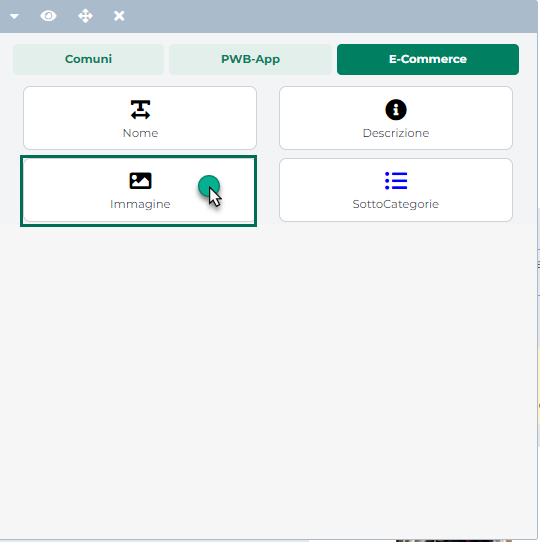
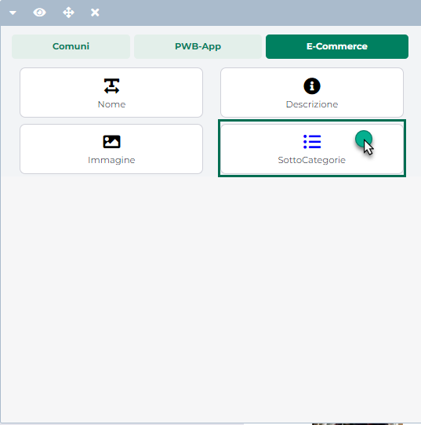
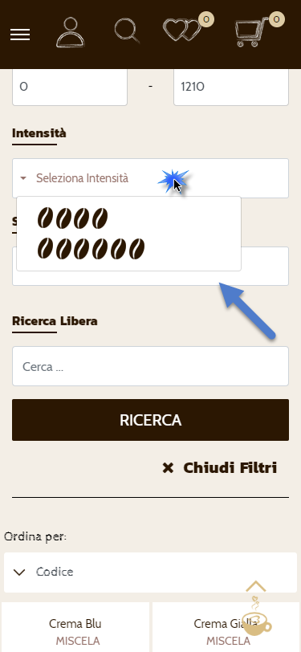
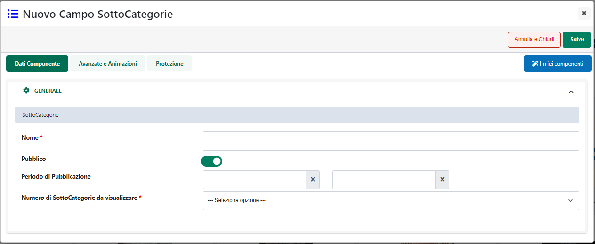
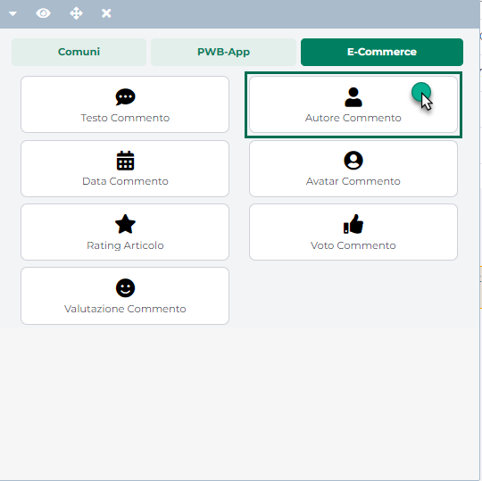

# ALLEGATI ORDINE

In generale è possibile allegare file ad un determinato documento
operando in tre modi diversi:

- **Dal Front end del sito** -- Una volta abilitata la gestione degli
  allegati sul componente "Ordine (Checkout)", gli utenti del sito
  avranno poi la possibilità, in fase di creazione di un nuovo ordine ed
  eventualmente anche in fase di modifica di un ordine preesistente, di
  allegare al documento stesso file che soddisfino determinate
  condizioni (dimensioni del file inferiori ad un valore massimo
  impostato in fase di configurazione del componente, estensione del
  file coerente con quelle impostate in fase di configurazione del
  componente ecc...)

> Per maggiori informazioni in merito si veda anche la sezione "*Lista
> componenti Ecommerce -- Componente Ordine Custom (Checkout) --
> Gestione Allegati* " di questo manuale

- **Dal gestionale** -- **Solo per E-commerce Mexal**. In relazione alle
  sole tipologie di documenti indicati in corrispondenza del parametro
  "**Sigle Documenti File Docuvision**" (maschera di "*Configurazione
  parametri dell'ordine*"), l'amministratore avrà la possibilità di
  utilizzare Docuvision per allegare al documento in esame tutti i file
  desiderati.

- **Dal Back end di Passweb** operando, in questo senso, dalla sezione
  "**Allegati**" presente nella maschera di visualizzazione del
  dettaglio del relativo documento

\]

All'interno di questa sezione verranno infatti visualizzati tutti i file
attualmente allegati al documento in esame.

In particolare :

- **Le righe in grassetto** identificano allegati provenienti da
  Docuvision e gestiti quindi direttamente all'interno del gestionale

- **Le righe con sfondo azzurrino** identificano allegati gestiti da
  Passweb e, nello specifico, inseriti sul front end direttamente dagli
  utenti del sito

- **Le righe con sfondo bianco** identificano, invece, allegati gestiti
  da Passweb ma inseriti dall'amministratore del sito direttamente da
  questa sezione del back end

Per ciascuno dei file presenti in elenco viene indicato:

- Il nome del file allegato -- campo "**Titolo**"

- L'eventuale nota associata all'allegato -- Campo "**Nota**"

- La data in cui il file è stato allegato al documento -- campo
  "**Data**"

- Se il file in esame potrà o meno essere inserito come allegato alle
  varie mail gestite in automatico dall'applicazione per il documento in
  esame -- Campo "**Mail**"

- Se il file in esame è o meno un allegato di tipo Stampa -- Campo
  "**Stampa**"

- Se il file in esame è stato o meno allegato al documento partendo dal
  Wizard di Passweb oppure da Docuvision -- Campo "**Wizard**"

> **ATTENZIONE!** Anche gli allegati caricati a partire da Docuvision
> avranno il campo Wizard impostato su SI

Il campo di ricerca attivabile cliccando sulla lente di ingrandimento,
presente in testata di ogni singola colonna, consente di filtrare i dati
in griglia sulla base dei valori presenti all'interno della colonna
stessa. L'icona raffigurante due piccole frecce posta anch' essa in
testata ad ogni singola colonna della griglia, consente invece di
ordinare in maniera crescente e/o decrescente gli elementi presenti in
elenco.

I pulsanti presenti nella contestuale barra degli strumenti consentono
rispettivamente di:

- **Download** (
   ): consente di effettuare il download del file
  attualmente selezionato in elenco

- **Elimina** (
   ): consente di eliminare il file
  attualmente selezionato in elenco

> **ATTENZIONE!** Se il file eliminato dovesse provenire dal gestionale
> (file evidenziato in grassetto e campo "Wizard" impostato a N), nel
> caso in cui venisse variato, lato Mexal, il relativo documento, ed il
> file eliminato su Passweb fosse ancora presente all'interno di
> Docuvision questo stesso file verrà nuovamente esportato sul sito a
> seguito della prima sincronizzazione utile.

- **Svuota** (
   ): consente di eliminare in un colpo
  solo tutti gli allegati associati al documento in esame.

> Anche in questo caso, ovviamente, nel momento in cui eventuali
> allegati provenienti dal gestionale dovessero essere ancora presenti
> in Docuvision, se e quando il documento in esame dovesse essere
> variato lato gestionale, questi stessi documenti verranno nuovamente
> esportati (a seguito della prima sincronizzazione utile) anche
> all'interno del sito,

- **Modifica** (
   ): consente di modificare l'allegato
  attualmente selezionato in elenco.

> **ATTENZIONE!** E' possibile modificare solo ed esclusivamente file
> che sono stati allegati al documento in esame partendo direttamente
> dal Wizard di Passweb.
>
> In tutti gli altri casi (file allegati al documento partendo dal
> gestionale e/o dal front end del sito) l'allegato potrà essere
> eliminato ma mai modificato

- **Nuovo** (
   ): consente di allegare al documento in
  esame un nuovo file.

Cliccando su quest'ultimo pulsante verrà quindi visualizzata la maschera
"**Allegato**"

all'interno della quale poter indicare un valore per i seguenti
parametri:

- **File:** consente di selezionare ed uplodare all'interno del sito lo
  specifico file da allegare al documento in esame.

- **Titolo:** consente di assegnare al file caricato mediante il
  precedente parametro, uno specifico titolo, titolo questo che verrà
  utilizzato come nome del file allegato.

> Nel caso in cui il campo in esame dovesse essere lasciato vuoto, verrà
> poi valorizzato in automatico dall'applicazione con il nome del file
> caricato.

- **Nota:** consente di indicare una nota da associare al file allegato
  al documento in esame. Tale nota verrà poi visualizzata sul front end
  del sito come descrizione aggiuntiva per il relativo allegato.

- **Stampa:** consente di indicare se il file in esame dovrà essere
  considerato o meno come "**Stampa pdf**" del relativo documento.
  **Selezionando tale parametro il file caricato dovrà quindi essere,
  per forza di cose un file pdf**. In caso contrario in fase di
  salvataggio verrà visualizzato un apposito messaggio di errore.

> **ATTENZIONE!** Per ogni documento è ammesso un unico allegato di tipo
> "Stampa".
>
> In conseguenza di ciò, nel momento in cui nella lista degli allegati
> dovesse essere già presente una un file marcato come "Stampa" e
> venisse aggiunto un nuovo allegato impostando per esso il segno di
> spunta sul campo \"Stampa\", verrà in automatico tolta l'indicazione
> di stampa per il vecchio allegato e il nuovo allegato verrà ora
> utilizzato come nuovo file di stampa.

- **Mail:** consente, se selezionato, di impostare il campo Mail sul
  valore S e di poter quindi allegare il relativo file a tutte le mail
  inviate in automatico dall'applicazione per il documento in esame.

> **ATTENZIONE! Affinché un determinato file possa essere allegato alle
> varie mail non è sufficiente che il campo "Mail" sia impostato sul
> valore S ma occorre anche aver configurato correttamente la relativa
> tipologia di mail**, impostando per essa un determinato oggetto e
> verificando di aver correttamente selezionato anche il relativo
> parametro "Allegati"

> Per maggiori informazioni in merito si veda anche il precedente
> capitolo "*Ordini -- Configurazione Ordini -- Dati Email*" di questo
> manuale
>
> Mentre per i file allegati ad un documento operando direttamente dal
> Wizard di Passweb è sempre possibile modificare il valore del campo
> Mail selezionando o deselezionando il parametro in esame, per le altre
> tipologie di allegato è invece opportuno ricordare che:

- i file allegati ad un documento partendo da Docuvision avranno il
  campo Mail impostato a S solo ed esclusivamente nel momento in cui
  tale allegato sia anche di tipo "Stampa"

- i file allegati ad un documento partendo dal Front end del sito
  avranno il campo Mail sempre impostato a S

> Considerando quindi che, in entrambi i casi, il relativo allegato non
> può essere modificato dal Wizard di Passweb (può, eventualmente, solo
> essere eliminato) e posto ovviamente di aver configurato correttamente
> le diverse tipologie di mail si avrà anche che:

- i file allegati ad un documento partendo da Docuvision potranno essere
  allegati alle varie mail solo se sono anche di tipo Stampa

- i file allegati ad un documento partendo dal Front end del sito
  verranno sempre allegati alle varie mail inviate in automatico
  dall'applicazione.

<!-- -->

- **Consenti rimozione utente:** consente di indicare se l'utente dovrà
  avere o meno, sul front end del sito, la possibilità di rimuovere
  l'allegato in esame.

> Selezionando questo parametro in fase di visualizzazione del documento
> sul front end del sito, comparirà quindi, in corrispondenza
> dell'allegato in questione, il pulsante "**Rimuovi allegato**".
>
> Al contrario nel momento in cui il parametro in esame non dovesse
> essere selezionato, l'utente avrà la possibilità di scaricare e
> visualizzare l'allegato ma non potrà eliminarlo in alcun modo

- **Notifica utente:** consente di indicare se al salvataggio
  dell'allegato dovrà essere inviata o meno anche una mail di notifica
  al cliente per informarlo della presenza, sul documento in esame, di
  questo nuovo allegato.

> **ATTENZIONE! Affinché la mail di notifica relativa alla presenza di
> un nuovo allegato possa essere effettivamente inviata, non è
> sufficiente selezionare il parametro "Notifica Utente" ma occorre
> anche verificare di aver configurato in maniera corretta la mail di
> tipo "Notifica Allegato"**

> Per maggiori informazioni in merito si veda anche quanto indicato nel
> precedente capitolo "*Ordini -- Configurazione Ordini -- Dati Email*"
> di questo manuale

**ATTENZIONE!** **Eventuali file allegati ad un documento partendo da
Passweb (Back end o Front end non fa differenza) non verranno mai
inseriti all'interno del gestionale, resteranno legati allo specifico
documento,** e potranno quindi essere gestiti, secondo le regole
precedentemente elencate, solo ed esclusivamente all'interno di Passweb.

Nel momento in cui un determinato ordine dovesse essere trasformato in
un documento di altro tipo (es. evaso mediante bolla o fattura),
eventuali allegati presenti sul documento di partenza potranno essere
accessibili solo ed esclusivamente visualizzando il dettaglio del
documento di origine.

In questo senso occorre ricordare che in fase di sincronizzazione,
qualora un determinato documento dovesse essere trasformato in un altro
tipo di documento, il documento di origine verrà comunque conservato
all'interno di Passweb e, nello specifico, verrà portato nello stato di
**"Trasformato"** (per maggiori informazioni relativamente ai possibili
"Stati" di un ordine si veda anche il relativo capitolo di questo
manuale "*Ordini -- Stati dell'Ordine*")

Se l'esigenza dovesse dunque essere quella di accedere, dal Wizard agli
allegati presenti su di un ordine che è già stato trasformato in bolla o
fattura, sarà necessario portarsi alla pagina "Lista Ordini" e procedere
in uno dei due modi di seguito indicati:

- Filtrare tra i documenti presenti in elenco quelli che si trovano
  nello stato "**Trasformato**"

> Selezionare tra questi l'ordine desiderato e cliccare sul pulsante
> "**Visualizza Ordine**" per accedere al relativo dettaglio da cui sarà
> poi possibile visualizzare e scaricare eventuali allegati

- Selezionare tra i documenti presenti in elenco la bolla o la fattura
  in cui è stato trasformato l'ordine in esame, e cliccare sul pulsante
  "**Visualizza Ordine**" per accedere al relativo dettaglio. In questo
  caso nella parte alta della maschera, tra i "**Documenti correlati**"
  comparirà anche la sigla dell'ordine che ha dato origine alla relativa
  bolla / fattura

> Cliccando sulla sigla dell'ordine sarà quindi possibile accedere al
> dettaglio del documento di origine da cui poter visualizzare e
> scaricare eventuali allegati

**ATTENZIONE!** Gli ordini in stato "Trasformato" possono essere
visualizzati e consultati solo ed esclusivamente all'interno del Wizard
di Passweb seguendo una delle due procedure sopra analizzate

Nel momento in cui l'esigenza dovesse invece essere quella di accedere
agli allegati presenti su di un ordine che è già stato trasformato in
bolla o fattura direttamente dal front-end del sito sarà necessario:

- Portarsi alla pagina "**I miei ordini**"

- Selezionare tra i documenti presenti in elenco la bolla o la fattura
  in cui è stato trasformato l'ordine in esame, e cliccare sul pulsante
  "**Visualizza Ordine**" per accedere al relativo dettaglio. In questo
  caso nella parte alta della maschera, tra i "**Documenti correlati**"
  comparirà anche la sigla dell'ordine che ha dato origine alla relativa
  bolla / fattura nel cui dettaglio saranno poi presenti i relativi
  allegati

