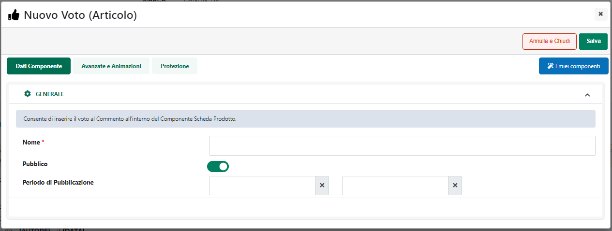
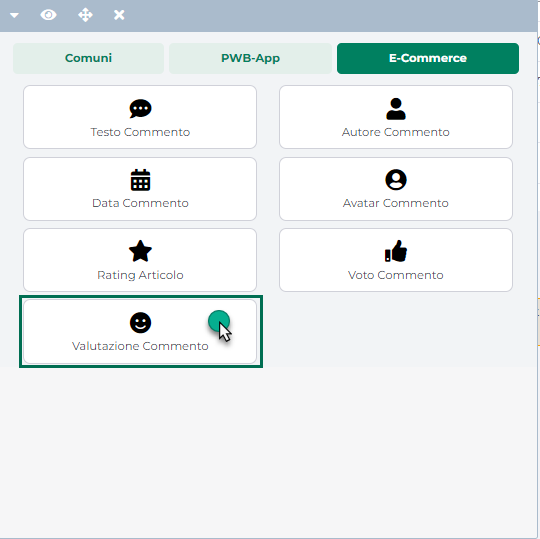

# STATI DELL'ORDINE

Gli ordini gestiti all'interno del proprio sito e-commerce possono
assumere diversi possibili stati. Nel dettaglio:

**[NUOVO]{.underline}**

L\' ordine viene posto in questo stato quando il cliente conferma per la
prima volta il suo ordine e questo non viene inserito immediatamente nel
gestionale.

**[MEMORIZZATO]{.underline}**

L\' ordine viene posto in questo stato in diverse possibili situazioni:

1.  dopo la prima sincronizzazione tra Passweb ed il gestionale
    (l\'ordine compare quindi per la prima volta anche sul gestionale).
    E' a questo punto che sul sito viene assegnato anche un numero
    all\'ordine;

2.  quando viene sincronizzato un ordine che inizialmente si trovava
    nello stato di MODIFICATO. Alla prossima sincronizzazione l\'ordine
    sul web passerà allo stato di MEMORIZZATO e verranno eventualmente
    riportate sul gestionale le nuove modifiche);

Lo stato MEMORIZZATO può presentarsi, inoltre, in corrispondenza di
un'altra situazione particolare legata essenzialmente alla sostituzione
dell'ordine.

a)  **MEMORIZZATO -- SOSTITUITO :** la presenza di un ordine posto in
    questo stato è indice di un avvenuto conflitto generato dalla
    modifica \"contemporanea\" dello stesso Ordine Sospeso sia
    all\'interno del gestionale che all\'interno del sito web. In
    particolare verrà rilevato un conflitto nella gestione ordini di
    Passweb al verificarsi delle seguenti condizioni:

    - gestione ordini da Passweb attiva;

    - modifica di un ordine in stato di sospeso da parte del cliente
      all\'interno del sito web;

    - modifica dello stesso ordine all\'interno del gestionale prima che
      sia avvenuta una sincronizzazione.

Le modifiche apportate all\'ordine da parte del cliente sul sito web
verranno copiate in un **nuovo documento web** con sigla **s\_\[sigla
documento gestionale\],** mentre le modifiche apportate allo stesso
ordine all\'interno del gestionale verranno replicate nel documento
originale.

**NOTA BENE:** le modifiche apportate, all\'interno del gestionale, ad
un ordine sospeso hanno sempre la priorità rispetto ad eventuali
modifiche apportate allo stesso documento all\'interno del sito web.

**NOTA BENE:** eventuali conflitti potranno essere rilevati, e le
corrispondenti azioni correttive avviate solamente dopo una
sincronizzazione.

Al verificarsi di del conflitto sopra indicato verrà inviata al cliente
la mail **"E-Mail di Sostituzione"** opportunamente indicata alla pagina
**"Configurazione Ordini"** di Passweb. Tale mail verrà inviata anche
all\'indirizzo specificato nei Parametri di Sincronizzazione per la mail
di fine sincronizzazione (nel caso in cui non sia stato indicato tale
indirizzo la mail verrà inviata all\'indirizzo indicato alla pagina
"Posta/SMS" nel corrispondente campo E-mail).

Una volta rilevato un conflitto di questo tipo, la situazione andrà poi
gestita caso per caso ad esempio attraverso una comunicazione telefonica
con il cliente stesso.

**[MODIFICATO]{.underline}**

L\' ordine viene posto in questo stato nel momento in cui un cliente
decide, dopo aver visionato un ordine in sospeso, decide di modificarlo.
Tale stato è in ogni caso temporaneo nel senso che alla prossima
sincronizzazione l\'ordine in questione verrà portato nello stato di
MEMORIZZATO.

**[SOSPESO]{.underline}**

L\' ordine viene posto in questo stato quando viene sincronizzato il
corrispondente ordine gestionale e questo ha almeno una riga nello stato
**S (sospeso)** o nello stato **B (bloccato)**. In questa situazione, se
è stato posto a **NO** il parametro "**Gestione ordine da Mexal /
Ho.Re.Ca.**" (vedi anche pagina *"Ordini - Configurazione Ordini"* di
questo manuale) il cliente potrà modificare questo stesso ordine
decidendo dunque se confermarlo con i soli articoli effettivamente
acquistabili, se eliminare alcuni articoli, se aggiungerne eventualmente
di nuovi o se annullare completamente l'ordine.

A seguito di eventuali modifiche apportate ad un ordine in sospeso, dopo
la conferma, lo stato dell'ordine passerà da SOSPESO a MEMORIZZATO.

Nel caso in cui l'ordine in questione venga invece annullato il suo
stato passerà ovviamente da SOSPESPO a ANNULLATO

**[MODIFICATO -- ANNULLATO]{.underline}**

L\' ordine viene posto in questo stato quanto il cliente decide di
annullare un ordine che si trova sul web nello stato di SOSPESO

**[ANNULLATO]{.underline}**

L' ordine viene posto in questo stato quando sul gestionale tutte le sue
righe vengono poste a N

**[EVASO]{.underline}**

L \'ordine viene posto in questo stato quando viene sincronizzato il
corrispondente ordine gestionale e questo contiene solamente righe che
si trovano nello stato E (Evadibile).

**[BOLLATO]{.underline}**

Stato identificativo di tutti i documenti di tipo bolla riferiti ad
ordini generati dal sito più eventuali bolle originate sul gestionale e
successivamente esportate sul web. E\' possibile selezionare i
riferimenti ai documenti correlati alla bolla cliccando sugli appositi
link in modo da poterne visualizzare i dettagli (se nella colonna sigla
ordine è visualizzato 0/0 ciò vuol dire che non esistono documenti
correlati alla bolla in questione poiché questa è nata all\'interno del
gestionale e successivamente è stata esportata sul web).

**NOTA BENE:** è l\'unico stato visualizzabile per i documenti presenti
all\'interno della sezione \"Ordini Bollati\".

**[FATTURATO]{.underline}**

Stato identificativo di tutti documenti di tipo fattura riferiti ad
ordini generati dal sito più eventuali fatture originate sul gestionale
e successivamente esportate. E\' possibile selezionare i riferimenti ai
documenti correlati alla fattura cliccando sugli appositi link in modo
da poterne visualizzare i dettagli (se nella colonna sigla ordine è
visualizzato 0/0 ciò vuol dire che non esistono documenti correlati alla
fattura in questione poiché questa è stata generata dal gestionale,
senza cioè provenire da un ordine).

**NOTA BENE:** se l\'ordine originario mantiene anche solo una riga
nello stato annullato continuerà ad essere visualizzato nella sezione
relativa agli "Ordini Attivi" con tutti gli eventuali riferimenti ad
evasioni parziali.

**[TRASFORMATO]{.underline}**

In fase di sincronizzazione, qualora un determinato documento dovesse
essere trasformato in un altro tipo di documento (es. Ordine trasformato
in Bolla o Fattura), il documento di origine verrà comunque conservato
all'interno di Passweb e portato nello stato di **"Trasformato"**

**ATTENZIONE!** Gli Ordini e i Resi Merce in stato "Trasformato" possono
essere visualizzati e consultati solo ed esclusivamente all'interno del
Wizard di Passweb e, nello specifico, all'interno delle maschere "Lista
Ordini" e "Lista Resi".

**[PAGAMENTO NON CONFERMATO]{.underline}**

Stato identificativo di tutti i documenti pagati mediante gateway
bancario e per i quali la relativa applicazione di Back Office non ha
restituito alcuna risposta al sito Passweb.

Ordini posti in questo stato resteranno memorizzati unicamente
all'interno del database di Passweb e non verranno mai inseriti
automaticamente sul relativo gestionale Passepartout.

Alla prima sincronizzazione utile verrà inviata una mail di avviso
all'indirizzo indicato nel campo "**E-mail**" alla pagina
"**Posta/SMS**" del Wizard in maniera tale da avvisare l'amministratore
di questa situazione.

Una volta verificato, all'interno dell'applicazione di Back Office della
banca, lo stato reale del pagamento relativo a questi ordini, potrebbe
essere necessario cancellarli dal database di Passweb oppure inserirli
all'interno del gestionale (ad esempio perché il pagamento è stato
effettuato ma si sono verificati dei problemi a seguito dei quali il
Back Office della banca non è stato in grado di ritornare una risposta
positiva al sito Passweb).

Per effettuare una di queste due operazioni è necessario innanzitutto
portarsi nella pagina "**Gestione Ordini**" del Wizard e individuare gli
ordini con Stato uguale a **"Pagamento Non Confermato"**.

**NOTA BENE**: gli ordini con stato "Pagamento Non Confermato" sono
evidenziati in giallo. E' comunque possibile filtrare gli ordini con uno
specifico stato attraverso l'apposito pannello di Ricerca.

A questo punto dunque se dal Back Office risultasse che la transazione
abbia avuto esito positivo, e sia quindi necessario inserire l'ordine
all'interno del gestionale, occorrerà abilitare lo stesso mettendo il
segno di spunta sulla check box che appare di fianco all'ordine e
premere poi il pulsante **"Conferma Ordine"** presente nella contestuale
barra degli strumenti.

Cliccando su questo pulsante verrà avviata una **sincronizzazione
parziale** (**solo inserimento ordini** e quindi **non scalata dal
numero di sincronizzazioni previste da contratto**) o **totale** (**in
questo caso scalata dal numero di sincronizzazioni previste da
contratto**) dipendentemente da quanto impostato per il parametro
"**Sincronizzazione completa alla Conferma dell'Ordine**" presente nella
maschera "*Ordini - Configurazione Ordini*" precedentemente esaminata.

In queste condizioni dunque, dopo aver cliccato sul pulsante in
questione, e posto ovviamente che il gestionale alla validazione del
documento sia raggiungibile via internet, i documenti selezionati
verranno immediatamente inseriti all'interno del gestionale stesso.

Nel caso in cui il gestionale all'atto della validazione di questi
documenti non fosse contattabile via internet i documenti ora validati
rimarranno memorizzati all'interno di Passweb e verranno quindi inseriti
nel gestionale alla prima sincronizzazione (parziale o totale) utile.

Nel caso in cui l'ordine o gli ordini selezionati non dovessero invece
essere inseriti sul gestionale potranno allora essere rimossi anche dal
database di Passweb selezionandoli e cliccando sul corrispondente
pulsante **"Elimina Ordine"** ( ) presente nella barra degli strumenti.

**[DA VERIFICARE]{.underline}**

Stato identificativo dei nuovi documenti che soddisfano il filtro
impostato in corrispondenza del parametro "**Documenti Nuovi da
Verificare**" presente all'interno della maschera "Configurazione
Parametri dell'Ordine" del Wizard.

**ATTENZIONE! per i documenti in stato "Da Verificare" la memorizzazione
sul gestionale non sarà automatica ma avverrà solo previa conferma del
documento stesso da parte dell'amministratore all'interno del Wizard di
Passweb**

La procedura mediante cui poter validare documenti in stato "Da
Verificare", abilitandoli di fatto a poter essere inseriti sul
gestionale, è esattamente la stessa utilizzata per validare anche
documenti in stato di "Pagamento non confermato"

Nel momento in cui l'esigenza dovesse essere dunque quella di validare
questi documenti sarà sufficiente selezionarli tra quelli presenti alla
pagina "**Gestione Ordini**" e, successivamente, cliccare sul pulsante
"**Conferma Ordine**" presente nella contestuale barra degli strumenti.

Se invece l'esigenza dovesse essere quella di eliminare o annullare
questi documenti sarà necessario agire, dopo averli selezionati,
rispettivamente sul pulsante "**Elimina Ordine**" o "**Annulla Ordine**"

Nel primo caso (eliminazione dell'ordine) il relativo documento verrà
cancellato definitivamente dal sito e non potrà quindi ne essere
modificato ne tanto meno essere inserito nel gestionale.

Nel secondo caso (annullamento dell'Ordine) il relativo documento verrà
posto sul sito nello stato di "Annullato" e potrà quindi essere ancora
gestito all'interno del sito (ad esempio come base di partenza per un
riordino degli articoli in esso presenti)

Infine, in merito allo stato "Da Verificare" è bene sottolineare anche
che:

- **lo stato "Da Verificare" verrà applicato solo ed esclusivamente in
  relazione a documenti "Nuovi"**. Sono esclusi dunque da questo stato
  tutti gli ordini "Modificati" ossia tutti gli ordini effettuati
  partendo da un ordine in stato Sospeso

- **lo stato di "Pagamento non confermato" è prioritario rispetto allo
  stato "Da Verificare"** per cui se un determinato ordine, pagato
  tramite gateway online, dovesse risultare in stato di "Pagamento non
  confermato" rimarrebbe in questo stesso stato anche nel momento in cui
  dovesse soddisfare il filtro settato mediante il parametro "Documenti
  nuovi da verificare".

