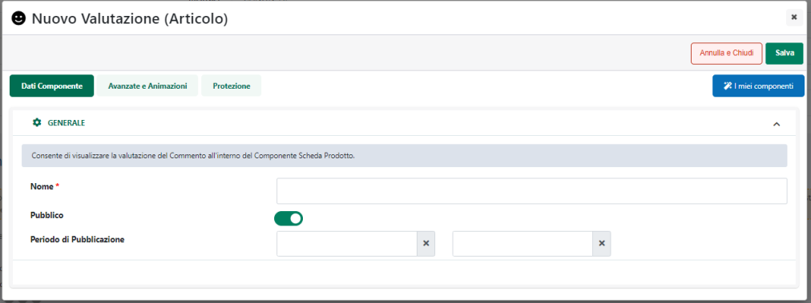
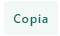
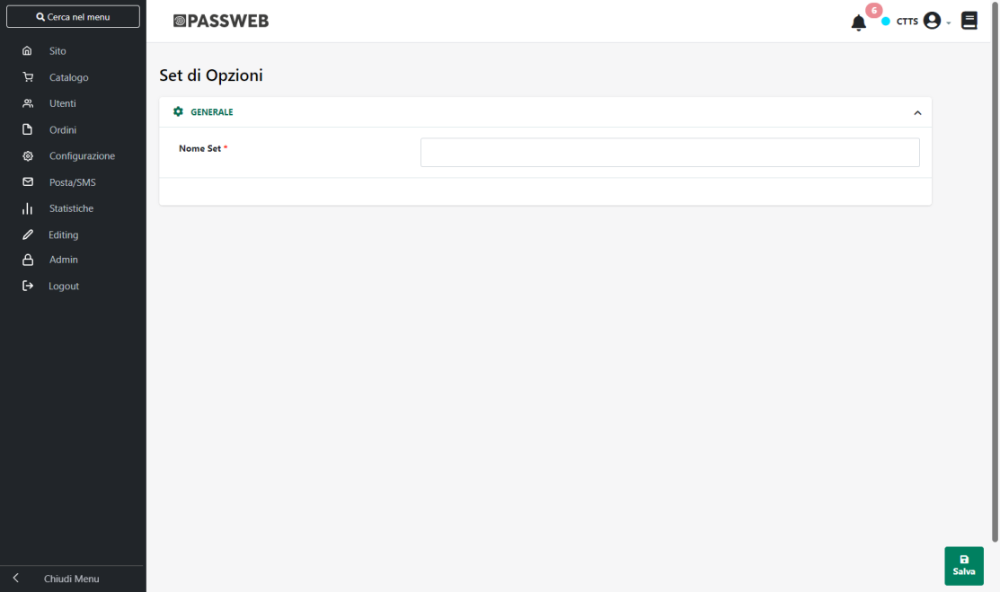
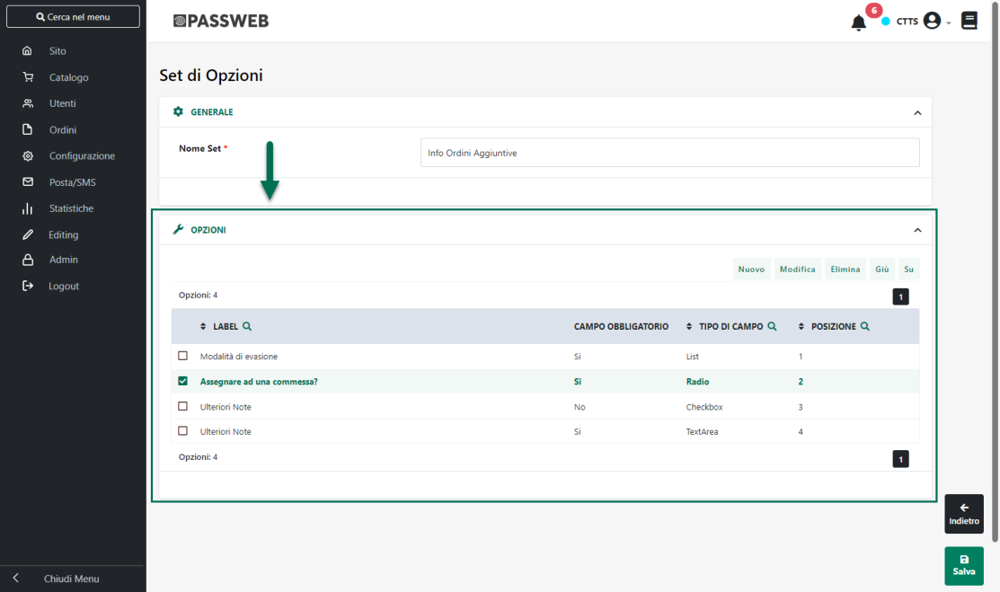

# SET OPZIONI

**ATTENZIONE!** **Per poter gestire i Set Opzioni a livello di Ordine è
necessario aver acquistato e attivato il modulo delle Custom Option**

La sezione "**Set Opzioni**", accessibile dalla voce di menu principale
"**Ordini**" consente di estendere quello che è il normale funzionamento
delle note di corpo gestibili per ogni documento prodotto dal sito

All'interno di questa sezione è infatti possibile definire e gestire un
insieme di campi personalizzati che potranno poi essere mostrati in fase
di checkout e che consentiranno agli utenti del sito di fornire
ulteriori informazioni in merito all'ordine che stanno effettuando.

A differenza della nota di corpo che, di fatto, è un semplice campo di
testo che l'utente può utilizzare per inserire un qualsiasi tipo di
informazione sull'ordine, i Set di Opzioni consentono di gestire anche
campi ti tipo select box, radio button, check box ..., oltre a
condizioni di obbligatorietà e visibilità, mediante le quali poter
guidare l'utente nella selezione delle informazioni addizionali da
inserire in fase di checkout.

Una volta effettuato l'accesso a questa sezione del Wizard verrà
mostrata la maschera **Set di Opzioni**

che consente di visualizzare e gestire tutti i Set di Opzioni Ordine
attualmente codificati oltre che, ovviamente, crearne di nuovi.

I pulsanti presenti nella barra principale degli strumenti consentono
rispettivamente di:

**Modifica** (
 ): consente di modificare il set di
opzioni attualmente selezionato in elenco sia a livello di
configurazione che di campi custom in esso presenti

**Elimina** (
 ): consente di eliminare il set di
opzioni attualmente selezionato in elenco

**Copia** (
 ): consente di effettuare una copia del
il set di opzioni attualmente selezionato in elenco

**Nuovo**
( ): consente di definire un nuovo Set di
Opzioni.

Cliccando su questo pulsante verrà visualizzato il campo "**Nome Set**"
mediante il quale poter assegnare un nome al Set di Opzioni che si sta
realizzando

Dopo aver assegnato un nome al Set, cliccando sul pulsante "**Salva**"
presente nella parte bassa della maschera verrà visualizzata la sezione
"**Opzioni**" all'interno della quale poter definire i singoli campi che
andranno poi a comporre il Set in esame

