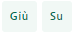
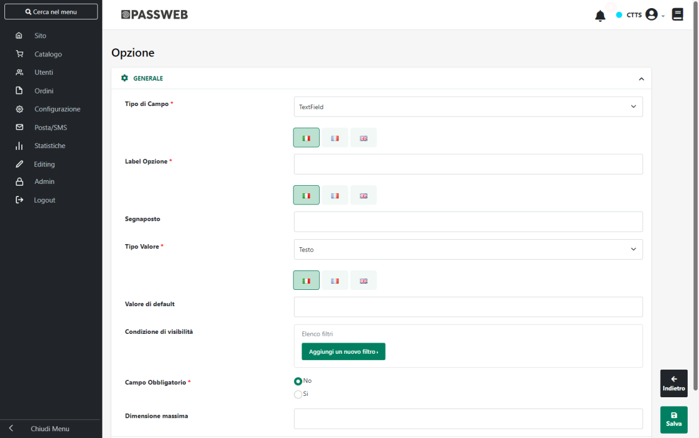
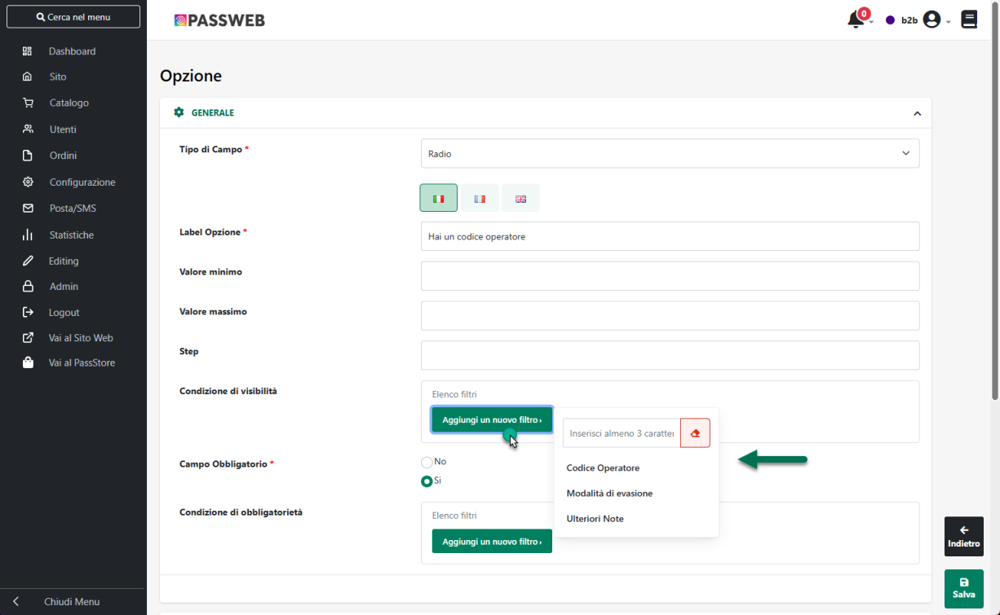
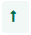
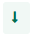
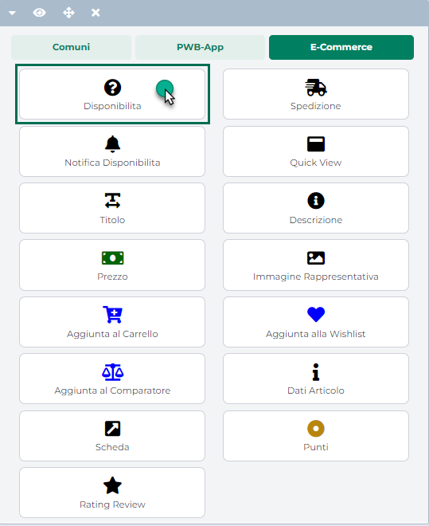

# OPZIONI DEL SET

Come evidenziato nel precedente capitolo di questo manuale ogni Set di
Opzioni Ordine potrà essere composto da uno o più campi personalizzati
che verranno poi proposti agli utenti del sito in fase di checkout.

**ATTENZIONE!** Per poter visualizzare e gestire le opzioni di un Set, è
necessario aver effettuato almeno un salvataggio del Set stesso

Una volta assegnato un nome al Set cliccando sul pulsante "Salva" verrà
infatti visualizzata la sezione "**Opzioni**" all'interno della quale
poter definire e gestire i singoli campi che andranno a comporre il Set
in esame

I pulsanti presenti nella contestuale barra degli strumenti consentono
rispettivamente di:

**Modifica**
( ): consente di modificare l'opzione di
personalizzazione attualmente selezionata in elenco

**Elimina**
( ): consente di eliminare l'opzione di
personalizzazione attualmente selezionata in elenco

**Giù / Su**
(): consentono di modificare (spostandola verso il
basso o verso l'alto) la posizione assunta dall'opzione di
personalizzazione all'interno del form che verrà poi visualizzato in
fase di checkout

**Nuovo**
( ): consente di creare una nuova opzione
di personalizzazione.

Cliccando su questo pulsante verrà infatti visualizzata la maschera
"**Opzione**"

all'interno della quale poter impostare un valore per i seguenti
parametri:

**Tipo di Campo:** consente di definire il tipo di controllo da
utilizzare per gestire l'opzione di personalizzazione che si sta
codificando e, conseguentemente, il tipo di campo che verrà poi
visualizzato sul front end del sito in fase di checkout.

E' possibile selezionare uno dei seguenti valori:

- **TextField:** in queste condizioni l'opzione di personalizzazione
  verrà gestita mediante un semplice campo di testo. Sul front end del
  sito, in fase di checkout, verrà quindi visualizzato **un semplice
  campo di input** che l'utente potrà utilizzare per inserire del "testo
  libero"

- **TextArea:** in queste condizioni l'opzione di personalizzazione
  verrà gestita mediante un'area di testo. Sul front end del sito, in
  fase di checkout, verrà quindi visualizzato **un text area** che
  l'utente potrà utilizzare, come nel caso precedente, per inserire del
  "testo libero" (esattamente come avviene per il normale campo "note")

- **Radio:** in queste condizioni l'opzione di personalizzazione verrà
  gestita mediante **un controllo di tipo Radio Button**. Utile nel
  momento in cui il dato aggiuntivo da inserire in fase di checkout
  debba essere un' informazione ben precisa selezionata tra N possibili
  opzioni preconfigurate

- **List:** in queste condizioni l'opzione di personalizzazione verrà
  gestita mediante **un controllo di tipo Select box**. Utile nel
  momento in cui il dato aggiuntivo da inserire in fase di checkout
  debba essere un' informazione ben precisa selezionata tra N possibili
  opzioni preconfigurate

- **Date:** in queste condizioni l'opzione di personalizzazione verrà
  gestita mediante **un controllo di tipo Date Picker**. Utile nel
  momento il dato aggiuntivo da inserire in fase di checkout debba
  essere una specifica data

- **Checkbox:** in queste condizioni l'opzione di personalizzazione
  verrà gestita mediante **un controllo di tipo Check Box**. Utile nel
  momento in cui la personalizzazione consiste nella possibilità da
  parte dell'utente di selezionare una o più informazioni aggiuntive
  all'interno di un elenco di N possibili opzioni preconfigurate.

**Label Opzione:** consente di specificare, in ciascuna delle lingue
attualmente gestite, la label da utilizzare per l'opzione di
personalizzazione che si sta codificando

**Segnaposto:** solo per controlli di tipo **"Text Field"** e **"Text
Area"**. Consente di indicare, in ciascuna delle lingue attualmente
gestite, un testo che verrà poi utilizzato come segnaposto all'interno
del corrispondente campo / area di input

**Tipo Valore:** solo per controlli di tipo **"Text Field"**. Consente
di indicare il tipo di dato da gestire all'interno del corrispondente
campo di input. E' possibile selezionare uno dei seguenti valori:

- **Testo:** in queste condizioni all'interno del campo di input
  utilizzato per gestire l'opzione di personalizzazione potrà essere
  inserito un qualsiasi testo alfanumerico (maiuscolo o minuscolo non fa
  differenza)

- **Maiuscolo:** in queste condizioni all'interno del campo di input
  utilizzato per gestire l'opzione di personalizzazione potrà essere
  inserito un qualsiasi testo alfanumerico maiuscolo

- **Numerico:** in queste condizioni all'interno del campo di input
  utilizzato per gestire l'opzione di personalizzazione potranno essere
  inseriti solo ed esclusivamente numeri interi.

- **Decimale:** in queste condizioni all'interno del campo di input
  utilizzato per gestire l'opzione di personalizzazione potranno essere
  inseriti indifferentemente numeri interi o decimali (utilizzando per
  questo il carattere , oppure il carattere . ).

- **Mail**: in queste condizioni all'interno del campo di input
  utilizzato per gestire l'opzione di personalizzazione potrà essere
  inserito solamente un indirizzo di posta elettronica (un apposito
  controllo verificherà la corretta sintassi dell'indirizzo indicato)

**Valore minimo / massimo:** solo per controlli di tipo **"Text Field"**
con "**Tipo Valore**" impostato su "**Numerico**", "**Decimale**" o
"**Prezzo**"

Consentono di impostare un range di validazione per il numero inserito a
front end all'interno del corrispondente campo di input

**Step:** solo per controlli di tipo **"Text Field"** con "**Tipo
Valore**" impostato su "**Numerico**", "**Decimale**" o "**Prezzo"**

Consente di impostare lo step di validazione per i valori che verranno
poi inseriti all'interno del corrispondente campo di input.

Nel momento in cui si dovesse dunque decidere di impostare per questo
parametro un valore diverso da zero, il numero inserito a front end
all'interno del relativo campo, verrà accettato e validato solo nel caso
in cui sia effettivamente un multiplo dello step indicato.

In queste condizioni inoltre, in corrispondenza del campo di input,
verrà visualizzato anche un apposito messaggio per informare l'utente
del fatto che il valore da inserire all'interno del campo dovrà essere
necessariamente un multiplo dello step indicato.

**Valore di default:** solo per controlli di tipo **"Text Field"** e
**"Text Area"**. Consente di indicare un testo che verrà utilizzato (e
visualizzato) **come valore di default** all'interno del corrispondente
campo di input.

**Condizione di visibilità**: consente di impostare una condizione in
base alla quale poter definire quando l'opzione di personalizzazione in
esame dovrà essere effettivamente visibile sul front end del sito.

Tale condizione potrà essere definita, sostanzialmente, sulla base dei
valori impostati per le altre opzioni di personalizzazione presenti
all'interno dello stesso set.

Cliccando sul pulsante "**Aggiungi Nuovo Filtro**" verranno infatti
visualizzate tutte le opzioni dello stesso set ad esclusione di quelle
per cui il parametro "**Tipo di Campo**" è stato impostato sul valore
"**Date**"

Una volta selezionata l'opzione desiderata sarà poi possibile impostare
il filtro da soddisfare affinché l'opzione di personalizzazione in esame
possa effettivamente essere visualizzata sul front end del sito

Nell'esempio rappresentato in figura, l'opzione in esame verrà
effettivamente visualizzata e proposta sul front end agli utenti del
sito, solo nel momento in cui l'opzione "**Modalità di evasione**",
presente all'interno dello stesso set, dovesse essere impostata
esattamente sul valore "**Immediata"**

**ATTENZIONE!** Per essere certi del corretto funzionamento di un
eventuale filtro impostato su un campo di tipo check box, nel caso in
cui si consideri anche la possibilità di avere più check con selezione
multipla di più opzioni da parte dell'utente, la condizione del filtro
dovrebbe essere impostata sull'operatore "**contiene / non contiene**"

Ovviamente nel caso in cui non dovesse essere impostata nessuna
Condizione di Visibilità, l'opzione in esame sarà sempre visibile

**Campo Obbligatorio:** consente di indicare se l'opzione di
personalizzazione in esame dovrà o meno essere considerata come
obbligatoria al fine di poter completare l'ordine.

**Condizione di obbligatorietà** -- visibile solo nel caso in cui il
parametro "Campo Obbligatorio" sia stato impostato sul valore "Si"

Consente di impostare una condizione in base alla quale poter definire
quando l'opzione di personalizzazione in esame dovrà essere
effettivamente obbligatoria.

Anche la Condizione di Obbligatorietà, così come quella di visibilità
potrà essere definita sulla base dei valori impostati per le altre
opzioni di personalizzazione presenti all'interno dello stesso set.

**ATTENZIONE!** Eventuali Condizioni di Obbligatorietà verranno
applicate solo nel caso in cui l'opzione in esame sia effettivamente
visibile nel form di personalizzazione del prodotto

Ciò significa dunque che nel momento in cui, per una per determinata
opzione di personalizzazione, dovessero essere impostate sia una
condizione di visibilità che una di obbligatorietà, quest'ultima verrà
effettivamente applicata solo se è stata prima verificata anche la
condizione di visibilità e dunque solo se l'opzione in esame risulta
essere effettivamente visibile all'utente sul front end del sito

**ATTENZIONE!** Nel caso in cui non dovesse essere impostata nessuna
Condizione di Obbligatorietà, l'opzione in esame sarà considerata sempre
obbligatoria

**Dimensione Massima:** solo per controlli di tipo **"Text Field"**,
**"Text Area"**. Consente di indicare il numero massimo di caratteri
accettati dal relativo campo di input

**Gestione Valori:** solo per controlli di tipo **"List"**, **"Radio"**
e **"Check Box"**. All'interno di questa sezione sarà possibile indicare
le diverse possibili opzioni di scelta che verranno visualizzate sul
front end del sito all'interno del relativo controllo.

**ATTENZIONE!** Prima di poter inserire le possibili opzioni di scelta è
necessario aver effettuato almeno un salvataggio dell'opzione di
personalizzazione in esame.

Nella parte sinistra della sezione "Gestione Valori" è riportato
l'elenco delle possibili opzioni di scelta che verranno poi visualizzate
sul front end del sito in relazione al campo in esame.

I pulsanti presenti nella contestuale barra degli strumenti consentono
rispettivamente di:

**Elimina**
( ): consente di eliminare l'opzione
attualmente selezionata in elenco

**Modifica**
( ): consente di modificare l'opzione attualmente
selezionata in elenco

**Sposta Su / Giù**
( /
 ): consente di spostare l'opzione
attualmente selezionata verso l'alto / il basso in modo tale da
riordinare le opzioni presenti in elenco secondo le specifiche esigenze
del caso

**Aggiungi**
( ): consente di aggiungere una nuova
opzione di selezione

Per ciascuna delle possibili opzioni di scelta sarà necessario indicare:

- **Valore:** consente di specificare il valore da salvare nel momento
  in cui l'utente dovesse scegliere la corrispondente opzione.

- **Testo:** consente di indicare la label che dovrà essere
  visualizzata, sul front end del sito, in corrispondenza dell'opzione
  di scelta che si sta configurando.

> **ATTENZIONE!** Nel caso in cui il campo "Testo" venga lasciato vuoto,
> label e valore dell'opzione di scelta coincideranno entrambi con
> quanto inserito all'interno del campo Valore.

- **Immagine:** consente di selezionare un'Immagine da associare alla
  corrispondente opzione.

- **Selezionato:** flaggando questa casella l'opzione di scelta che si
  sta configurando apparirà sul sito già selezionato a default.

