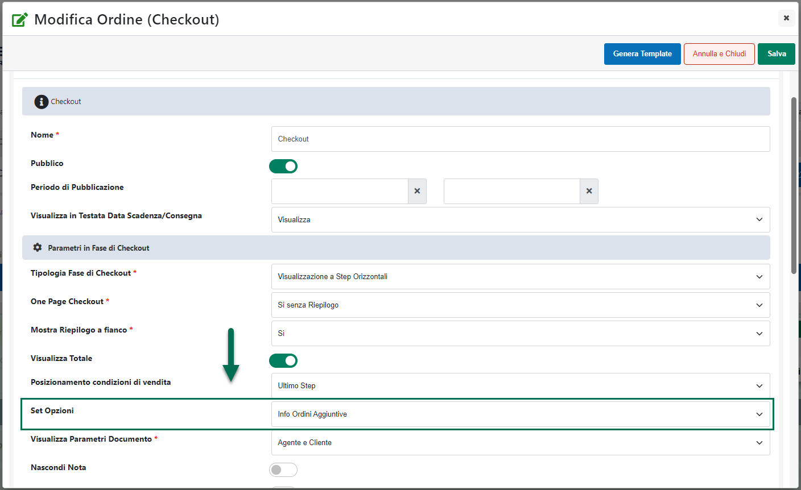
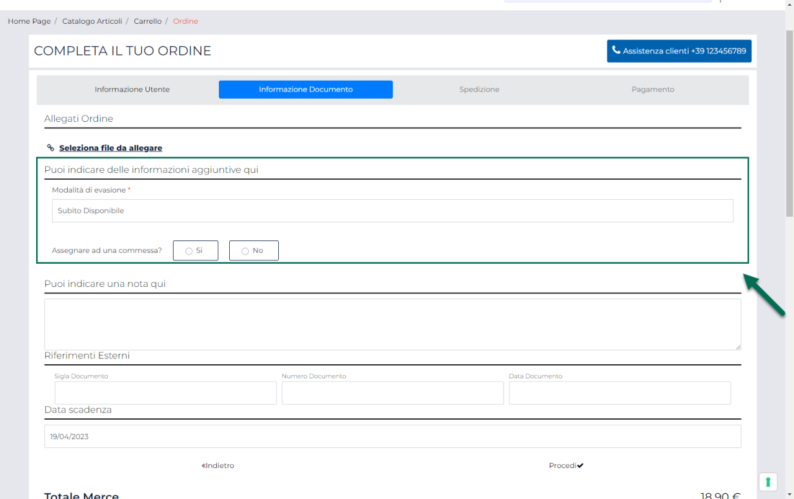
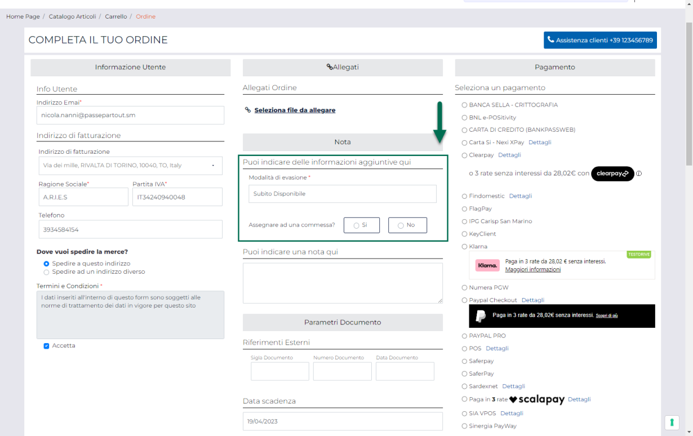

# VISUALIZZAZIONE DEL SET OPZIONI ORDINE IN FASE DI CHECKOUT

Una volta creato un Set di Opzioni Ordine, con il corrispondente insieme
di campi personalizzati, il passo successivo sarà quello di associarlo
al componente "**Ordine Custom**" in maniera tale da poter visualizzare
sul front end del sito il form che l'utente dovrà andare a compilare, in
fase di checkout, per aggiungere all'ordine le informazioni addizionali
previste dal Set in esame.

**ATTENZIONE!** E' possibile, ovviamente, associare al componente
"Ordine Custom" un solo Set di Opzioni alla volta

Passweb offre comunque la possibilità, come visto nei precedenti
capitoli di questo manuale, di creare più Set di Opzioni perché si
potrebbero configurare anche situazioni che richiedano l'inserimento,
sul front end del sito, di più componenti Ordine visibili a gruppi di
utenti differenti e ciascuno con associato un differente set di opzioni.

Per associare un ben determinato Set di Opzioni al componente Ordine,
sarà sufficiente agire dalla maschera di configurazione del componente
stesso mediante il parametro "**Set Opzioni**"

**ATTENZIONE!** Per maggiori informazioni relativamente ai parametri di
configurazione del componente "Ordine Custom (Checkout)" si veda quanto
indicato nel relativo capitolo di questo manuale ("*Varianti Sito
Responsive -- Lista Componenti Ecommerce -- Componente Ordine Custom
(Checkout)* ) "

Dopo aver associato un Set di Opzioni al componente Ordine, dunque, sul
front end del sito, in fase di checkout, verrà visualizzato il form
contenente tutti i campi definiti per il Set in oggetto

**ATTENZIONE!** i campi custom relativi al set di opzioni verranno
visualizzati in punti diversi del checkout a seconda della specifica
modalità di visualizzazione adottata per il componente Ordine.

Nello specifico, per checkout con "**Visualizzazione a Step
Orizzontali**" i campi custom verranno visualizzati in corrispondenza
dello step "**Informazioni Documento**" (come evidenziato nella figura
sopra riportata).

Per tutte le altre modalità di visualizzazione ("**Visualizzazione a
Step con Accordion**", "**Visualizzazione senza step affiancato**" e
"**Visualizzazione senza step incolonnato**") i campi custom verranno
invece visualizzati all'interno della sezione "**Nota**"

**ATTENZIONE!** Il titolo della sezione contenente i campi custom può
essere personalizzato alla pagina "*Testi / Messaggi del Sito -- Testi
dei Componenti*" agendo sul parametro "**Opzioni -- Indicazione**" del
componente "**Checkout Custom (Ordine)**"

