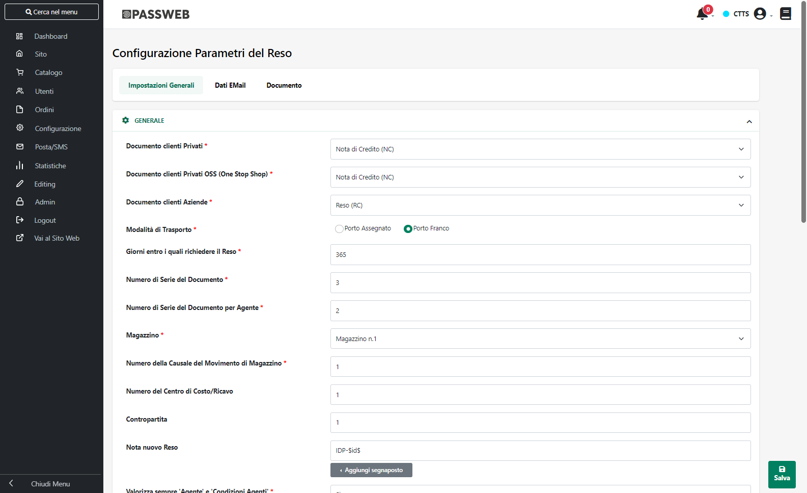

# CONFIGURAZIONE RESI

All'interno di questa sezione è possibile:

- impostare tutti i parametri necessari per poter specificare come
  dovranno essere gestiti i documenti di Reso Merce all\'interno del
  sito web e come questi stessi documenti dovranno poi essere inseriti
  sul gestionale -- **Impostazioni Generali**

- configurare tutte le mail inviate in automatico dall'applicazione e in
  qualche modo collegate alla gestione dei documenti di Reso Merce --
  **Dati E-mail**

- gestire e personalizzare il template utilizzato per la visualizzazione
  del dettaglio dei documenti di Reso Merce in Area Riservata, nelle
  Stampe e nelle mail -- **Documento**

