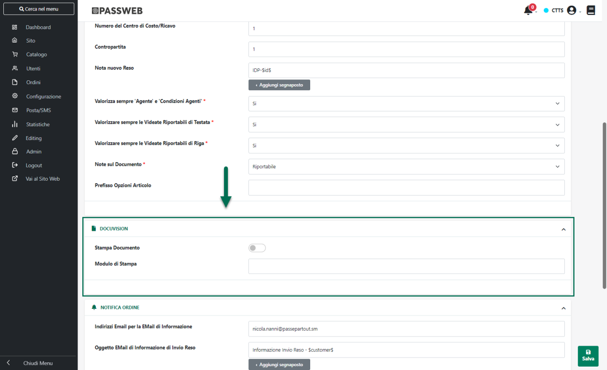
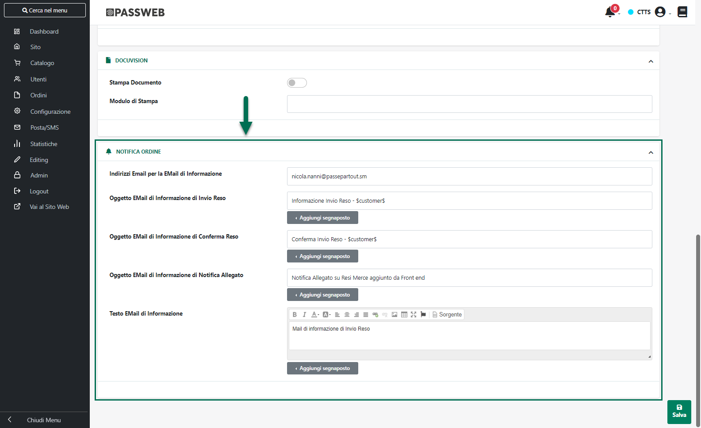

# IMPOSTAZIONI GENERALI

All'interno di questa scheda è possibile settare tutti i parametri
necessari per specificare come dovranno essere gestiti i documenti di
Reso Merce all\'interno del sito web e come questi stessi documenti
dovranno poi essere inseriti sul gestionale.

{width="5.759722222222222in"
height="3.5131944444444443in"}

In particolare occorrerà indicare un valore per i seguenti parametri:

- **Documento clienti Aziende:** consente di stabilire la tipologia del
  documento che verrà generato e, conseguentemente, memorizzato
  all\'interno del gestionale nel momento in cui ad effettuare la
  richiesta di reso merce dovesse essere un utente di tipo
  "**Azienda**".

- **Documento clienti Privati:** consente di stabilire la tipologia del
  documento che verrà generato e, conseguentemente, memorizzato
  all\'interno del gestionale nel momento in cui ad effettuare la
  richiesta di reso merce dovesse essere un utente di tipo "**Privato**"
  e l'indirizzo di spedizione della merce dovesse appartenere ad uno dei
  Paesi che non rientra tra quelli gestibili mediante OSS (One Stop
  Shop)

- **Documento Clienti Privati OSS (One Stop Shop):** consente di
  stabilire la tipologia del documento che verrà generato e,
  conseguentemente, memorizzato all\'interno del gestionale nel momento
  in cui ad effettuare la richiesta di reso merce dovesse essere un
  utente di tipo "**Privato**" e l'indirizzo di spedizione della merce
  dovesse appartenere ad uno dei Paesi che rientra tra quelli gestibili
  mediante OSS (One Stop Shop)

> **ATTENZIONE!** Per "**Paesi gestibili mediante OSS (One Stop Shop)**"
> si intendono tutti i paesi dell' Unione Europea ad esclusione di
> quello indicato in corrispondenza del parametro "**Paese Fiscale**"
> presente all'interno della sezione "*Configurazione -- Paese Lingua e
> Valuta -- Gestione Paese*" del Wizard

{width="5.8375in"
height="3.428472222222222in"}

- **Modalità di Trasporto:** consente di impostare la tipologia del
  trasporto che dovrà essere utilizzata per la gestione del reso merce e
  che verrà quindi inserita nel relativo campo del piede del documento
  gestionale. E' possibile selezionare uno dei seguenti valori:

  - **Porto assegnato:** in questo caso il trasporto è da considerarsi
    con pagamento a carico del destinatario

  - **Porto franco:** in questo caso il trasporto è da considerarsi con
    pagamento a carico del mittente

- **Giorni entro i quali richiedere il Reso:** consente di impostare il
  numero esatto di giorni, **a partire dalla data della fattura /
  corrispettivo o della bolla**, entro cui potrà essere effettuata la
  richiesta di reso merce.

> **ATTENZIONE! Nel caso in cui si desideri NON gestire i Resi Merce
> attraverso il sito Ecommerce è sufficiente impostare il valore 0
> all'interno di questo campo. In queste condizioni alla pagina "Ordini"
> del sito verranno dunque visualizzate le sole sezioni relative ai
> documenti Attivi, Bollati e Fatturati**

- **Numero di Serie del Documento:** consente di specificare il
  sezionale all\'interno del quale verranno registrati, sul gestionale,
  i documenti di reso merce provenienti dal sito e-commerce (è
  necessario verificare che il numero di serie indicato corrisponda ad
  un sezionale effettivamente gestito).

- **Numero di Serie del Documento per Agente (Ecommerce Mexal):**
  consente di indicare il sezionale Mexal all\'interno del quale
  verranno registrati i documenti di reso merce provenienti dal sito
  e-commerce nel caso in cui sia un Agente ad aver effettuato la
  richiesta per conto di un suo cliente (è necessario verificare che il
  numero di serie indicato corrisponda ad un sezionale Mexal
  effettivamente gestito).

- **Magazzino:** numero del magazzino che verrà movimentato a seguito
  dell'inserimento, sul gestionale, del documento di reso merce (è
  possibile selezionare uno qualsiasi dei magazzini effettivamente
  gestiti).

- **Numero della Causale del Movimento di Magazzino (Ecommerce Mexal):**
  numero identificativo della causale Mexal utilizzata per indicare che
  un documento di reso merce è relativo agli acquisti effettuati tramite
  il sito di e-commerce (utile per fare una ricerca, da Mexal, di tutti
  i documenti emessi dal sito).

- **Numero del Centro di Costo/Ricavo (Ecommerce Mexal):** consente di
  indicare il valore da attribuire al campo \"**Cos/ric**\" presente,
  sul gestionale, nella testata del documento di reso merce.

- **Contropartita (solo Ecommerce Mexal):** consente di indicare la
  Contropartita che dovrà poi essere riportata sulle righe del relativo
  documento in fase di memorizzazione all'interno del gestionale (F6 nel
  campo quantità della riga presente in \"Emissione-Revisione
  Documenti\")

> **ATTENZIONE!** Sono accettati valori numerici compresi all'interno
> dell'intervallo 1-120 e identificativi della relativa Contropartita
> codificata in Mexal all'interno della tabella \"**Magazzino -- Tabelle
> generali -- Contropartite**\"

- **Nota Nuovo Reso (solo Ecommerce Mexal):** consente di specificare
  una nota che verrà poi riportata all'interno del corrispondente campo
  "Note" presente nella testata del documento Mexal utilizzato per
  gestire il reso merce.

> Il pulsante "**Aggiungi Segnaposto**" consente di inserire all'interno
> del campo in oggetto l'elemento "Numero Documento" corrispondente al
> segnaposto **\$id\$** **che verrà poi sostituito in fase di
> inserimento del documento in Mexal con l'identificativo assegnato al
> reso merce all'interno di Passweb.**
>
> **NOTA BENE:** nel caso in cui l'identificativo assegnato al reso in
> Passweb, o lo specifico valore definito per il campo in questione
> dovesse superare il numero di caratteri ammessi dal corrispondente
> campo gestionale questa informazione, all'interno del gestionale
> stesso, sarà ovviamente troncata.

- **Valorizzare sempre "Agente" e "Condizioni Agente" (Ecommerce
  Mexal)**: consente di decidere se valorizzare o meno i campi
  "**Agente**" e "**Cond**" (Condizione agente) in testata al documento
  **nel caso in cui ad effettuare la richiesta di reso merce sia un
  cliente**.

{width="6.740277777777778in"
height="3.363888888888889in"}

> Impostando il parametro a **SI**, i campi sopra evidenziati verranno
> correttamente valorizzati in fase di inserimento del relativo
> documento in Mexal. Impostando il parametro a **NO** tali campi non
> verranno valorizzati.
>
> **Nel caso in cui invece ad aver effettuato la richiesta di reso merce
> sia stato un Agente (siti B2B) tali campi verranno sempre valorizzati
> in Mexal indipendentemente da quanto impostato per il parametro in
> oggetto.**
>
> **Passweb si preoccuperà unicamente di inserire, in testata al
> documento, le due informazioni sopra indicate. Tutta la ripartizione
> delle provvigioni Agente, così come eventuali particolarità sulle
> provvigioni, sono gestite direttamente da Mexal secondo le regole
> definite nelle specifiche "Condizioni Agente" e/o nelle specifiche
> particolarità.**

{width="3.234027777777778in"
height="2.1166666666666667in"}

**NOTA BENE:** affinché il campo "Cond" possa essere correttamente
valorizzato nella testata del documento Mexal scatenando quindi la
ripartizione delle provvigioni agente, è necessario, ovviamente, aver
abilitato all'interno del gestionale la "**Gestione Multi Agente**". Per
maggiori informazioni in merito si rimanda all'apposita sezione del
manuale Mexal.

> **Nel caso in cui l'agente che ha effettuato la richiesta di reso
> merce per un certo cliente non corrisponda all' "Agente Primario",
> definito nella condizione agente associata al cliente intestatario del
> documento, il campo relativo alla condizione agente non verrà
> valorizzato**.

- **Valorizzare sempre le Videate Riportabili di Testata (Ecommerce
  Mexal):** se impostato a SI consente, una volta inserito in Mexal il
  documento di reso merce, di valorizzare le Videate Riportabili di
  Testata con i dati presenti negli stessi campi dell\'anagrafica
  clienti. Al contrario impostando questo parametro a NO, all\'interno
  del documento Mexal (maschera di Emissione/Revisione Documenti) non
  verranno poi valorizzate le eventuali Videate Riportabili di Testata,
  pur essendo le stesse videate correttamente valorizzate in anagrafica
  clienti;

- **Valorizzare sempre le Videate Riportabili di Riga (Ecommerce
  Mexal)**: se impostato a SI consente, una volta inserito in Mexal il
  documento di reso merce, di valorizzare per ogni articolo presente nel
  documento, le videate riportabili utente con i dati presenti negli
  stessi campi dell\'anagrafica articoli. Al contrario impostando questo
  parametro a NO, all\'interno del documento Mexal (maschera di
  Emissione/Revisione Documenti) non verranno poi valorizzate per i
  singoli articoli le eventuali videate riportabili utente, pur essendo
  le stesse videate correttamente valorizzate in anagrafica articoli;

- **Note sul Documento:** consente di decidere se le note eventualmente
  inserite sul sito in fase di generazione del reso merce dovranno
  essere gestite, sul relativo documento gestionale, come note
  Riportabili o non Riportabili. E' possibile selezionare, dunque, uno
  dei seguenti valori

  - **Riportabile:** in questo caso le note eventualmente inserite
    verranno gestite lato Mexal come note Riportabili. Tali note
    verranno quindi riportate anche nei documenti successivi alla
    trasformazione da Reso Merce (RC) e Nota d'Accredito (NC)

  - **Non Riportabile:** in questo caso le note eventualmente inserite
    verranno gestite lato Mexal come note NON Riportabili, e come tali
    saranno presenti solo ed esclusivamente nei documenti originari (RC
    o NC).

- **Prefisso Opzioni:** consente di impostare l'insieme di caratteri da
  anteporre alla note di riga utilizzate, sul documento gestionale, per
  gestire le opzioni di personalizzazione articolo. Per maggiori
  informazioni relativamente ai Set e alle Opzioni di personalizzazione
  articolo, si veda anche il relativo capitolo di questo manuale
  ("*Catalogo -- Opzioni Articoli*")

> **ATTENZIONE!** Nel caso in cui il parametro in esame non dovesse
> essere valorizzato, le note di riga utilizzate per gestire le opzioni
> di personalizzazione articolo verranno precedute, a default, dai
> caratteri "##"

##### DOCUVISION

La sezione "**Docuvision**" presente all'interno della maschera
"Configurazione parametri del Reso" (solo per siti Ecommerce collegati a
Mexal) consente di settare i parametri di configurazione che regolano
l'integrazione tra i resi effettuati all'interno del sito e il
documentale Passepartout.

{width="5.759722222222222in"
height="3.5131944444444443in"}

Nello specifico dunque il parametro:

- **Stampa Documento (solo Ecommerce Mexal):** selezionando questo
  parametro, in fase di sincronizzazione, oltre ad inserire il reso in
  magazzino verrà lanciata automaticamente anche la stampa dei relativi
  documenti utilizzando, in questo senso, il modulo di stampa indicato
  all'interno del successivo parametro.

- **Modulo di Stampa (solo Ecommerce Mexal):** consente di indicare il
  modulo di stampa da utilizzare, lato gestionale, per la stampa
  automatica dei resi provenienti dal sito web.

> L'elenco dei moduli di stampa utilizzabili è visibile sul gestionale
> alla voce "*Servizi -- Personalizzazioni -- Modulistica Documenti
> Grafica*"

{width="5.720833333333333in"
height="3.032638888888889in"}

> Nel caso in cui il campo in esame venga lasciato vuoto verrà ricercato
> ed utilizzato, su Mexal, il modulo corrispondente alla sigla del
> documento inserito.
>
> In queste condizioni, ad esempio, nel caso di un reso cliente verrà
> quindi utilizzato il modulo di stampa associato alla sigla "RC";
>
> Nel caso in cui invece il campo in questione venga valorizzato, verrà
> ricercato ed utilizzato sul Mexal, il modulo il cui codice è composto
> dalla concatenazione della sigla del documento e del valore indicato
> all'interno di questo stesso campo.
>
> Supponendo dunque, da una parte, di considerare un reso cliente (RC) e
> dall'altra parte di aver indicato all'interno del campo "Modulo di
> stampa" il valore D, nel momento in cui l'ordine sarà inserito
> all'interno di Mexal verrà avviata automaticamente anche la stampa di
> questo stesso ordine utilizzando il modulo con codice "RCD"
>
> **ATTENZIONE!** Affinchè la stampa automatica dei resi web possa
> avvenire con successo è necessario rispettare alcune condizioni di
> fondamentale importanza. Nello specifico è necessario:

- Definire all'interno di Mexal un modulo di stampa per ogni tipologia
  di documento gestita sul sito (OC, OX, PR, PX, RC, NC).

> Nel caso in cui tale condizione non dovesse essere verificata, in fase
> di sincronizzazione verrà restituito l'errore **"Nessun formato di
> stampa è stato definito per questo documento".** L'ordine verrà quindi
> inserito correttamente ma non verrà avviata nessuna stampa automatica

- Verificare che per i moduli di stampa utilizzati dai resi web non sia
  attiva la "Conferma di Inizio Stampa" (campo "**Conferma Inizio
  Stampa**" **della maschera "Parametri Modulo" impostato sul valore**
  "**Mai**")

{width="4.2659722222222225in"
height="1.5131944444444445in"}

> Nel caso in cui tale condizione non dovesse essere verificata, in fase
> di sincronizzazione verrà restituito l'errore **\"Impossibile accedere
> alla tastiera - Tastiera non disponibile in modalità senza interfaccia
> utente\".**
>
> Infine, nel caso in cui la stampa automatica debba essere effettuata
> non in Docuvision ma su di una stampante fisica è necessario
> verificare che il campo "**Collegamento**" presente nella maschera
> Mexal di modifica dei parametri della stampante associata al modulo
> utilizzato ("*Servizi -- Configurazioni - Stampanti*") sia impostato
> sul valore "**Dispositivo collegato al server**"

{width="4.1819444444444445in"
height="1.6236111111111111in"}

> **ATTENZIONE!** Per ovvie ragioni la stampa automatica su di una
> stampante fisica può essere abilitata solo nel caso di installazioni
> Mexal in locale

##### NOTIFICA ORDINE

La sezione "**Notifica Ordine**" presente all'interno della maschera
"Configurazione parametri del Reso" consente di impostare i parametri
relativi alle notifiche mail che potranno essere inviate
all'amministratore del sito nel momento in cui verranno effettuati, ad
esempio, dei nuovi documenti di reso merce.

{width="5.779166666666667in"
height="3.5256944444444445in"}

Nello specifico dunque il parametro:

- **Indirizzi Email per la Email di Informazione:** consente di
  specificare uno o più indirizzi mail (separati da ;) cui verranno
  inoltrate le "**Email di Informazione**" (Informazione di Invio Reso,
  Informazione di Conferma Reso e Informazione di Notifica Allegato)

- **Oggetto Email di Informazione di Invio Reso:** consente di
  specificare l'oggetto della mail di Informazione contestuale
  all'effettuazione di una richiesta di reso merce sul sito

- **Oggetto Email di Informazione di Conferma Reso:** consente di
  specificare l'oggetto della mail di Informazione contestuale all'
  accettazione e quindi alla conferma di una richiesta di reso merce..

- **Oggetto Email di Informazione di Notifica Allegato:** consente di
  specificare l'oggetto della mail di notifica che verrà inviata, agli
  indirizzi indicati all'interno del precedente campo "Indirizzi Email
  per la Email di Informazione", nel momento in cui dovessero essere
  aggiunti ad un determinato reso, **dal Front End del sito** (e quindi
  da parte di chi ha creato il documento), nuovi Allegati.

> **ATTENZIONE!** Come per le mail di "Informazione Invio Reso" e
> "Informazione di Conferma Reso" anche in questo caso nel momento in
> cui il campo in esame dovesse essere lasciato vuoto, all'inserimento
> di nuovi allegati da parte degli utenti sul front end del sito non
> verrà inviata nessuna mail di notifica.
>
> Il Testo della mail di Notifica Allegato sarà esattamente quello
> inserito nel successivo campo "Testo Email di Informazione" seguito
> dal riepilogo dell'ordine e con allegati i nuovi file uplodati dal
> cliente.

- **Testo Email di Informazione:** consente di personalizzare il testo
  dell'Email di Informazione (di Invio Reso, di Conferma Reso e di
  Notifica Allegato).

> Il pulsante "**Sorgente**" presente nella barra degli strumenti
> dell'editor di testo consente di editare il corpo della mail lavorando
> direttamente a livello di codice HTML

Il pulsante "**Aggiungi Segnaposto**" presente in corrispondenza di ogni
campo di tipo "**Oggetto Email**" e "**Testo Email**" consente di
personalizzare l'oggetto e il testo della relativa mail inserendo
appositi segnaposto che verranno poi valorizzati dinamicamente da
Passweb a seconda, ad esempio, di chi effettua l'ordine o di dove viene
inviata la merce.

Per maggior informazioni relativamente al significato e all'uso di
questi segnaposto si veda anche il successivo capitolo di questo manuale

