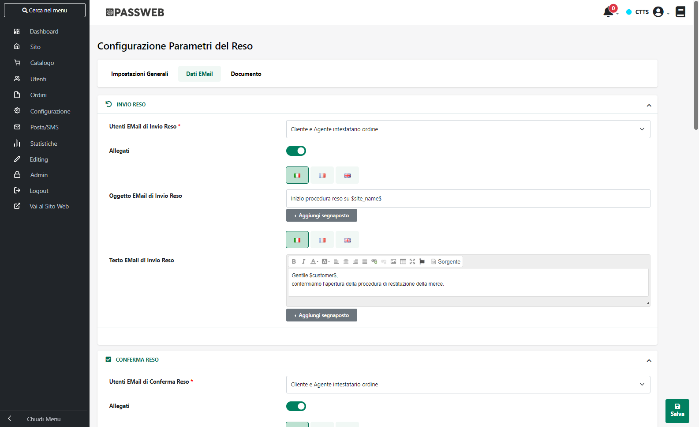
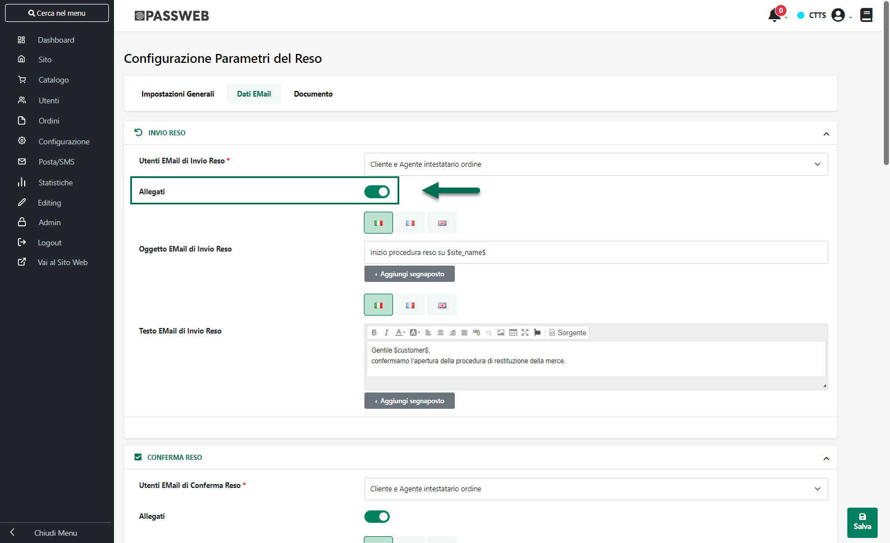
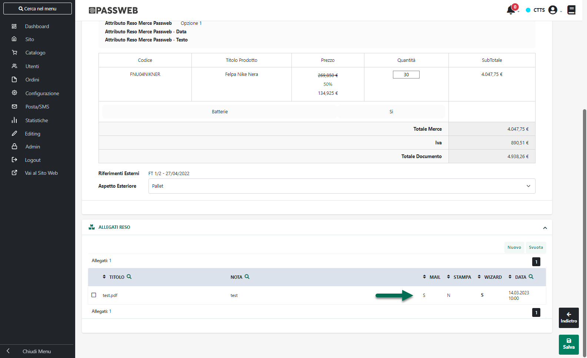
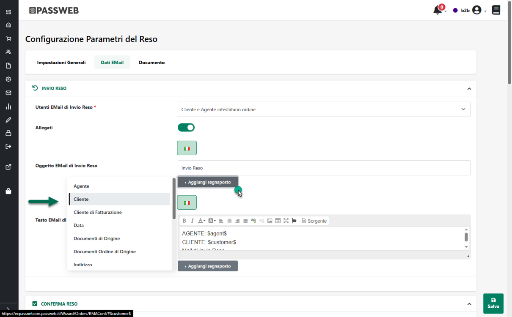
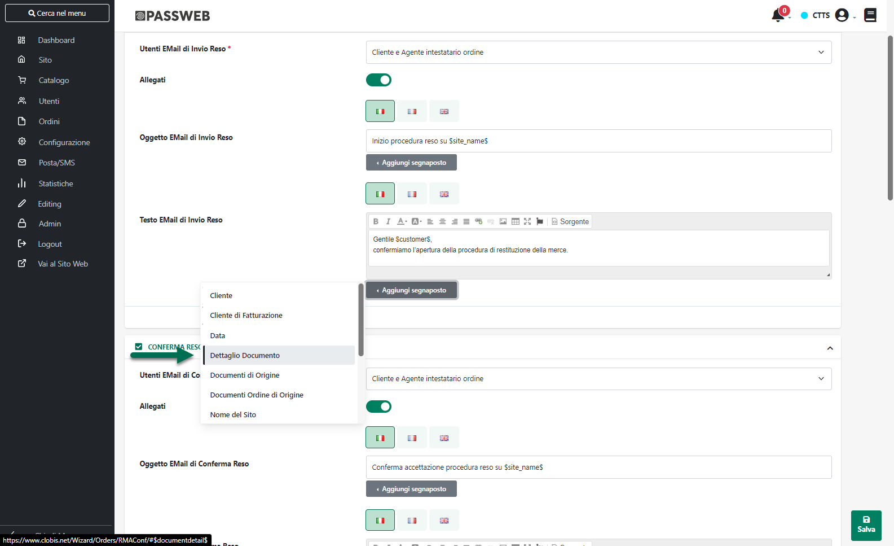
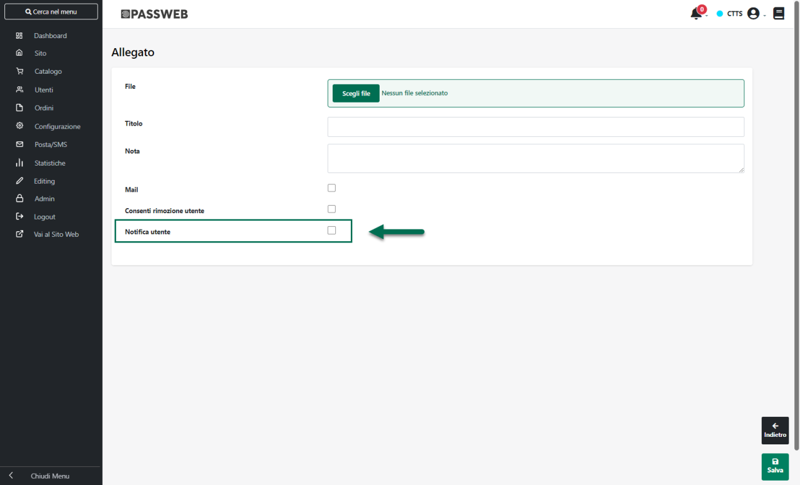

# DATI EMAIL

All'interno della sezione "**Dati Email**" è invece possibile, come
precedentemente evidenziato, indicare, in tutte le lingue gestite
all'interno del sito, i contenuti delle e-mail inviate in automatico
dall'applicazione in corrispondenza dei diversi possibili stati assunti
da un documento di reso merce.

{width="5.792361111111111in"
height="3.545138888888889in"}

Per ciascuna mail sarà possibile indicare i seguenti dati:

**Utenti Email di ... (Ecommerce Mexal):** consente di specificare le
tipologie di utenti cui dovrà essere inviata la corrispondente Email,
**indipendentemente dal fatto che la richiesta di reso merce sia stata
effettuata direttamente da un cliente o, per suo conto, da parte di un
Agente**.

E\' possibile selezionare uno dei seguenti valori:

- **Cliente e Agente intestatario Ordine:** selezionando questo valore
  la corrispondente mail verrà inviata al Cliente e all'Agente
  intestatario del documento che ha generato la richiesta di reso merce
  (per **Agente intestatario del documento** si intende l'Agente
  presente in testata del corrispondente documento Mexal e quindi l'
  Agente che ha realmente effettuato l'ordine per conto del cliente)

- **Cliente, Agente intestatario Ordine e Agente associato al Cliente:**
  selezionando questo valore la corrispondente mail verrà inviata al
  Cliente intestatario del documento che ha generato la richiesta di
  reso merce, all'Agente intestatario di questo stesso documento e
  all'Agente associato in Mexal al cliente intestatario del documento
  (che può non coincidere, soprattutto in una gestione gerarchica di
  Agenti e Sotto Agenti, con l'Agente intestatario del documento)

- **Cliente:** selezionando questo valore la corrispondente mail verrà
  inviata solo ed esclusivamente al cliente intestatario del documento
  che ha generato la richiesta di reso merce

- **Agente intestatario Ordine:** selezionando questo valore la
  corrispondente mail verrà inviata solo ed esclusivamente all'Agente
  intestatario del documento che ha generato la richiesta di reso merce.

- **Agente intestatario Ordine e Agente associato al Cliente:**
  selezionando questo valore la corrispondente mail verrà inviata solo
  ed esclusivamente all'Agente intestatario del documento che ha
  generato la richiesta di reso merce e all'Agente associato in Mexal al
  cliente intestatario del documento stesso

- **Agente intestatario Ordine e Agenti gerarchia:** la corrispondente
  mail verrà inviata all'Agente intestatario dell'ordine e a tutti gli
  Agenti che sono collocati, rispetto ad esso, ad un livello gerarchico
  superiore nella gerarchia agenti in uso all'interno del sito

- **Agente intestatario Ordine, Agente associato al cliente e Agenti
  gerarchia:** la corrispondente mail verrà inviata all'Agente che ha
  effettuato l'ordine, all'Agente associato, in Mexal, al cliente
  intestatario del documento e agli Agenti che, rispetto ad essi, sono
  collocati ad un livello gerarchico superiore nella gerarchia agenti in
  uso all'interno del sito

- **Cliente, Agente intestatario Ordine e Agenti gerarchia:** la
  corrispondente mail verrà inviata al cliente intestatario del
  documento, all'Agente intestatario dell'ordine e a tutti gli Agenti
  che sono collocati, rispetto ad esso, ad un livello gerarchico
  superiore nella gerarchia agenti in uso all'interno del sito

- **Cliente, Agente intestatario Ordine, Agente associato al cliente e
  Agenti gerarchia:** la corrispondente mail verrà inviata al cliente
  intestatario del documento, all'Agente che ha effettuato l'ordine,
  all'Agente associato, in Mexal, al cliente intestatario del documento
  e agli Agenti che, rispetto ad essi, sono collocati ad un livello
  gerarchico superiore nella gerarchia agenti in uso all'interno del
  sito

Il Check "**Allegati**" presente in corrispondenza di tutte le diverse
tipologie di Mail presenti all'interno di questa sezione

{width="5.792361111111111in"
height="3.5256944444444445in"}

consente invece di indicare se alle mail di quella determinata tipologia
dovranno essere allegati o meno anche tutti i file che hanno il campo
"**Mail**" impostato sul valore S

{width="5.792361111111111in"
height="3.5256944444444445in"}

In questo senso è bene ricordare che:

- gli allegati ad un determinato reso inseriti sul Front End dagli
  utenti del sito, avranno sempre il campo "Mail" impostato a S.

- i file allegati al documento operando da Docuvision (solo Ecommerce
  Mexal) avranno il campo Mail impostato a S solo nel caso in cui siano
  documenti di tipo "Stampa"

- per i file allegati ad un determinato documento operando direttamente
  dal Wizard di Passweb il campo Mail è impostabile direttamente in fase
  di upload dell'allegato stesso e, a differenza degli allegati inseriti
  da Front End e/o di quelli inseriti da Docuvision, potrà essere
  modificato in un qualsiasi momento.

Per maggiori informazioni relativamente a come poter allegare file ad un
reso operando direttamente dal Wizard di Passweb si veda anche il
successivo capitolo "*Gestione Resi -- Allegati Reso*" di questo
manuale.

**Oggetto E-Mail di ...:** consente di specificare l'oggetto della
corrispondente Email.

**Testo E-Mail di ...:** consente di definire il contenuto della
corrispondente Email. Il pulsante "**Sorgente**" presente nella barra
degli strumenti dell'editor di testo consente di editare il corpo della
mail lavorando direttamente a livello di codice HTML

Il pulsante "**Aggiungi Segnaposto**" presente in corrispondenza di ogni
campo di tipo "**Oggetto Email**" e "**Testo Email**" consente di
personalizzare l'oggetto e/o il testo della relativa mail inserendo
appositi segnaposto che verranno poi valorizzati dinamicamente da
Passweb a seconda dello specifico documento.

{width="5.5in"
height="3.4090277777777778in"}

Per comporre l'oggetto e/o il testo di una mail è quindi possibile
utilizzare i seguenti segnaposto:

- **Agente:** verrà sostituito, in fase di creazione della mail, con il
  nominativo dell'eventuale agente associato al relativo documento.

<!-- -->

- **Cliente:** verrà sostituito, in fase di creazione della mail, con il
  nominativo del cliente cui è destinata la merce

- **Cliente di fatturazione:** verrà sostituito, in fase di creazione
  della mail, con il nominativo del cliente che ha effettuato l'ordine

- **Data:** verrà sostituito, in fase di creazione della mail, con la
  data di emissione relativo documento

- **Documenti di Origine:** nel caso in cui l'ordine in questione
  dovesse essere trasformato prima in bolla e successivamente in
  fattura, questo segnaposto verrà sostituito, in fase di creazione
  della mail, con la sigla della bolla che ha generato la relativa
  fattura.

- **Documenti Ordine di Origine:** verrà sostituito, in fase di
  creazione della mail, con la / le sigla/e dei documenti "Ordine" che
  hanno generato il documento in esame. Tale segnaposto potrà quindi
  essere utilizzato, ad esempio, nella mail di evasione per indicare
  l'ordine o gli ordini che hanno generato la relativa bolla / fattura

- **Numero Documento:** verrà sostituito, in fase di creazione della
  mail, con l'identificativo Passweb del relativo documento

- **Sigla Documento:** verrà sostituito, in fase di creazione della
  mail, con la sigla associata dal gestionale al relativo documento

- **Nome del sito:** verrà sostituito, in fase di creazione della mail,
  con il nome assegnato al proprio sito web

- **Url del Sito:** verrà sostituito, in fase di creazione della mail,
  con l' url del proprio sito web

**ATTENZIONE!** A default nell'oggetto delle varie mail viene
automaticamente inserito il segnaposto relativo al Cliente intestatario
del documento di reso merce.

Per quel che riguarda invece il testo delle mail, oltre ai segnaposto
appena analizzati, sarà possibile utilizzare anche il segnaposto
**"Dettaglio Documento"**

{width="5.811805555555556in"
height="3.5256944444444445in"}

In questo senso è bene ricordare che il testo delle mail, configurabili
all'interno dei questa sezione del Wizard, è composto, essenzialmente,
da due distinti elementi:

- Un "**Testo libero**"

- **Il dettaglio del documento**, ossia i dati relativi allo specifico
  reso merce (elenco di articoli, totali, indirizzi di spedizione
  ecc...)

Il "Testo Libero" può essere inserito, gestito e personalizzato,
direttamente all'interno del relativo campo "Testo Email di...".

Il Dettaglio del documento, invece, può essere personalizzato sempre
dalla pagina "Configurazione Parametri del Reso", all'interno però della
sezione "Documento". Per maggiori informazioni in merito si vedano anche
i successivi capitoli di questo manuale.

**ATTENZIONE!** La mail di evasione reso tramite nota di credito avrà i
destinatari, l\'oggetto e il testo indicati all'interno della maschera
"*Configurazione Parametri del Reso -- Dati Email*". Il dettaglio
documento di questa mail invece, verrà costruito secondo quanto indicato
all'interno della sezione "Documento" della maschera "*Configurazione
Parametri dell'Ordine*"

Una volta definito e personalizzato il dettaglio del documento, questo
potrà poi essere inserito in una qualsiasi posizione del corpo della
relativa mail utilizzando, appunto, il segnaposto "Dettaglio Documento"
evidenziato in figura.

**ATTENZIONE!** Nel caso in cui si decida di non utilizzare nel testo di
una mail il segnaposto "Dettaglio Documento" i dati del relativo
documento verranno inseriti come ultimo elemento della corrispondente
mail

**NOTA BENE:** per attivare l'invio di una mail connessa ad un
particolare stato del documento di reso merce è sufficiente specificare
per essa un oggetto.

**ATTENZIONE: Nel caso in cui non venga indicato nessun oggetto la
relativa mail non verrà mai inviata.**

Sono gestite le seguenti mail :

- **E-Mail di Invio Reso:** mail che verrà inviata, agli utenti
  appositamente selezionati all'interno del relativo campo,
  contestualmente all'effettuazione sul sito di una richiesta di reso
  merce.

> **ATTENZIONE!** Nel caso in cui tra i destinatari sia stato
> selezionato il cliente intestatario del documento, questa stessa mail
> verrà inviata anche ad eventuali indirizzi associati al relativo
> indirizzo di spedizione merce.
>
> Allo stato attuale la richiesta di reso merce è in attesa di
> approvazione da parte dell'amministratore del sito. E' memorizzata
> solamente all\'interno del database del sito e si trova nello stato di
> \"**DA VERIFICARE**\"

- **E-Mail di Conferma Reso:** mail che verrà inviata, agli utenti
  appositamente selezionati all'interno del relativo campo,
  contestualmente all'approvazione da parte dell'amministratore del sito
  di una richiesta di reso merce.

> **ATTENZIONE!** Nel caso in cui tra i destinatari sia stato
> selezionato il cliente intestatario del documento, questa stessa mail
> verrà inviata anche ad eventuali indirizzi associati al relativo
> indirizzo di spedizione merce.
>
> Allo stato attuale la richiesta di reso merce è ancora memorizzata
> solamente nel database del sito trovandosi però nello stato di
> **CONFERMATA**.
>
> Tale richiesta potrà quindi essere inserita nel gestionale generando
> così il relativo documento di reso merce (RC o NC)

- **Rifiuto Reso:** mail che verrà inviata, agli utenti appositamente
  selezionati all'interno del relativo campo, contestualmente al rifiuto
  da parte dell'amministratore del sito, di una richiesta di reso merce.

> **ATTENZIONE!** Nel caso in cui tra i destinatari sia stato
> selezionato il cliente intestatario del documento, questa stessa mail
> verrà inviata anche ad eventuali indirizzi associati al relativo
> indirizzo di spedizione merce.
>
> Allo stato attuale la richiesta di reso merce è ancora memorizzata
> solamente nel database del sito trovandosi questa volta però nello
> stato di **ANNULLATA**.
>
> Tale richiesta non potrà quindi MAI essere inserita nel gestionale

- **Nota di Credito (Ecommerce Mexal):** mail che verrà inviata, agli
  utenti appositamente selezionati all'interno del relativo campo,
  contestualmente alla prima sincronizzazione utile e successiva alla
  trasformazione in Mexal di un Reso Merce (RC) in una Nota d'Accredito
  (NC).

> **ATTENZIONE!** Nel caso in cui tra i destinatari sia stato
> selezionato il cliente intestatario del documento, questa stessa mail
> verrà inviata anche ad eventuali indirizzi associati al relativo
> indirizzo di spedizione merce.

- **Notifica Allegato:** testo dell'e-mail di notifica che verrà inviata
  ai destinatari indicati all'interno del campo "Utenti Email Notifica
  Allegato", nel momento in cui, **operando direttamente dal Wizard di
  Passweb**, dovessero essere aggiunti ad un determinato documento di
  reso merce dei nuovi allegati con il flag "**Notifica Utente**"
  selezionato.

{width="5.811805555555556in"
height="3.5256944444444445in"}

> **ATTENZIONE!** Nel caso in cui, in fase di inserimento di un nuovo
> allegato da Wizard, non dovesse essere selezionato il flag "Notifica
> Utente", indipendentemente dal fatto di aver configurato o meno la
> mail di Notifica non verrà comunque inviata ai destinatari indicati
> nessun tipo di comunicazione.

**NOTA BENE:** per maggiori informazioni relativamente ai diversi
possibili stati assunti da un documento di reso merce, si veda anche il
successivo capitolo "Creazione e gestione di un Reso Merce".

