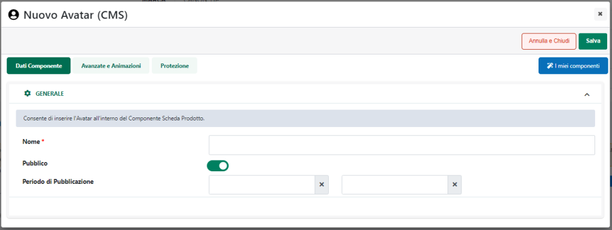
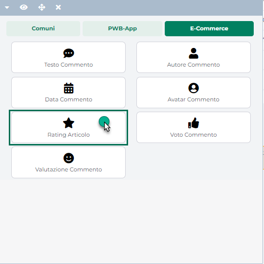
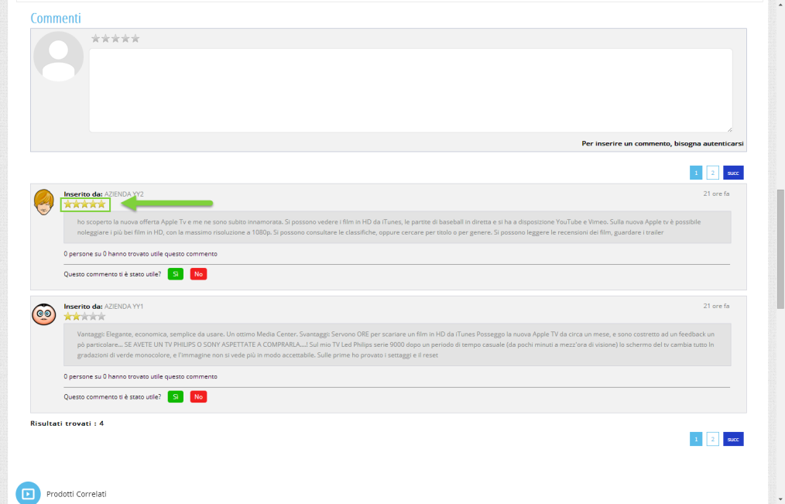
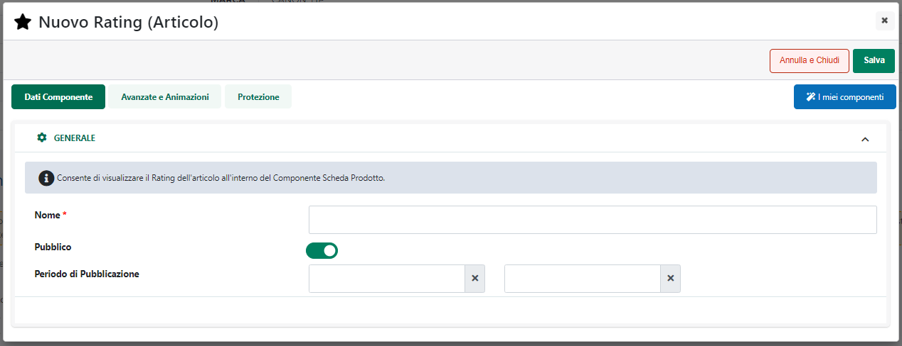
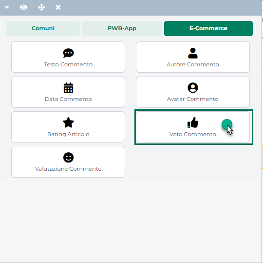
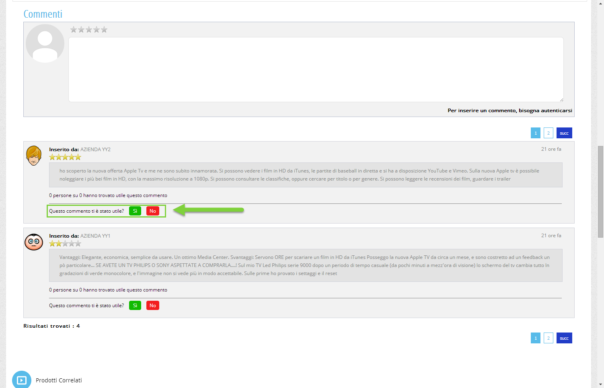

# GESTIONE ATTRIBUTI

La sezione **"Gestione Attributi"** consente di definire e gestire i
vari Attributi che potranno poi essere associati ai documenti di tipo
"Reso Merce" presenti all'interno del proprio sito Ecommerce.

**ATTENZIONE!** La gestione degli Attributi relativi ai documenti di
tipo Reso Merce, è in tutto e per tutto analoga alla gestione degli
Attributi relativi ad Ordini / Bolle / Fatture

Tali attributi altro non sono, quindi, se non un dato aggiuntivo che
potrà essere utilizzato all'interno del sito per fornire maggiori
informazioni sullo specifico documento e potranno essere valorizzati,
dipendentemente dalla loro natura, all'interno del Wizard di Passweb
oppure direttamente all'interno del gestionale.

Una volta effettuato l'accesso alla sezione "*Ordini -- Resi -- Gestione
Attributi*" del Wizard verrà quindi visualizzata la maschera
"**Attributi Documento**"

{width="5.779166666666667in"
height="3.5256944444444445in"}

contenente l'elenco di tutti gli Attributi attualmente gestiti
all'interno del proprio sito e-commerce in relazione a documenti di tipo
Reso Merce.

Il campo di ricerca attivabile cliccando sulla lente di ingrandimento,
presente in testata in corrispondenza della colonna "Nome", consente di
filtrare i dati in griglia sulla base dei valori presenti all'interno
della colonna stessa.

I pulsanti "**Modifica Attributo**"
({width="0.6555555555555556in"
height="0.175in"} ) ed "**Elimina Attributo**"
({width="0.6166666666666667in"
height="0.16875in"} ) presenti nella contestuale barra degli strumenti,
consentono, rispettivamente di modificare ed eliminare l'Attributo
attualmente selezionato in elenco.

All'interno di questa sezione sarà inoltre possibile, ovviamente,
definire dei nuovi Attributi che, nello specifico, potranno essere di
due diverse tipologie (dipendentemente dalla tipologia di sito
considerata):

- **Mexal:** sono **Attributi Ordine corrispondenti a specifici campi
  Mexal.** Ogni attributo di questa categoria può corrispondere:

  - **ad uno specifico campo di apposite "Videate anagrafiche
    PC/Clienti/Fornitori" di Mexal**.

  - **ad un campo MyDB che fa parte di una tabella di tipo "Anagrafica
    MyDB" utilizzata come estensione Riportabile delle tabelle Clienti /
    Fornitori**

- **Passweb:** sono **Attributi Ordine definiti direttamente in
  Passweb.** La creazione e la gestione di questi attributi è demandata
  interamente a Passweb. Ogni attributo di questo tipo **dovrà quindi
  essere definito e valorizzato direttamente all'interno del Wizard**
  del proprio sito e-commerce.

All'interno di questa sezione sarà inoltre possibile definire dei nuovi
Attributi che, nello specifico, potranno essere di due diverse tipologie

**ATTENZIONE!** Nel caso di siti Ecommerce collegati ad uno dei
gestionali Ho.Re.Ca. sono gestiti solo ed esclusivamente Attributi
Ordine di tipo Passweb

Cliccando quindi sul pulsante **"Nuovo Attributo"**
({width="0.5909722222222222in"
height="0.175in"} ) verrà visualizzata la maschera **"Attributi"**

{width="5.779166666666667in"
height="3.5256944444444445in"}

attraverso cui poter definire le caratteristiche dell'Attributo che si
sta realizzando, caratteristiche queste che potranno variare in
relazione alla tipologia dell'attributo stesso.

In particolare sarà quindi necessario specificare un valore per i
seguenti campi:

**Nome Attributo:** consente di definire il nome dell'Attributo Ordine
che si sta realizzando.

**Sorgente Dati (Ecommerce Mexal):** consente di specificare la
tipologia dell' Attributo che si intende realizzare. E' possibile
selezionare uno dei seguenti valori:

- **Mexal:** consente di creare un Attributo che può essere mappato su
  di uno specifico campo del gestionale:

> In questo caso sarà quindi necessario indicare un valore anche per i
> seguenti parametri:

- **Etichetta del campo:** consente di specificare, in tutte le lingue
  gestite all'interno del sito, l'etichetta identificativa
  dell'attributo che si sta realizzando.

- **Campo Mexal:** consente di definire, per ciascuna delle lingue
  gestite all'interno del sito, l'associazione tra l'Attributo che si
  sta realizzando e uno dei campi Mexal disponibili.

> In questo senso dal relativo menu a tendina sarà possibile
> selezionare:

- uno qualsiasi dei campi delle "Videate Anagrafica
  PC/Clienti/Fornitori" di Mexal

- uno qualsiasi dei campi MyDB precedentemente creati e che fa parte di
  una tabella di tipo "Anagrafica MyDB" utilizzata come **estensione
  Riportabile** delle tabelle Clienti / Fornitori.

> Per maggiori informazioni relativamente alla gestione dei campi MyDB
> si veda anche quanto indicato all'interno del capitolo
> "*Configurazione -- MyDB*" di questo manuale

Nel caso in cui il campo della Videata Anagrafica PC/Clienti/Fornitori
sia effettivamente presente all'interno del gestionale ma non ancora nel
menu a tendina sopra evidenziato sarà necessario, per prima cosa,
allineare la base dati di Passweb con quella di Mexal attraverso
l'apposita funzione di "Aggiornamento Attributi Mexal" (vedi anche
"Configurazione -- Parametri Sincronizzazione" di questo manuale).
Successivamente sarà necessaria anche una sincronizzazione per
consentire a Passweb di prelevare da Mexal i valori corretti per il
nuovo campo.

**NOTA BENE:** la valorizzazione degli Attributi di tipo Mexal dovrà
avvenire, documento per documento, direttamente all'interno del
gestionale. Sarà poi la sincronizzazione a preoccuparsi di riportare
tali valori all'interno del sito.

- **Passweb:** consente di creare un Attributo la cui gestione sarà
  demandata interamente a Passweb.

{width="5.779166666666667in"
height="3.5256944444444445in"}

> In questo caso sarà quindi necessario indicare un valore anche per i
> seguenti parametri:

- **Etichetta del campo:** consente di specificare, in tutte le lingue
  gestite all'interno del sito, l'etichetta identificativa
  dell'attributo che si sta realizzando.

- **Tipo di Campo:** consente di specificare il tipo di controllo di
  input che dovrà poi essere utilizzato, all'interno della
  corrispondente sezione del Wizard, per valorizzare il corrispondente
  attributo. E' possibile selezionare, dal relativo menu a tendina, uno
  dei seguenti valori:

  - **Testo:** il corrispondente attributo potrà poi essere valorizzato
    utilizzando un normale campo di input

  - **Data:** il corrispondente attributo dovrà essere di tipo "Data" e
    potrà quindi essere valorizzato selezionando la relativa data da un
    apposito calendario

  - **Drop Down:** il corrispondente attributo potrà essere valorizzato
    selezionando uno dei valori presenti all'interno di un apposito menu
    a tendina.

> Al salvataggio dell'Attributo verrà quindi visualizzata la sezione
> **"Gestione Opzioni"**

{width="5.610416666666667in"
height="3.7465277777777777in"}

> all'interno della quale poter definire l'elenco dei valori che
> l'attributo in questione potrà poi assumere.
>
> Per ogni elemento della griglia dovrà essere indicata, in ciascuna
> delle lingue gestite all'interno del sito, la relativa etichetta, e se
> tale elemento dovrà rappresentare o meno il valore di default per
> l'attributo in esame. Considerando che il controllo di tipo Drop Down
> permetterà, in fase di valorizzazione dell'attributo, di selezionare
> uno solo dei valori disponibili, uno soltanto dei valori inseriti in
> griglia potrà essere considerato come valore di default del controllo
> (evidenziato in grassetto).

- **Selezione Multipla:** il corrispondente attributo potrà essere
  valorizzato selezionando uno o più valori tra quelli presenti
  all'interno di un'apposita lista.

> Anche in questo caso al salvataggio dell'Attributo verrà visualizzata
> la sezione **"Gestione Opzioni"** all'interno della quale poter
> definire l'elenco dei valori che l'attributo in questione potrà poi
> assumere.
>
> Per ogni elemento della griglia dovrà essere indicata, in ciascuna
> delle lingue gestite all'interno del sito, la relativa etichetta, e se
> tale elemento dovrà rappresentare o meno il valore di default per
> l'attributo in esame.
>
> Considerando che, a differenza del caso precedente, il controllo di
> tipo "Selezione Multipla" permetterà, in fase di valorizzazione
> dell'attributo, di selezionare per esso uno o più valori tra quelli
> presenti in elenco, in questo caso sarà possibile definire due o più
> valori che dovranno poi essere considerati come valori di default per
> l'attributo stesso (e inseriti quindi, a default, nel box di destra).

- **Valore di default (per attributi di tipo Testo o Data):** consente
  di specificare un valore di default che potrà essere associato al
  relativo attributo nel caso in cui per esso non venga indicato, in
  maniera specifica, un valore differente. Per i controlli di tipo Drop
  Down e Selezione Multipla la definizione del valore di default avverrà
  all'interno della sezione "Gestione Opzioni" secondo quanto
  precedentemente indicato.

> In relazione al valore di default, impostabile per gli Attributi di
> tipo Passweb, è necessario fare alcune osservazioni di fondamentale
> importanza.
>
> **Occorre infatti considerare che il valore inserito all'interno di
> questo campo viene considerato, almeno inizialmente, solo ed
> esclusivamente come un valore propositivo.**
>
> Ciò significa, dunque, che portandosi nella corrispondente sezione
> della maschera "Gestione Ordini" da cui è possibile valorizzare gli
> Attributi di tipo Passweb associati allo specifico documento, tali
> attributi presenteranno già, a video, il loro valore di default,
> valore questo che però non sarà ancora memorizzato nel database di
> Passweb (e conseguentemente non sarà neppure visualizzato all'interno
> del sito).
>
> Al salvataggio del documento tutti i valori dei suoi attributi
> verranno memorizzati nel database di Passweb (e conseguentemente
> visualizzati all'interno del sito) passando quindi da semplici valori
> propositivi a valori di proprietà esclusiva di quello specifico
> documento. In queste condizioni dunque se, al salvataggio di un
> documento, fosse stato mantenuto, per un certo attributo, il suo
> valore di default nel caso in cui successivamente per questo stesso
> attributo dovesse essere specificato un valore di default differente,
> per i documenti già memorizzati tale variazione non avrebbe
> conseguenze e l'attributo in oggetto continuerebbe ad assumere i
> valori attualmente presenti nel database.
>
> **ATTENZIONE!** quanto appena detto NON è valido per i controlli di
> tipo "Drop Down" e "Selezione Multipla"
>
> Per questo tipo di controlli infatti un'eventuale variazione e/o
> eliminazione dei valori di default avvierà una procedura automatica
> che eseguirà l'aggiornamento e/o l'eliminazione del valore in esame
> per tutti i documenti (compresi quelli già slavati) per i quali è
> stata selezionata l'opzione in oggetto.

**NOTA BENE:** per maggiori informazioni in relazione alla
valorizzazione dei vari Attributi di tipo Passweb direttamente dal
back-end dell'applicazione si veda anche la sezione "Resi -- Gestione
Resi" di questo manuale.

- **Campo Univoco (solo per controlli di tipo "Testo" e "Data"):**
  selezionando questo parametro, verrà associata al corrispondente
  attributo, la proprietà di univocità. Questo significa dunque che in
  fase di valorizzazione dell'attributo stesso verrà effettuato un
  controllo di univocità in base al quale non sarà possibile specificare
  per documenti differenti lo stesso valore.

- **Campo Obbligatorio:** selezionando questo parametro, verrà associata
  al corrispondente attributo, la proprietà di obbligatorietà. Questo
  significa dunque che in fase salvataggio del documento all'interno del
  Wizard di Passweb, il corrispondente attributo dovrà essere
  obbligatoriamente valorizzato.

**NOTA BENE**: al salvataggio, lato Wizard, di un documento, verranno
effettuati i controlli di univocità e di obbligatorietà sugli attributi
associati a questo stesso documento. Verranno quindi visualizzati
eventuali messaggi di errore in relazione ad attributi obbligatori non
valorizzati e/o ad attributi univoci che riportano lo stesso valore per
documenti differenti.

