# GESTIONE RESI

All'interno di questa sezione è possibile visualizzare e gestire tutte
le richieste di Reso Merce effettuate dagli utenti del sito.

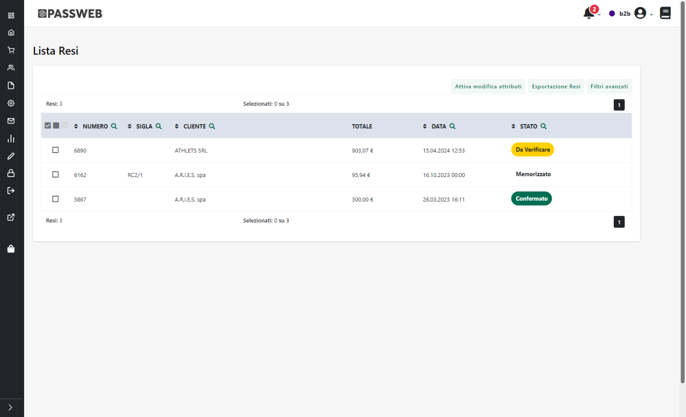

Tra i documenti presenti in elenco sono evidenziati in:

- **Giallo:** le richieste di reso merce ancora in stato DA VERIFICARE

- **Verde**: le richieste di reso merce approvate e quindi in stato
  CONFERMATO

- **Grigio**: le richieste di reso merce in stato di ANNULLATO

- **Azzurro**: le richieste di reso merce approvate, registrate
  all'interno del gestionale e gestite mediante documenti di tipo NC
  (Note d'accredito)

Per maggiori informazioni sui possibili stati assunti da una richiesta
di reso merce si veda anche il precedente capitolo "*Creazione e
gestione di un Reso Merce*" di questo manuale

Le prime tre icone presenti nell'intestazione della griglia consentono
di attivare e gestire la selezione multipla dei documenti in elenco

Nello specifico l'icona:

- : consente di attivare / disattivare
  la selezione multipla dei documenti in elenco

- 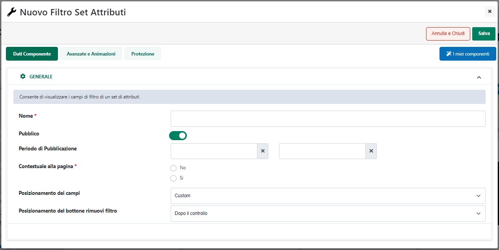: consente di selezionare in blocco
  tutti i documenti attualmente presenti in elenco

- 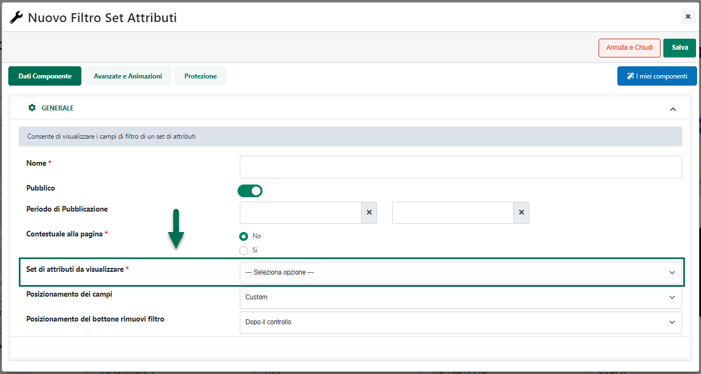: consente di deselezionare il blocco
  tutti i documenti presenti in elenco

**ATTENZIONE!** la selezione multipla è attiva, per ovvie ragioni, solo
ed esclusivamente in relazione alla funzionalità di "**Elimina Ordine**"

L' icona raffigurante due piccole frecce posta in testata ad ogni
singola colonna (
 ) consente invece di ordinare in maniera
crescente e/o decrescente, sulla base dei dati presenti all'interno di
quella stessa colonna, i dati in tabella

Il campo di ricerca attivabile cliccando sulla lente di ingrandimento,
presente in testata di ogni singola colonna, consente di filtrare i dati
in griglia sulla base dei valori presenti all'interno della colonna
stessa.

Nel caso in cui l'esigenza dovesse essere, ad esempio, quella di
filtrare e visualizzare, tra tutti i documenti presenti, solo ed
esclusivamente quelli riferiti ad un certo cliente, sarà sufficiente
cliccare sulla lente di ingrandimento presente in testata alla colonna
"Cliente", inserire quindi nel corrispondente campo di ricerca il
nominativo del cliente da ricercare, e cliccare infine sull'icona
indicata in figura per avviare la ricerca.

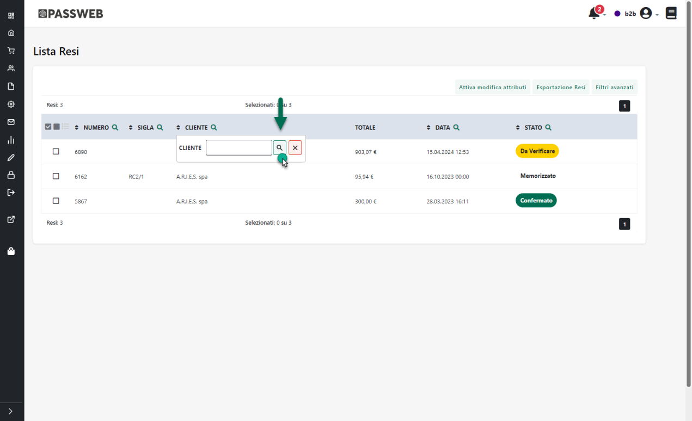

In generale è quindi possibile filtrare i documenti in griglia per:

- **Numero:** consente di filtrare i documenti in elenco sulla base del
  loro codice identificativo in Passweb;

- **Sigla:** consente di filtrare i documenti in elenco sulla base della
  sigla del relativo documento gestionale.

- **Cliente:** consente di filtrare i documenti in elenco sulla base del
  cliente intestatario del documento stesso

- **Data:** consente di filtrare i documenti in elenco per data

- **Stato:** consente di filtrare i documenti in elenco sulla base del
  loro stato (nuovo, memorizzato, da verificare, annullato ecc ...).

Una volta impostato un filtro di ricerca, per poterlo poi eliminare sarà
sufficiente cliccare sull'icona raffigurante una piccola lente di
ingrandimento con un -- all'interno (
 ) che comparirà in testata alla colonna
in corrispondenza della quale è stato impostato il filtro stesso.

Volendo poi è anche possibile applicare filtri di ricerca più evoluti e
basati su campi non immediatamente visibili in griglia.

Il pulsante "**Filtri Avanzati**" (
 ) presente nella barra degli strumenti, consente
infatti di aprire una sezione di ricerca contenete un query builder
utilizzabile per creare e customizzare il proprio filtro di ricerca

Il pulsante "**Aggiungi un nuovo filtro**" consente di visualizzare
l'elenco dei campi su cui poter impostare la condizione di filtro.

Nello specifico, grazie ai filtri avanzati sarà possibile costruire il
proprio filtro di ricerca documenti utilizzando i seguenti campi:

- **Data** **Documento**: consente di filtrare i documenti in elenco per
  data

- **Numero Documento**: **:** consente di filtrare i documenti in elenco
  sulla base del loro codice identificativo in Passweb

- **Sigla Documento**: consente di filtrare i documenti in elenco sulla
  base della sigla dell\'ordine/documento del gestionale

- **Stato Documento**: consente di filtrare i documenti in elenco sulla
  base del loro stato

- **Codice Utente Fatturazione**: consente di filtrare i documenti in
  elenco sulla base dell'utente intestatario

- **Articoli**: consente di filtrare i documenti in elenco sulla base
  degli articoli in essi contenuti

Una volta selezionato il campo su cui impostare il filtro, sarà poi
necessario selezionare l'operatore relazionale (uguale, contiene, è in
...) da utilizzare all'interno del filtro stesso ed il valore che il
campo in esame dovrà assumere affinché la condizione impostata possa
essere effettivamente soddisfatta.

In questo senso, ovviamente, gli operatori disponibili e le modalità di
inserimento del valore da soddisfare potranno cambiare in relazione alla
tipologia di campo su cui è stato impostato il filtro.

Nel caso in cui, ad esempio, il filtro dovesse essere impostato sul
campo "**Data**" gli operatori relazioni disponibili saranno solo
"**maggiore o** **uguale**" e "**minore o uguale**" e il valore da
impostare sarà, ovviamente, una specifica data.

Impostando invece il filtro sul campo "**Articoli**", gli operatori
relazioni disponibili saranno "**è in**" e "**non è in**" mentre il
valore da ricercare sarà gestito con un campo ad autocompletamento in
cui poter inserire il codice o il titolo dell'articolo da ricercare.

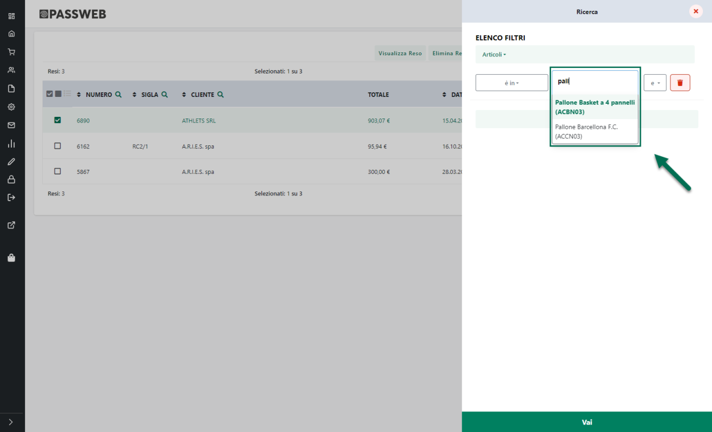

**E' inoltre possibile concatenare tra loro due o più condizioni di
filtro, basate anche su più campi differenti, in maniera tale da
realizzare delle query più o meno complesse a seconda del tipo di
risultato che si desidera ottenere.**

Al termine di ogni condizione verrà infatti visualizzata una **"e"**,
corrispondente all'operatore logico "**AND"**, e utilizzata, a default,
per concatenare tra loro eventuali ulteriori condizioni che dovranno
essere considerate nella costruzione della query di ricerca dei
documenti.

Cliccando su questo elemento verranno visualizzati tutti gli operatori
logici da poter utilizzare nella costruzione della propria query.

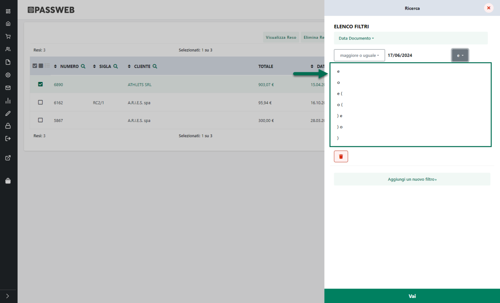

In questo senso, come precedentemente evidenziato, la **"e"**
corrisponderà all'operatore logico **AND** mentre la **"o"**
all'operatore logico **OR.** Le eventuali parentesi, poste prima o dopo
questi operatori, potranno essere utilizzate, esattamente come avviene
in algebra, per specificare quali condizioni dovranno essere valutate
prima e quali dopo.

Il pulsante "**Vai**" presente nella parte bassa del pannello di ricerca
consente di applicare il filtro impostato e chiudere automaticamente il
pannello stesso.

Infine, per poter eliminare i filtri di ricerca avanzati eventualmente
impostati è possibile procedere in due modi diversi:

- Aprire il pannello di ricerca dei filtri avanzati, eliminare tutte le
  condizioni di filtro eventualmente impostate cliccando per questo sul
  pulsante raffigurante un piccolo cestino (
  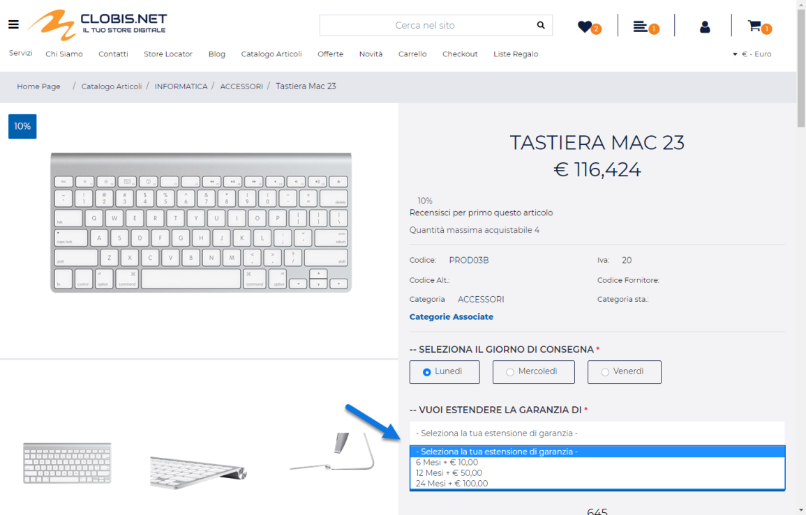 ) posto in corrispondenza di ogni
  singola condizione e cliccare, infine, sul pulsante "Vai"

- Cliccare sul pulsante "**Elimina filtri avanzati**" (
  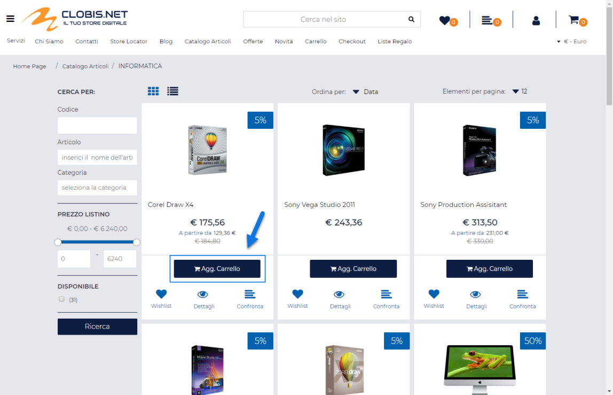 ) che verrà visualizzato, una volta
  applicato un filtro di questo tipo, nella relativa barra degli
  strumenti

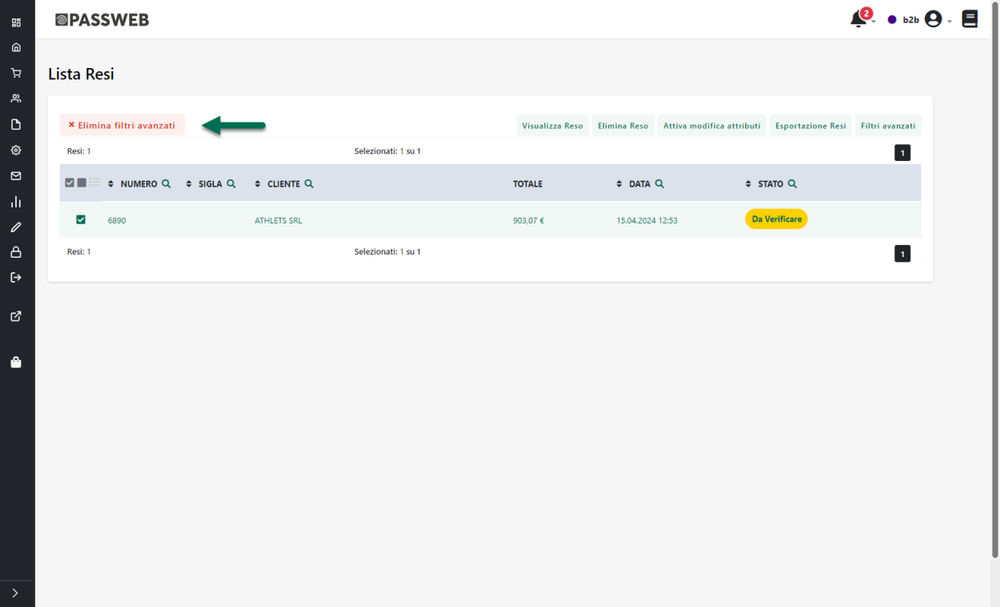

**ATTENZIONE! i filtri applicati mediante i campi di ricerca presenti in
testata alla griglia non sono compatibili con i filtri di ricerca
avanzati**

Ciò significa dunque che applicando un filtro di ricerca avanzato
verranno automaticamente eliminati eventuali filtri in colonna
precedentemente applicati e, allo stesso modo, applicando un filtro in
colonna verranno prima eliminati in maniera automatica eventuali filtri
avanzati

Tornando alla barra degli strumenti, infine, oltre al pulsante "Filtri
Avanzati" precedentemente esaminato, potranno essere visualizzati anche
ulteriori pulsanti che consentono rispettivamente di:

- **Elimina Reso**
  (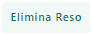 ): permette di eliminare dal database del sito la
  richiesta di reso merce attualmente selezionata.

> In relazione a questa specifica funzionalità è possibile attivare e
> gestire la selezione multipla dei documenti in elenco in maniera tale
> da eliminare, se necessario, più elementi contemporaneamente
>
> **ATTENZIONE!** Nel caso in cui la richiesta in esame abbia già
> prodotto il relativo documento gestionale, per poterla eliminare in
> maniera definitiva è necessario eliminarla anche all'interno del
> gestionale o, quanto meno, impostarla affinchè non possa più essere
> esportata e visualizzata all'interno del sito.

- **Memorizza Reso**
  ( ): permette di inserire all'interno del
  gestionale la richiesta di reso merce attualmente selezionata in
  elenco generando quindi il relativo documento (RC o NC) sulla base
  delle impostazioni settate nella maschera di configurazione resi
  precedentemente analizzata.

> **ATTENZIONE! Il pulsante "Memorizza Reso" verrà visualizzato,
> ovviamente, solo per quelle richieste di reso merce già visualizzare
> ed approvate e che si trovano quindi nello stato di "CONFERMATO"**

- **Esportazione Resi**
  (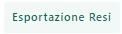 ): consente di esportare i dati relativi ai
  documenti presenti in griglia all'interno di tre distinti file:

  - **Testata.csv --** file contenente i dati di testa dei documenti
    esportati

  - **Righe.csv** -- file contente i dati di riga dei documenti
    esportati

  - **Taglie.csv** (solo Ecommerce Mexal) **--** file contenente i dati
    relativi ad eventuali articoli a taglie presenti nei documenti
    esportati

> Il campo "**id**" presente all'interno del file "Testata.csv"
> rappresenta l'identificativo del relativo documento ed è collegato al
> campo "**idDocumento**" presente all'interno del file "Righe.csv".
> Grazie a questo collegamento è quindi possibile individuare tutte le
> righe relative ad uno specifico documento.
>
> Allo stesso modo il campo "**idRigaDocumento**" presente sia
> all'interno del file "Taglie.csv" che all'interno del file "Righe.csv"
> consente di legare i dati relativi ad eventuali taglie alla rispettiva
> riga del documento.
>
> Cliccando su questo pulsante verrà visualizzata la maschera
> "**Esportazione Resi**"

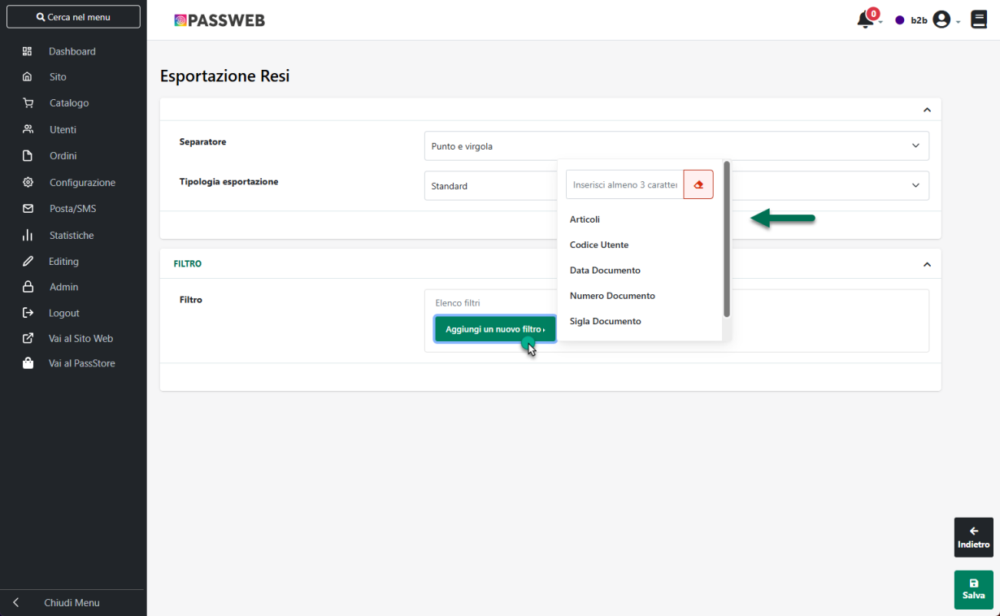

> all'interno della quale poter definire il carattere separatore che
> dovrà essere utilizzato nella creazione dei vari file csv (campo
> **Separatore**) e, soprattutto, all'interno della quale poter
> impostare eventuali filtri di esportazione definibili sulla base di:

- Data Documento

- Numero Documento

- Sigla Documento

- Tipologia Documento

- Codice Utente

<!-- -->

- **Attiva Modifica Attributi**
  ( ): consente di attivare la modalità
  "**Modifica Attributi**" in cui poter visualizzare il dettaglio di
  ogni singolo documento presente in elenco con la possibilità di
  modificare eventuali Attributi Passweb, presenti all'interno del
  documento stesso

- **Disattiva Modifica Attributi**
  (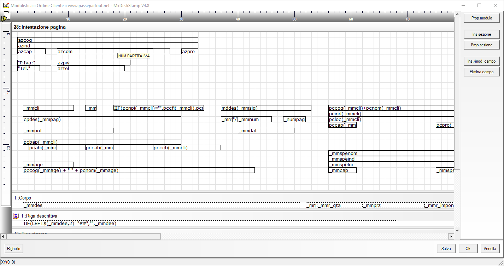 ): consente di disattivare la modalità di
  "**Modifica Attributi**". Una volta disabilitata tale modalità sarà
  sempre possibile accedere alla visualizzazione del dettaglio di uno
  qualsiasi dei documenti presenti in elenco questa volta però in sola
  visualizzazione senza cioè poter modificare in alcun modo eventuali
  Attributi presenti all'interno del documento.

> **ATTENZIONE!** Per maggiori informazioni relativamente alla gestione
> degli Attributi su documenti di tipo "Reso Merce" si veda anche quanto
> indicato all'interno del capitolo "*Resi -- Gestione Attributi*" di
> questo manuale

- **Visualizza Reso**
  ( ): consente di visualizzare e gestire il documento
  attualmente selezionato in elenco.

> Cliccando su questo pulsante si verrà infatti ricondotti alla maschera
> di dettaglio del documento selezionato, maschera questa suddivisa in
> due distinte sezioni:

- Dettaglio Documento -- consente di visualizzare ed eventualmente
  modificare (a livello di attributi) il dettaglio del documento in
  esame

- Allegati -- consente di gestire eventuali file allegati al documento
  in esame

> Per maggiori informazioni relativamente ai contenuti di queste due
> sezioni si vedano anche i successivi capitoli di questo manuale.

