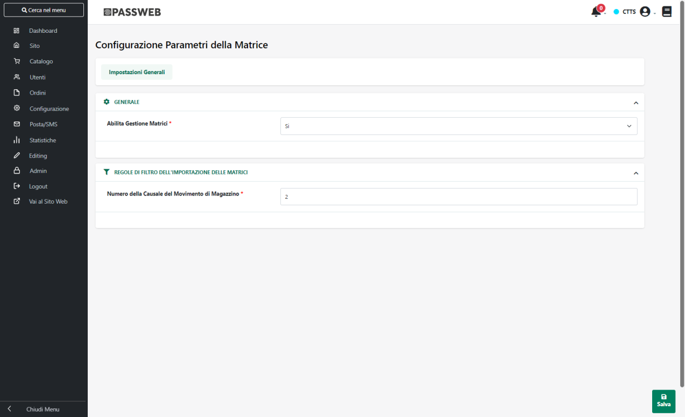
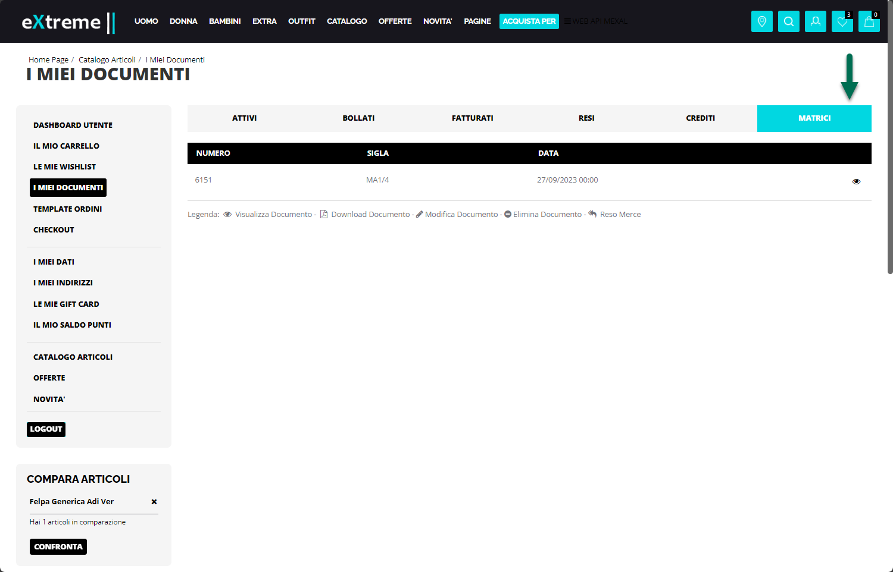
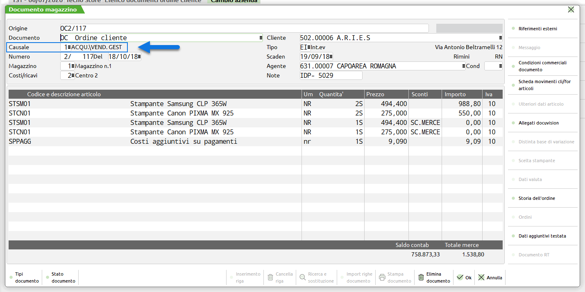

# CONFIGURAZIONE MATRICI

All'interno di questa sezione è possibile impostare tutti i parametri
necessari per poter specificare come dovranno essere gestiti all'interno
del proprio sito Ecommerce i documenti di tipo Matrice.

In particolare occorrerà indicare un valore per i seguenti parametri:

- **Abilita Gestione Matrici:** consente di decidere se abilitare o meno
  all'interno del sito la gestione dei documenti di tipo matrice (MA --
  MX).

> Impostando tale parametro a **Si,** verrà quindi visualizzata, tanto
> all'interno del componente "Checkout" quanto all'interno del
> Componente "Checkout Custom", la sezione **Matrici** mediante la quale
> ogni singolo utente avrà la possibilità di visualizzare e gestire il
> dettaglio di ogni singolo documento di tipo Matrice creato sul
> gestionale ed esportato all'interno del sito.

> Per maggiori informazioni relativamente a come poter esportare da
> Mexal documenti di tipo Matrice si veda anche il capitolo
> "*Configurazione Gestionale -- Sincronizzazione Ordini -- Mexal
> Esportazione di Documenti creati da Gestionale*" di questo manuale

- **Numero della Causale del Movimento di Magazzino:** consente di
  specificare il numero della Causale dei Movimenti di Magazzino cui
  dovranno essere associati all'interno del gestionale i documenti di
  tipo Matrice che verranno poi prelevati ed esportati sul sito.

> **ATTENZIONE! E' possibile visualizzare e gestire sul sito solo ed
> esclusivamente i documenti di tipo Matrice che sono stati associati,
> lato gestionale, alla Causale indicata all'interno di questo campo**

> Alla sincronizzazione verranno quindi eliminati automaticamente
> eventuali documenti di tipo Matrice presenti sul sito ma non associati
> alla Causale indicata all'interno di questo campo.

