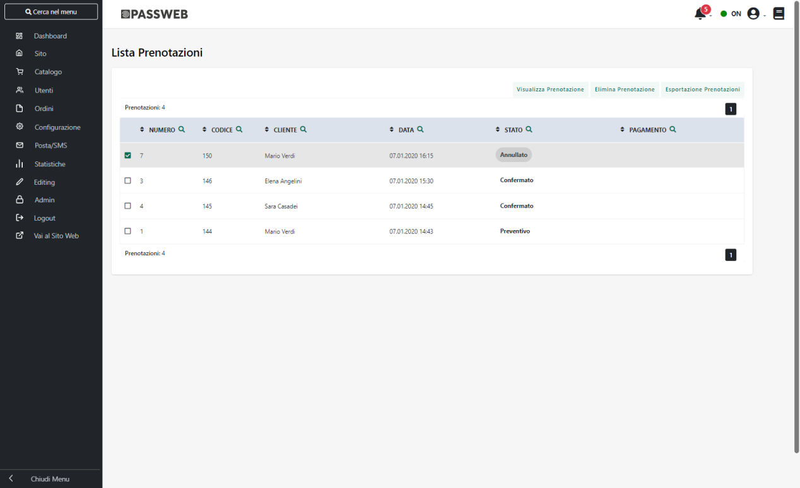
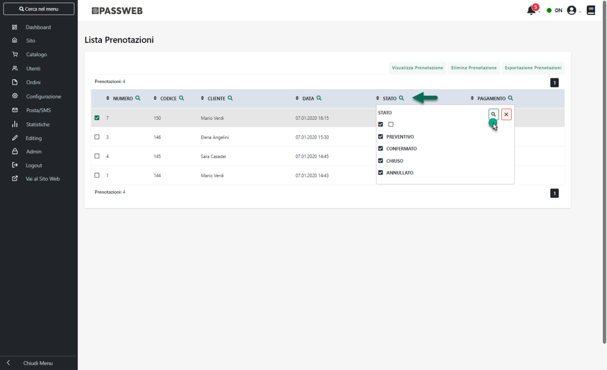
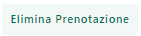
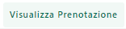
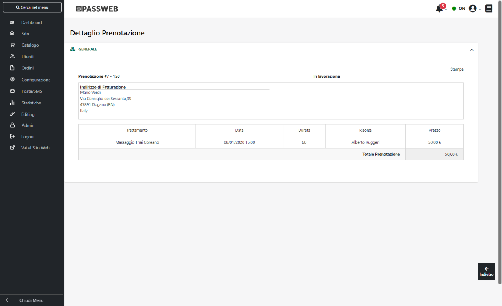
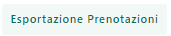
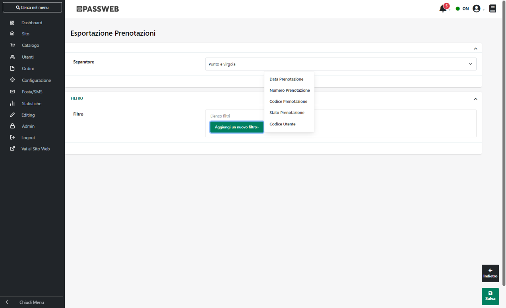

# GESTIONE PRENOTAZIONI

All'interno di questa sezione, disponibile solo per i siti Ecommerce
collegati a Beauty o Menu, è possibile disporre di un elenco completo,
con relativo dettaglio, di servizi e/o trattamenti effettuate dai vari
clienti all'interno dell'apposita sezione del sito web.

All'interno di questa pagina verrà quindi visualizzata la maschera
**"Lista Prenotazioni"**

contenente l'elenco di tutte le prenotazioni effettuate o esportate sul
sito.

Il campo di ricerca attivabile cliccando sulla lente di ingrandimento,
presente in testata di ogni singola colonna, consente di filtrare i dati
in griglia sulla base dei valori presenti all'interno della colonna
stessa.

Nel caso in cui l'esigenza dovesse essere, ad esempio, quella di
filtrare e visualizzare, tra tutti i documenti presenti, solo ed
esclusivamente quelli in un certo stato, sarà sufficiente cliccare sulla
lente di ingrandimento presente in testata alla colonna "Stato",
selezionare tra quelli presenti in elenco lo stato o gli stati per cui
si desidera effettuare la ricerca, e cliccare infine sull'icona indicata
in figura per avviare la ricerca.

In generale è quindi possibile filtrare i documenti in griglia per:

- **Numero:** consente di poter filtrare le prenotazioni da visualizzare
  a seconda del loro numero identificativo in Passweb;

- **Codice:** consente di poter filtrare le prenotazioni da visualizzare
  a seconda del loro codice Ho.Re.Ca.;

- **Data:** consente di filtrare i documenti in elenco per data

- **Stato:** consente di poter filtrare i documenti da visualizzare a
  seconda del loro stato (preventivo, confermato, chiusi, annullato);

Una volta impostato un filtro di ricerca, comparirà in testata alla
colonna in corrispondenza della quale è stato impostato il filtro stesso
una nuova icona raffigurante una lente di ingrandimento con un --
all'interno. Cliccando su questa icona sarà possibile eliminare il
filtro.

Infine è anche possibile ordinare, in maniera crescente e/o decrescente,
gli elementi in griglia cliccando semplicemente sull'icona raffigurante
due piccole frecce posta anch' essa in testata ad ogni singola colonna
della griglia

I pulsanti nella barra degli strumenti consentono di gestire la
specifica prenotazione.

Nello specifico il pulsante:

- **Elimina Prenotazione** (
   ): consente di eliminare la
  prenotazione attualmente selezionata in elenco

- **Visualizza Prenotazione** (
   ): consente di visualizzare il
  dettaglio della prenotazione attualmente selezionata.

> Il pulsante "**Stampa**" nel dettaglio della prenotazione, consente
> invece di stampare la prenotazione stessa utilizzando il Template di
> Stampa definito all'interno del Tab "Documento" presente alla pagina
> "*Ordini -- Gestione Prenotazioni -- Configurazione* " del Wizard.
>
> Per maggiori informazioni in merito a questo template di stampa si
> veda anche il successivo capitolo di questo manuale.

**Esporta Prenotazioni** (
 ): consente di esportare i dati relativi
alle prenotazioni presenti in griglia all'interno di due distinti file:

- **Testata.csv --** file contenente i dati di testa dei documenti
  esportati

- **Righe.csv** -- file contente i dati di riga dei documenti esportati

Il campo "**id**" presente all'interno del file "Testata.csv"
rappresenta l'identificativo del relativo documento ed è collegato al
campo "**idDocumento**" presente all'interno del file "Righe.csv".
Grazie a questo collegamento è quindi possibile individuare tutte le
righe relative ad uno specifico documento.

Cliccando su questo pulsante verrà visualizzata la maschera
"**Esportazione Prenotazioni**"

all'interno della quale poter definire il carattere separatore che dovrà
essere utilizzato nella creazione dei vari file csv (campo
**Separatore**) e, soprattutto, all'interno della quale poter impostare
eventuali filtri di esportazione definibili sulla base di:

- Data Prenotazione

- Numero Prenotazione

- Codice Prenotazione

- Stato Prenotazione

- Codice Utente

