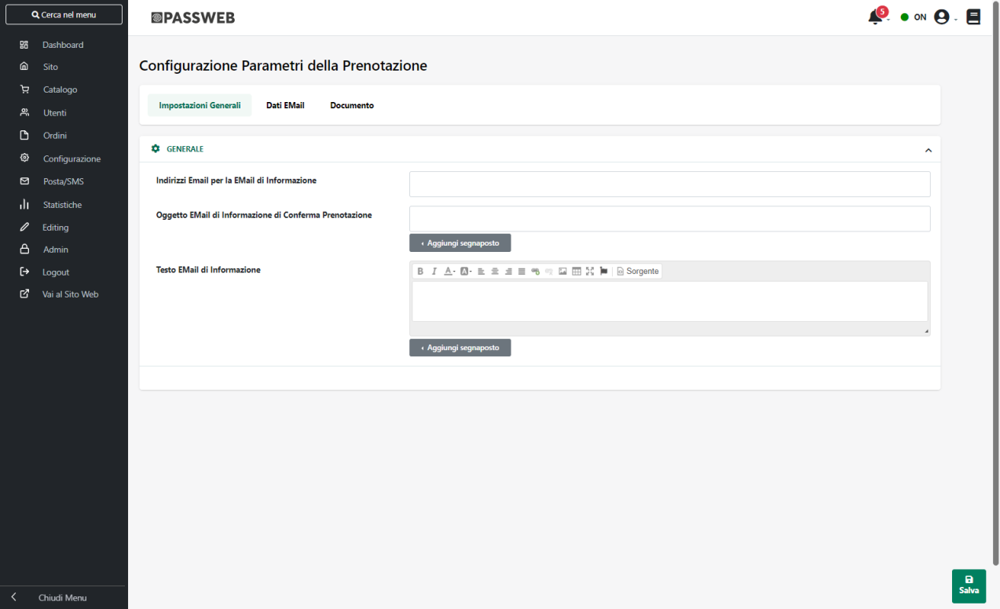
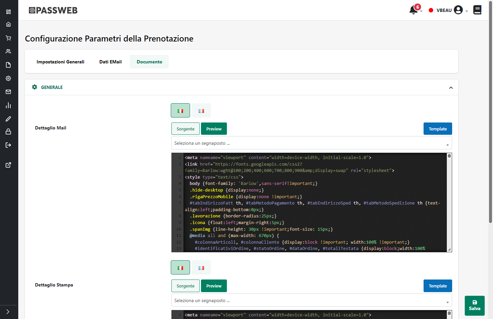

# CONFIGURAZIONE

All'interno di questa sezione è possibile impostare tutti i parametri
necessari per poter specificare come dovranno essere gestite all'interno
del proprio sito le diverse prenotazioni.

{width="5.792361111111111in"
height="3.532638888888889in"}

Nello specifico il campo:

- **Indirizzi Email per la Email di Informazione:** consente di
  specificare uno o più indirizzi mail (separati da ;) cui verrà
  inoltrata l' "**Email di Informazione**";

- **Oggetto Email di Informazione di Conferma Prenotazione:** consente
  di specificare l'oggetto della mail di Informazione contestuale alla
  conferma della prenotazione.

- **La mail di Informazione di Conferma Ordine** verrà inviata
  all'inserimento della relativa prenotazione sul gestionale (e quindi
  assieme alla mail di Conferma Prenotazione) agli indirizzi indicati
  nel precedente campo "**Indirizzi Email per la Email di
  Informazione".**

> Il Testo della mail sarà esattamente quello inserito nel campo "Testo
> Email di Informazione" seguito ovviamente dal riepilogo della
> prenotazione.
>
> Il pulsante "**Aggiungi Segnaposto**" presente in corrispondenza di
> ogni campo di tipo "Oggetto Email" consente di personalizzare
> l'oggetto della relativa mail inserendo appositi segnaposto che
> verranno poi valorizzati dinamicamente da Passweb a seconda di che
> effettua l'ordine e/o di dove viene inviata la merce.
>
> Per comporre l'oggetto di una mail è quindi possibile utilizzare i
> seguenti segnaposto:
>
> **Cliente:** verrà sostituito, in fase di creazione della mail, con il
> nominativo del cliente che ha effettuato la prenotazione.
>
> **Data:** verrà sostituito, in fase di creazione della mail, con la
> data della prenotazione
>
> **Numero Documento:** verrà sostituito, in fase di creazione della
> mail, con l'identificativo Passweb del relativo documento
>
> **Sigla Documento:** verrà sostituito, in fase di creazione della
> mail, con la sigla associata dal gestionale al relativo documento

All'interno della sezione "**Dati Email**" è invece possibile, indicare
in tutte le lingue gestite all'interno del sito, i contenuti delle
e-mail inviate in automatico dall'applicazione in corrispondenza dei
diversi possibili stati che potranno assumere le prenotazioni
all'interno del sito.

- **Oggetto Email di Conferma Prenotazione:** consente di specificare
  l'oggetto della mail di contestuale alla conferma della prenotazione.

- **Indirizzi Email in CCN**: consente di indicare uno o più indirizzi
  email (separati da ; ) cui inoltrare in copia nascosta la mail di
  conferma prenotazione.

- **Testo E-Mail di Conferma Prenotazione:** testo della mail che verrà
  inviata, all\'indirizzo specificato dal cliente all\'atto della
  registrazione sul sito subito dopo aver confermato la prenotazione di
  un servizio/trattamento.

All'interno della sezione **Documento** è possibile infine gestire e
personalizzare il Template utilizzato per la costruzione e la
visualizzazione del dettaglio della prenotazione nelle Stampe e nelle
varie Email inviate in automatico dall'applicazione

Nel momento in cui l'esigenza dovesse essere quella di personalizzare,
**sia a livello grafico che a livello di contenuti**, ad esempio, la
Stampa delle prenotazioni o il dettaglio che viene inserito, per questi
stessi documenti, nella varie mail inviate in automatico
dall'applicazione, sarà necessario agire all'interno dei relativi campi
presenti nel Tab "**Documento**".

{width="5.441666666666666in"
height="3.5256944444444445in"}

Nello specifico, i campi presenti all'interno di questa sezione
consentono rispettivamente di:

- **Dettaglio Mail:** consente di impostare e personalizzare il Template
  utilizzato per la costruzione del dettaglio delle Prenotazioni,
  dettaglio questo che verrà poi inserito nelle varie Email inviate in
  automatico dall'applicazione in corrispondenza dei diversi possibili
  stati assunti da questa particolare tipologia di documenti

> **ATTENZIONE!** si ricorda che i diversi client email interpretano
> ciascuno in maniera diversa il markup HTML utilizzato per costruire la
> mail e supportano solo determinate proprietà CSS (maggiori
> informazioni in merito possono essere trovate anche a questo indirizzo
> <https://www.caniemail.com/> ).
>
> In conseguenza di ciò, in fase di costruzione di questo Template, è
> sempre consigliabile utilizzare un markup e delle proprietà CSS
> correttamente interpretabili dalla maggioranza dei client email
> (tipicamente sarà necessario lavorare con delle tabelle)

- **Dettaglio Stampa:** consente di impostare e personalizzare il
  Template utilizzato per la costruzione del dettaglio delle
  Prenotazioni, dettaglio questo che verrà poi utilizzato nel momento in
  cui si dovesse decidere di stampare, da Area Riservata o da Front end,
  uno di questi documenti

> **ATTENZIONE!** come per le mail anche in fase di Stampa, non tutto il
> markup HTML e non tutte le proprietà CSS potrebbero essere
> interpretate come avviene effettivamente all'interno di una pagina web
>
> Anche in questo caso quindi, in fase di costruzione di questo
> Template, è sempre consigliabile utilizzare un markup e delle
> proprietà CSS il più standard possibile (tipicamente, come per le
> mail, il consiglio è quello di lavorare sempre con delle tabelle)

**ATTENZIONE!** **per maggiori informazioni relativamente all'utilizzo
dei campi "Dettaglio Mail" e "Dettaglio Stampa" si rimanda a quanto già
indicato all'interno di questo manuale per gli analoghi campi relativi,
ad esempio, a Ordini / Bolle / Fatture** (capitolo "*Ordini --
Configurazione Ordini -- Documento*")
