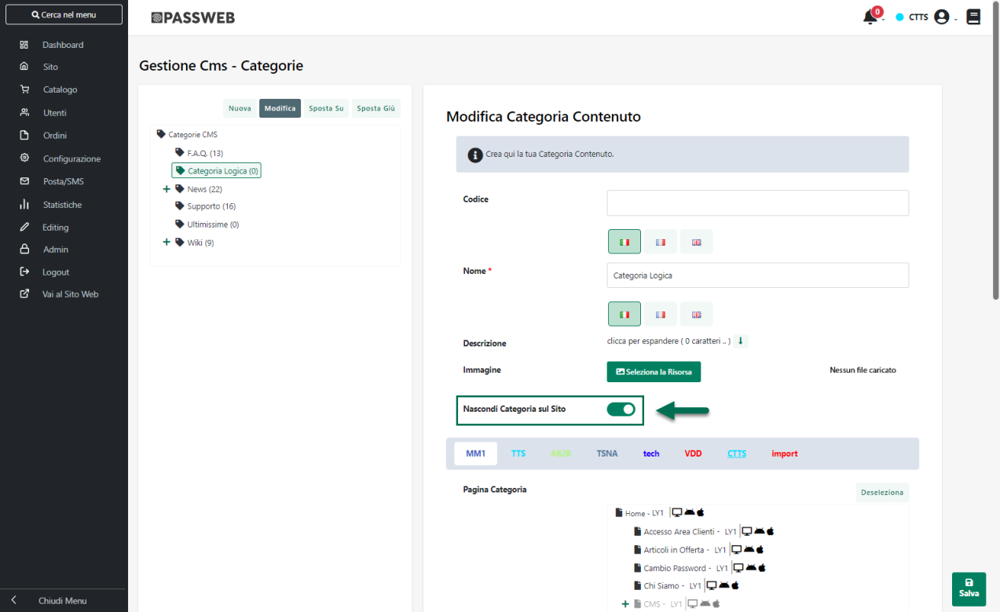
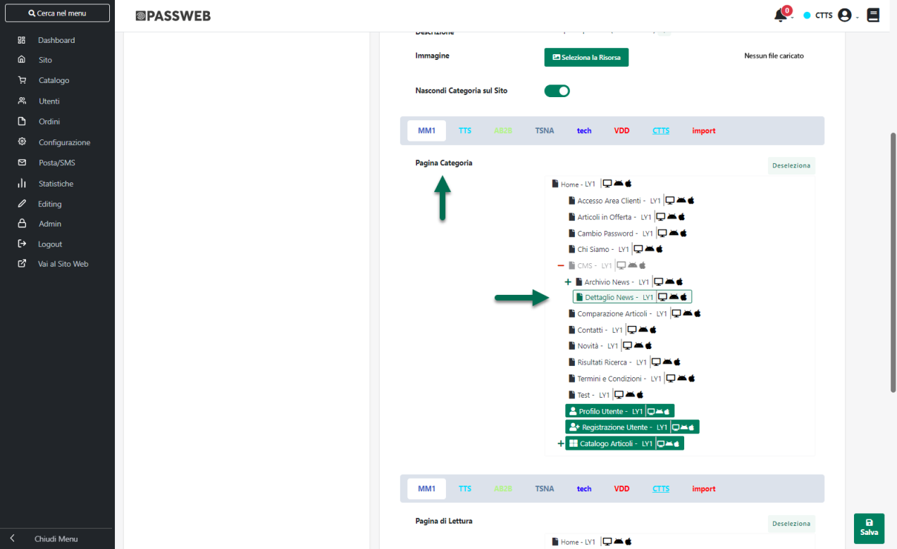
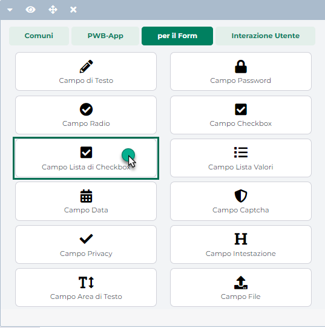
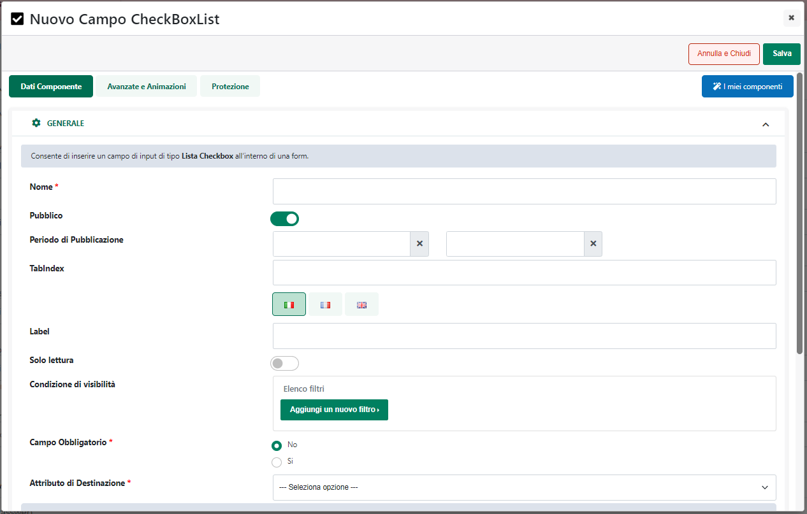
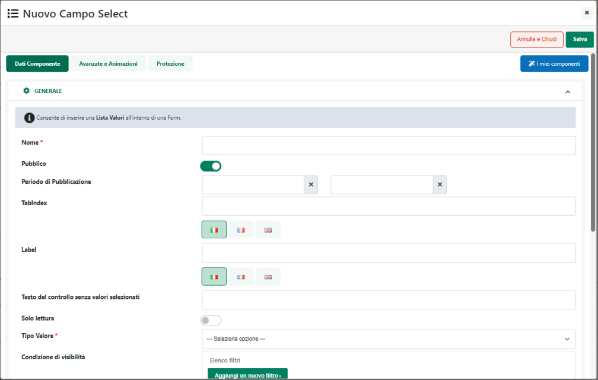
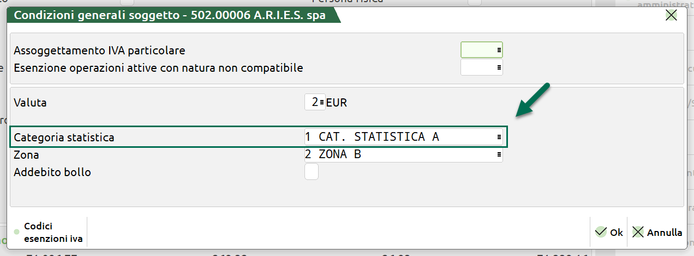
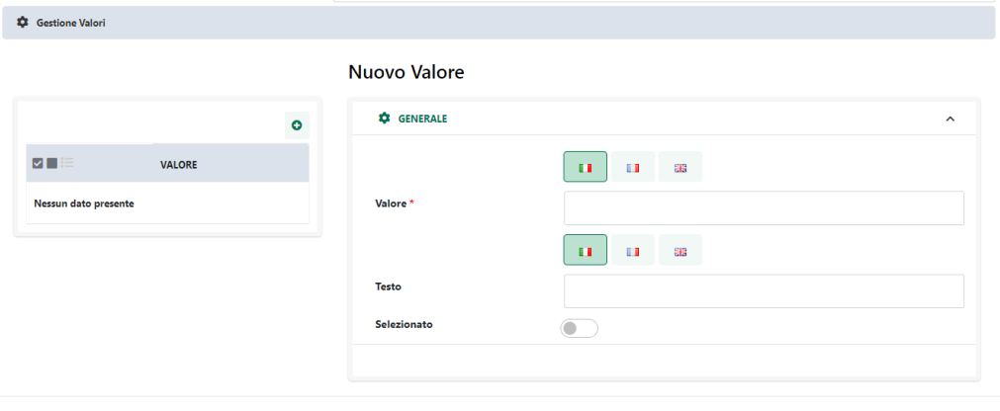
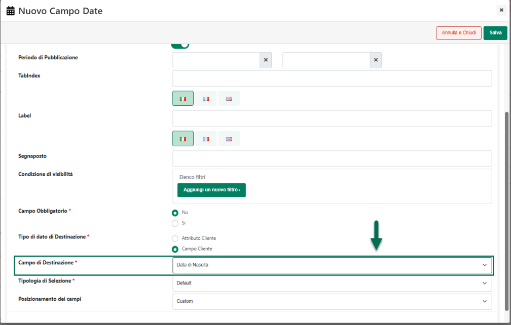
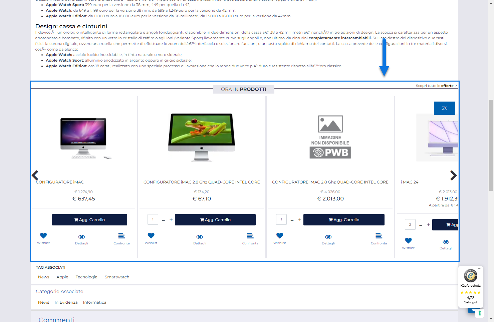
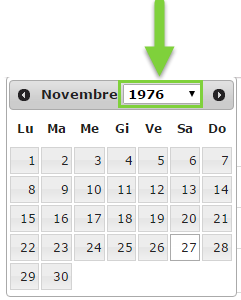

# GESTIONE FILE

Come evidenziato nei precedenti capitoli di questo manuale nella parte
destra della maschera di gestione dei documenti sono elencati tutti i
file presenti all'interno della cartella attualmente selezionata
(cartella questa che, nel relativo albero, sarà evidenziata in
grassetto).

Il pannello di ricerca presente nella parte alta della maschera consente
di ricercare specifici documenti tra tutti quelli presenti all'interno
della cartella attualmente selezionata in elenco e di eventuali sue
sottocartelle

**ATTENZIONE!** nel momento in cui l'esigenza dovesse quindi essere
quella di ricercare uno specifico documento all'interno di tutte le
cartelle attualmente gestite, sarà necessario accertarsi di aver prima
selezionato, in colonna sinistra, la radice "**Documenti**".

La ricerca viene effettuata sulla base del nome assegnato al singolo
file.

Una volta indicato il testo da ricercare cliccando sul pulsante
"**Vai**" verranno poi visualizzati, immediatamente al di sotto del
campo di ricerca, tutti i risultati che soddisfano il filtro impostato

Ogni risultato mostra il percorso completo della file che soddisfa il
filtro.

Cliccando quindi su uno dei risultati in elenco verrà aperta la relativa
cartella e verranno visualizzati, in griglia, tutti i documenti in essa
contenuti

Il pulsante "**Annulla**" consente invece di ripulire e azzerare il
filtro precedentemente impostato.

Dipendentemente dai permessi concessi all'utente sulla cartella
attualmente selezionata, i pulsanti presenti nella relativa barra degli
strumenti consentiranno rispettivamente di:

**Carica** (
 ): consente di uplodare nuovi documenti all'interno
della cartella selezionata.

Richiede i permessi di **Scrittura** o di **Modifica** sulla cartella in
esame oppure di essere il creatore della cartella stessa.

E' possibile caricare singoli file così come un'intera struttura di file
e cartelle partendo da un apposito file .zip.

Cliccando su questo pulsante verrà visualizzata la maschera "**Carica
Documento**"

mediante la quale poter effettuare l'upload desiderato.

In questo senso sarà quindi necessario:

- cliccare sul pulsante **"File" (**
   **)**

- selezionare il file desiderato tra quelli presenti all'interno del
  proprio PC

- assegnargli un nome (campo **Nome**)

- cliccare infine sul pulsante **"Upload File" (**
   **)** presente nella parte alta della
  maschera.

**ATTENZIONE! L'upload di nuovi file all'interno di una cartella può
essere effettuata anche con operazioni di Drag and Drop**

Una volta infatti selezionata la cartella all'interno della quale
caricare il file desiderato sarà sufficiente trascinare questo stesso
file sull'elenco dei documenti presenti nella cartella (nella colonna di
destra della pagina) per far aprire in automatico la maschera di "Upload
File" sopra evidenziata.

Rilasciando quindi il file all'interno della maschera **"Carica
Documento"** verrà compilato in automatico il campo file con il percorso
della risorsa da caricare. Sarà quindi possibile associare un nome al
file e confermare il caricamento con il relativo pulsante di Conferma.

**ATTENZIONE!** L'area di drop all'interno della quale rilasciare il
file da caricare è quella individuata dalla maschera **"Carica
Documento".**

**Nel caso in cui il file dovesse essere rilasciato in una posizione
diversa anziché effettuare l'upload verrà aperto il file all'interno del
browser**

Nel caso in cui non venga specificato un nome per il file che si sta
caricando verrà utilizzato come nome della risorsa il nome del file
stesso.

La sezione "**Esiste già un file con lo stesso nome**" presente nella
parte bassa della maschera di upload, consente di decidere come dovrà
comportarsi l'applicativo nel momento in cui dovesse essere caricato un
file con lo stesso nome di uno già presente all'interno della cartella

Infine, oltre al caricamento di un singolo File, volendo è anche
possibile **caricare in blocco un'intera struttura di cartelle e
sottocartelle (con eventuali file già presenti in esse) partendo da un
archivio compresso (file .zip) precedentemente creato.**

Per far questo sarà sufficiente abilitare, prima dell'upload, il check
**"Archivio"** evidenziato in figura

Attivando questo parametro l'applicazione saprà di dover trattare, in
fase di upload, un archivio compresso e si preoccuperà quindi di
valutare quanto presente all'interno del file .zip, di decomprimerlo, di
caricare in blocco i file presenti all'interno delle varie cartelle e di
creare se necessario eventuali nuove sottocartelle.

In particolare durante il procedimento di scansione del file .zip e di
creazione di eventuali nuove sottocartelle, verranno considerate le
seguenti regole:

- Nel caso in cui non sia già presente, allo stesso livello, una
  cartella con lo stesso nome di quella presente all'interno del file
  .zip, verrà creata una nuova cartella utilizzando per questo tutte le
  impostazioni della sua cartella padre

- Nel caso in cui sia già presente, allo stesso livello, una cartella
  con lo stesso nome di quella presente all'interno del file .zip, **ma
  questa cartella non risulti visibile all'utente che effettua l'upload
  dell'archivio compresso** **(perché non è stata a lui assegnata)**, a
  seguito del caricamento del file .zip verrà creata una nuova cartella,
  con lo stesso nome di quella già presente, seguito però da un numero
  progressivo (che servirà appunto per diversificare tra loro le due
  strutture di cartelle). Anche in questo caso verranno comunque
  utilizzate tutte le impostazioni della cartella padre.

- Nel caso in cui sia già presente, allo stesso livello, una cartella
  con lo stesso nome di quella presente all'interno del file .zip, **e
  questa cartella risulti visibile con permessi di Modifica o Scrittura
  anche all'utente che effettua l'upload dell'archivio compresso,** a
  seguito del caricamento del file .zip non verranno toccate le
  impostazioni delle cartelle preesistenti ma verranno semplicemente
  caricati al loro interno eventuali nuovi documenti presenti nel file
  .zip.

Per quel che riguarda invece i singoli file presenti all'interno
dell'archivio compresso, in fase di scansione del file .zip verrà
considerata la seguente regola:

- Nel caso in cui il file non esista già all'interno della
  corrispondente cartella e nel caso in cui l'utente che effettua
  l'upload abbia i permessi di "Modifica" e/o "Scrittura" sulla cartella
  in cui dovrà essere inserito il file, il file stesso verrà
  correttamente caricato e salvato all'interno della cartella in esame.

- Nel caso in cui il file esista già all'interno della corrispondente
  cartella e nel caso in cui l'utente che effettua l'upload abbia i
  permessi di "Modifica" su questa stessa cartella, il file inizialmente
  presente verrà sovrascritto e sostituito da quello nuovo.

- Nel caso in cui l'utente abbia, sulla cartella in cui dovrebbe essere
  inserito il nuovo file i soli permessi di Lettura, anche a seguito del
  upload del file .zip all'interno di questa cartella non verrà inserito
  alcun file.

**Elimina Documento** (
 ): consente di eliminare il documento
selezionato.

Richiede i permessi di **Modifica** o di **Scrittura** sulla cartella
selezionata. Nel caso di permessi di Scrittura potranno essere eliminati
unicamente i file caricati dallo stesso utente attualmente loggato.

Nel caso in cui l'utente tenti di eliminare un documento per il quale
non ha questo tipo di permessi verrà visualizzato un apposito messaggio
di avviso e la procedura di eliminazione, ovviamente, non potrà
terminare in maniera corretta

**Scarica (File)** (
 ): consente di effettuare il download
del documento selezionato.

Opzione è sempre attiva indipendentemente dai permessi che l'utente
attualmente loggato ha sulla cartella selezionata

**Anteprima** (
 ): consente di visualizzare un'anteprima
del documento selezionato senza doverlo necessariamente scaricare.

Opzione è sempre attiva indipendentemente dai permessi che l'utente
attualmente loggato ha sulla cartella selezionata. Inoltre nel caso in
cui il browser non possa effettuare l'anteprima del documento
selezionato verrà comunque avviato il download

**Sposta File** (
 ): consente di spostare il documento
selezionato all'interno di un'altra cartella della struttura.

Richiede i permessi di **Modifica** o di **Scrittura** **sulla cartella
di origine**. Inoltre nel caso di permessi di Scrittura potranno essere
spostati unicamente i file caricati dallo stesso utente attualmente
loggato.

**ATTENZIONE!** la cartella di destinazione del documento deve
necessariamente avere, per l'utente che effettua lo spostamento, i
permessi di Scrittura o di Modifica.

Nello specifico poi per spostare un file all'interno di un'altra
cartella sarà necessario:

- Selezionare il file che si desidera spostare

- Cliccare sul pulsante "**Sposta File**" per attivare la modalità di
  spostamento

- A questo punto spostandosi col mouse sulla sezione di sinistra della
  pagina per selezionare la cartella di destinazione, il puntatore del
  mouse si modificherà assumendo la forma di quattro piccole frecce.

- Selezionare quindi la cartella di destinazione e cliccare su di essa
  per effettuare lo spostamento

- Come per lo spostamento di un intera cartella anche in questo caso
  verrà richiesta un' ultima conferma prima di poter effettuare lo
  spostamento indicato

Nel caso in cui l'utente non abbia i permessi richiesti sulla cartella
di destinazione, verrà visualizzato un apposito messaggio e l'operazione
di spostamento, ovviamente, non potrà terminare in maniera corretta

**Svuota** (
 ): grazie a questo pulsante, visibile
solo ed esclusivamente nel caso in cui l'utente attualmente connesso
abbia i permessi di Modifica o di Scrittura sulla cartella attualmente
selezionata, è possibile eliminare in blocco tutti i documenti presenti
all'interno della cartella stessa (ed elencati quindi in griglia).

In particolare se l'utente che effettua l'operazione ha i permessi di
"**Modifica**" sulla cartella selezionata, verranno eliminati
indistintamente tutti i documenti in essa contenuti (dopo ovviamente
aver ulteriormente confermato l'operazione che si intende effettuare).

Se l'utente che effettua l'operazione ha invece i permessi di sola
"**Scrittura**" verranno eliminati in blocco dalla cartella selezionata
i soli file inseriti da questo stesso utente. Per i restanti file verrà
invece visualizzato un apposito messaggio per informare l'utente che non
ha i permessi per effettuare, sui file elencati, l'operazione richiesta.

Infine, per quanto riguarda la visualizzazione di questa sezione
dell'area riservata nei dispositivi mobile, come precedentemente
evidenziato a default verrà visualizzata solo la colonna contenente la
struttura delle cartelle gestite.

In queste condizioni per visualizzare i file presenti all'interno di una
specifica cartella sarà quindi necessario selezionarla e cliccare poi
sul pulsante "**Elenco Documenti**" (
 )

In questo modo verrà visualizzata la griglia dei documenti attualmente
presenti all'interno della cartella in esame. Dopo aver selezionato uno
dei documenti presenti in elenco il pulsante raffigurante tre piccoli
puntini consentirà di accedere al menu delle azioni effettuabili sul
file selezionato.

