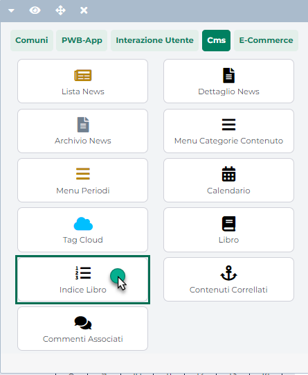
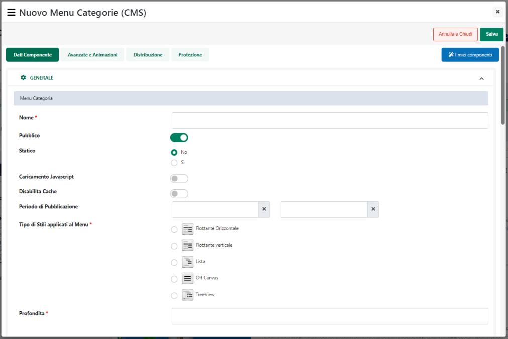

# MESSAGGI

All'interno di questa sezione è possibile gestire la ricezione e l'invio
di messaggi **da/verso altri utenti abilitati ad accedere in area
riservata**.

**ATTENZIONE! l'App Messaggi disponibile in Area Riservata NON è un
client di posta e non può quindi essere utilizzata per inviare messaggi
E-Mail ad un qualsiasi destinatario.**

I destinatari di eventuali messaggi inviati da questa sezione possono
essere, dunque, solo ed esclusivamente utenti del sito opportunamente
abilitati ad accedere in area riservata, oltre che, ovviamente,
appartenenti anche alla specifica gerarchia di utenti gestita

**ATTENZIONE!** Per poter accedere a questa sezione è necessario aver
abilitato la relativa App operando per questo all'interno dell'apposita
sezione del Wizard accessibile dal menu "*Sito -- Preferenze*".

Per maggiori informazioni in merito si veda anche la sezione "*Sito --
Preferenze -- Area Riservata*" di questo manuale

I pulsanti presenti nella parte alta della maschera consentono di
accedere alle sottosezioni relative ai:

- **Messaggi in Arrivo**

- **Messaggi Inviati**

- **Messaggi Eliminati**

- **Bozze**

Il menu laterale ad albero consente invece di filtrare per destinatario
/ mittente (a seconda del fatto di trovarsi nella sezione dei messaggi
in arrivo piuttosto che in quella dei messaggi inviati ...) i messaggi
presenti in griglia

All'interno di questo menu sono riportati tutti gli utenti e i gruppi
con cui l'utente attualmente loggato potrà effettivamente comunicare.
Nello specifico:

- **Rosso** i vari gruppi utente (vedi anche sezione "Utenti --
  Gerarchie" di questo manuale)

- **Azzurro** i singoli utenti di tipo **DIPENDENTE**;

- **Verde** i singoli utenti di tipo **AZIENDA**;

- **Arancione** i singoli utenti di tipo **COMMERCIALISTA**;

Una volta applicato un filtro utente, questo potrà poi essere eliminato
cliccando sul pulsante raffigurante una piccola gomma posto in alto a
destra all'interno della stessa colonna del menu ad albero

Oltre al filtro per utente, è possibile ricercare i messaggi in griglia
anche in base al loro "Oggetto" e / o al loro "Testo" agendo, in questo
senso, dal **pannello di ricerca** presente immediatamente al di sopra
della griglia dei messaggi

Il pulsante "**Vai**" presente nella parte bassa del pannello di ricerca
consente di applicare i filtri impostati e di avviare quindi la relativa
ricerca

Il pulsante "**Annulla**" consente invece di eliminare eventuali filtri
di ricerca precedentemente impostati (anche quelli settati mediante il
menu ad albero)

In visualizzazione mobile il pulsante "**Filtra per utenti**" presente
all'interno del pannello di ricerca

consente di richiamare il relativo menu ad albero

In queste condizioni per applicare il filtro sarà necessario selezionare
l'utente o il gruppo desiderato e cliccare poi sul pulsante
"**Applica**"

