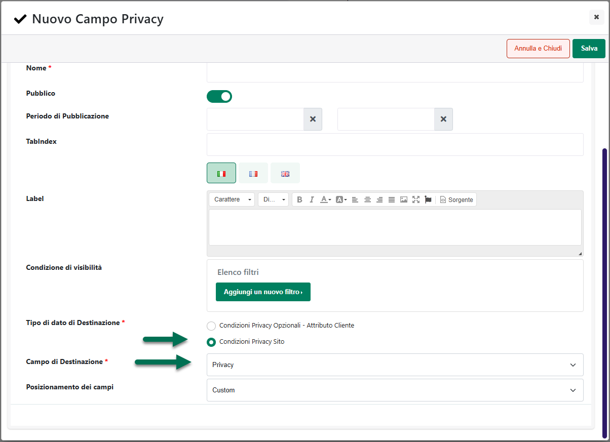

# NOTIFICHE

Come visto nei precedenti capitoli di questo manuale, Passweb consente
di gestire un sistema di notifiche Email, SMS, Telegram e/o Whatsapp
relative ai documenti caricati all'interno delle cartelle presenti in
area riservata.

Nello specifico, per le **Cartelle Standard** è possibile associare ad
ognuna di esse uno o più Amministratori (selezionandoli tra gli utenti
abilitati ad accedere alla cartella stessa) i quali verranno poi
notificati, a seconda dei check selezionati, nel momento in cui
dovessero essere caricati, all'interno della cartella in esame, dei
nuovi documenti

Nel caso delle **Cartelle Azienda** corrispondenti ad **utenti
codificati dal back end del proprio sito Passweb,** il discorso è
sostanzialmente analogo con l'unica differenza che, in questo, caso
l'Amministratore della cartella è definito in automatico
dall'applicazione e coincide esattamente con l'utente codificato
all'interno del Wizard, utente questo che, come nel caso precedente,
verrà quindi notificato nel momento in cui dovessero essere inseriti
nuovi documenti all'interno della cartella in esame.

Nel caso invece delle **Cartelle Azienda** corrispondenti ad **utenti
prelevati direttamente dal gestionale** il discorso è leggermente
diverso. I documenti presenti all'interno di queste cartelle, infatti,
non vengono caricati da area riservata ma sono gestiti direttamente
all'interno del gestionale.

In queste condizioni dunque l'applicazione non potrà sapere
immediatamente quando viene aggiunto un nuovo documento all'interno di
una determinata classe Docuvision e, in conseguenza di ciò, le notifiche
relative alla pubblicazione di questi documenti dovranno per forza di
cose essere gestite in maniera differente.

L'applicazione andrà quindi a controllare **ogni due ore**, per tutte le
aziende gestite all'interno del sito e per tutte le Classi Docuvision
pubblicate, l'eventuale presenza di nuovi documenti e, nel momento in
cui tale controllo dovesse dare esito positivo, si preoccuperà di
inviare alla relativa azienda, a seconda delle impostazioni settate, una
mail per notificargli la presenza di questi documenti.

Nello specifico poi tali notifiche verranno inviate al verificarsi delle
seguenti condizioni

- Aggiunta di un nuovo documento (file unico)

- Aggiunta di una nuova pagina ad un documento gestito a pagine

- Modifica di una pagina per un documento gestito a pagine

- Aggiunta di una nuova revisione ad un documento gestito a revisioni

**ATTENZIONE!** l'eliminazione di un intero documento, di una pagina per
un documento gestito a pagine e / o di una revisione per un documento
gestito a revisioni non genereranno l'invio di alcun tipo di notifica

Relativamente a queste notifiche occorre anche ricordare che:

- Ogni notifica verrà inviata una sola volta

- Se per qualche ragione il check effettuato da Passweb allo scadere
  delle due ore dovesse dare degli errori (perché, ad esempio, in quel
  momento il gestionale è aperto su di una maschera bloccante)
  l'eventuale presenza di nuovi documenti verrà notificata ai relativi
  destinatari al check successivo

- Le notifiche sono cumulative. In conseguenza di ciò nel momento in
  cui, a seguito di un determinato controllo, dovessero essere trovati
  per un'azienda, ad esempio, 5 nuovi documenti, verrà inviata,
  all'azienda stessa, una sola notifica con l'indicazione di tutti e 5
  questi documenti, documenti che potranno poi essere visualizzati solo
  ed esclusivamente dopo aver effettuato l'accesso in area riservata.

Oltre alla mail, volendo, è possibile notificare alle relative aziende
la presenza di nuovi documenti Docuvision anche:

- Via **SMS**

> Per poter attivare queste notifiche sarà però necessario:

- aver configurato correttamente l'integrazione tra il proprio sito
  Passweb e la piattaforma SMS Hosting (<http://www.smshosting.it>)
  specificando poi Login e Password, fornite in fase di registrazione al
  servizio, all'interno dei parametri di configurazione presenti alla
  pagina "**Account e-mail e SMS**" del Wizard (sezione
  "**Configurazione SMS**")

- aver attivato il flag "**Notifiche SMS per documenti**" presente alla
  pagina "**Configurazione Gestionale**" del Wizard (sezione
  "**Docuvision**")

- aver associato alla relativa azienda un numero di telefono valido

<!-- -->

- Via **Telegram**

> Per poter attivare queste notifiche sarà però necessario:

- aver configurato correttamente l'integrazione tra il proprio sito
  Passweb e Telegram (per maggiori informazioni in merito si veda anche
  quanto indicato all'interno del capitolo "*Passweb e Telegram*" di
  questo manuale)

- aver attivato il flag "**Notifiche Telegram per documenti**" presente
  alla pagina "**Configurazione Gestionale**" del Wizard (sezione
  "**Docuvision**")

- aver associato alla relativa azienda un numero di telefono valido

- l'azienda dovrà aver effettuato l'iscrizione al Bot Telegram partendo
  dal relativo pulsante presente, in Area Riservata, all'interno della
  pagina di Profilo Utente (per maggiori informazioni in merito si veda
  anche quanto indicato all'interno del successivo capitolo "*Profilo
  Utente*" di questo manuale)

<!-- -->

- Via **Whatsapp**

> Per poter attivare queste notifiche sarà però necessario:

- aver configurato correttamente l'integrazione tra il proprio sito
  Passweb e WA Smart Business (per maggiori informazioni in merito si
  veda anche quanto indicato all'interno del capitolo "*Passweb e WA
  Smart Business*" di questo manuale)

- aver attivato il flag "**Notifiche Whatsapp per documenti**" presente
  alla pagina "**Configurazione Gestionale**" del Wizard (sezione
  "**Docuvision**")

- aver associato alla relativa azienda un numero di telefono valido

**ATTENZIONE!** l'indirizzo email e il numero di telefono cui verranno
inviate le relative notifiche sono quelli impostati all'interno dei
rispettivi campi dell'anagrafica gestionale, dati questi visibili anche
in area riservata all'interno della sezione "Profilo Utente"

Nel momento in cui l'esigenza dovesse essere quella di gestire le
notifiche SMS, Telegram o Whatsapp in relazione, ad esempio, alle
attività in agenda o all'invio di nuovi messaggi ma non per i nuovi
documenti docuvision sarà quindi sufficiente deselezionare il flag
"**Notifiche Telegram / Whatsapp Documenti Docuvision**" precedentemente
evidenziato.

**ATTENZIONE! il controllo relativo alla presenza di nuovi documenti
docuvision viene effettuato utilizzando le Web Api Passcom**

In conseguenza di ciò **è assolutamente indispensabile, per poter
gestire questo tipo di notifiche, aver attivato e configurato in maniera
corretta il relativo utente gestionale** (per maggiori informazioni in
merito si veda anche quanto indicato nel precedente capitolo
"*Configurazione*" di questo manuale)

Occorre ricordare, inoltre, che in fase di configurazione dell'utente
Web Api all'interno del gestionale andranno indicate anche le aziende
dell'installazione per cui sarà poi effettivamente possibile
utilizzarle.

**ATTENZIONE!** Nel momento in cui, per una qualsiasi ragione, non
dovesse essere possibile utilizzare le Web Api per una delle aziende
gestite all'interno del sito, Passweb non sarà in grado di sapere se,
per quella stessa azienda, sono stati aggiunti o meno dei nuovi
documenti docuvision e, di conseguenza, non potrà inviare nessun tipo di
notifica

In queste condizioni verrà comunque inviata all'amministratore del sito,
una volta al giorno (attorno alla mezzanotte), una mail di avviso con
l'indicazione delle aziende per cui non sono state abilitate le Web Api
e per le quali non possono quindi essere inviate notifiche relative alla
pubblicazione di nuovi documenti docuvision.

Infine, l'eventuale presenza di nuovi documenti Docuvision, verrà
notificata anche all'interno dell'area riservata sia mediante l'apposita
icona delle notifiche

sia in bacheca all'interno del box "**Documenti**".

**ATTENZIONE! all'interno del box Documenti verranno visualizzati tutti
i documenti che sono stati aggiunti in Docuvision piuttosto che
direttamente in area riservata all'interno di apposite cartelle
standard, successivamente all'ultimo accesso effettuato.**

Una volta visualizzato tale elenco, i documenti in esso presenti non
verranno più considerati come nuovi per cui effettuando un logout e
subito dopo un successivo login il box Documenti sarà, ovviamente, vuoto

Per quel che riguarda invece le azioni effettuabili sui documenti
presenti all'interno di questo box cliccando sul nome di un documento
caricato in docuvision, verrà avviato immediatamente il download del
documento stesso.

Cliccando invece sul nome di un documento caricato all'interno di una
Cartella Standard l'utente verrà automaticamente ricondotto alla sezione
Documenti dell'area riservata dove troverà già aperta la cartella in cui
si trova il documento stesso (per maggiori informazioni relativamente
alla gestione dei documenti all'interno di Cartelle Standard, si veda
anche quanto indicato nei precedenti capitoli di questo manuale)

