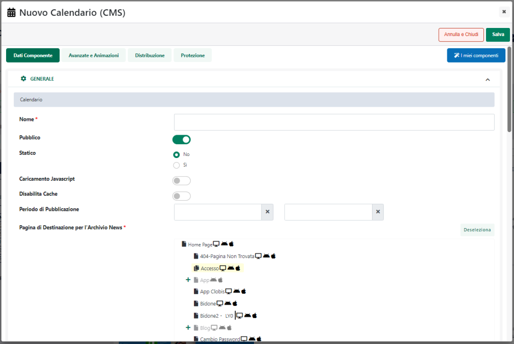

# CREAZIONE CAMPAGNE ED INVIO NEWSLETTER

Dopo aver creato in MailChimp le varie liste ed averle popolate di
utenti, inserendo ad esempio un apposito form di iscrizione direttamente
all'interno del proprio sito Passweb, il passo successivo sarà,
ovviamente, quello di creare delle nuove campagne e di inviare quindi le
Newsletter ai vari utenti iscritti al servizio.

**Una campagna, infatti, altro non è se non l'invio di una determinata
Newsletter ad un intera lista di iscritti o solamente ad alcuni
gruppi.**

**NOTA BENE**: l'invio di una campagna è un'operazione che, volendo, può
anche essere effettuata direttamente all'interno del proprio sito
Passweb in maniera tale da popolare i contenuti della Newsletter con gli
stessi contenuti CMS gestiti e pubblicati all'interno del proprio sito.
Per maggiori informazioni in merito si veda anche la sezione "Sito --
Gestione Newsletter" di questo manuale.

Per creare una nuova campagna MailChimp utilizza un Wizard step by step
**(Campaign Builder)** molto semplice che guida l'utente
nell'impostazione di tutti i parametri necessari per la creazione della
propria campagna.

Per prima cosa sarà necessario accedere alla sezione relativa alle
Campagne, cliccando per questo sul apposito pulsante (**Campaigns**)
presente nella barra principale degli strumenti

Il pulsante "**Create Campaign**" consente di selezionare il tipo di
campagna che si vuole realizzare e avviare successivamente il Wizard di
creazione.

Per realizzare un normale invio di mail a tutti o solo a parte degli
utenti di una certa lista sarà necessario selezionare la voce **"Regular
Campaign".**

Verrà quindi avviata la procedura guidata per la realizzazione della
propria campagna **(Campaign Builder)**

