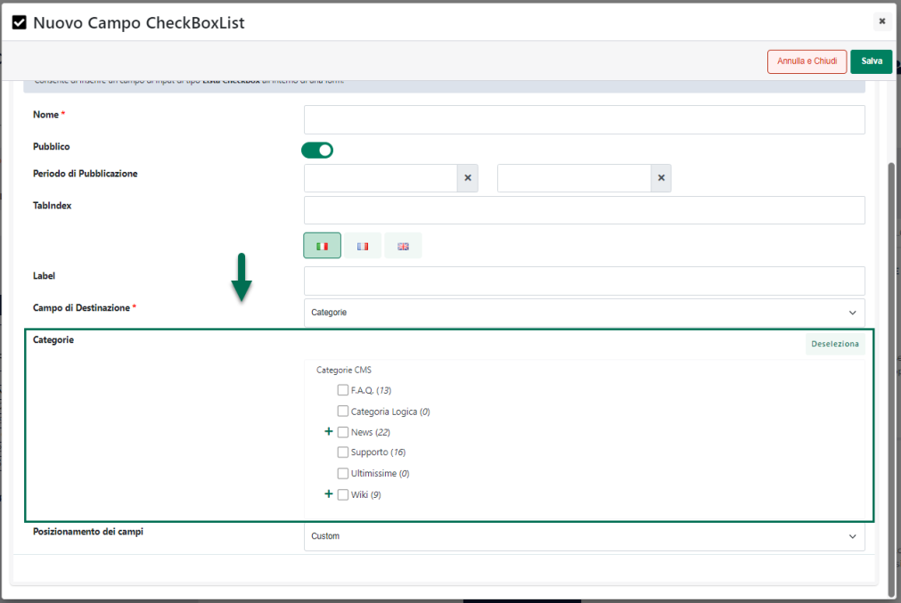

# STATISTICHE

MailChimp mette a disposizione dell'utente anche un'apposita sezione
all'interno della quale poter controllare le statistiche relative alla
varie campagne effettuate.

Per poter accedere a questa sezione sarà sufficiente cliccare sul
pulsante "**Reports**" del menu principale.

{width="6.398611111111111in"
height="4.392361111111111in"}

Verrà quindi visualizzato un elenco contenente tutte le campagne
effettuate

{width="6.398611111111111in"
height="4.392361111111111in"}

Il pulsante "**View Reports**" presente in corrispondenza di ogni
singola campagna consentirà di visualizzare il dettaglio delle
statistiche relative alla campagna stessa.

{width="6.398611111111111in"
height="4.392361111111111in"}

**NOTA BENE**: per maggiori informazioni in merito all'interpretazione
delle statistiche relative alle varie campagne si rimanda alla specifica
documentazione di MailChimp

