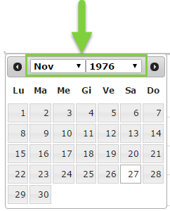
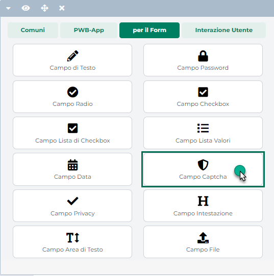
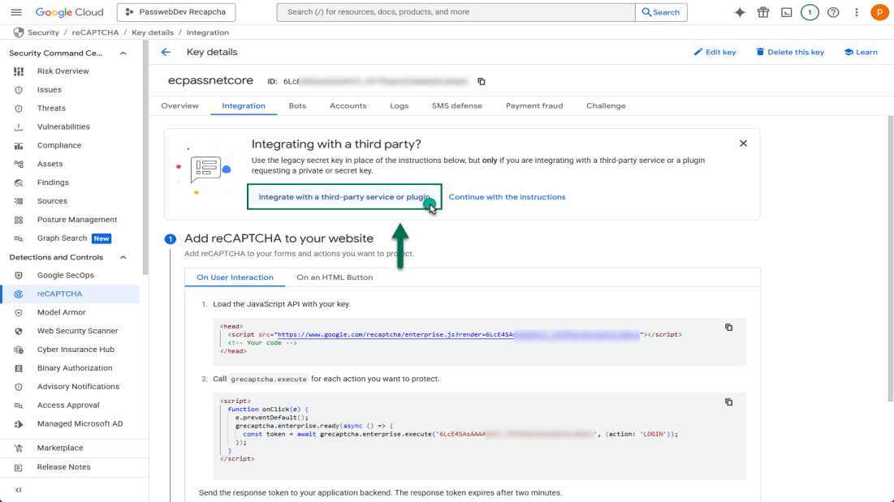

# STORES

Una volta effettuato l'accesso alla sezione "*Sito -- Gestione
Newsletter -- Stores*" del Wizard verrà visualizzata la maschera
"**Store Ecommerce**"

contenente l'elenco degli Store MailChimp attualmente codificati.

Il campo di ricerca attivabile cliccando sulla lente di ingrandimento
presente in testata, in corrispondenza delle varie colonne, consente di
filtrare i dati in griglia sulla base dei valori presenti all'interno
della colonna stessa.

Una volta impostato un filtro di ricerca, per poterlo poi eliminare sarà
sufficiente cliccare sull'icona raffigurante una piccola lente di
ingrandimento con un -- all'interno (
 ) che comparirà in testata alla colonna
in corrispondenza della quale è stato impostato il filtro stesso.

Infine è anche possibile ordinare, in maniera crescente e/o decrescente,
gli elementi in griglia cliccando semplicemente sull'icona raffigurante
due piccole frecce posta anch' essa in testata ad ogni singola colonna
della griglia (
 )

Per ogni singolo Store presente in elenco sono indicati:

- Il **nome** assegnato alla Store in fase di creazione

- La **lista Mailchimp** collegata allo Store

- La specifica **lingua** associata allo Store

- Se lo store in esame è o meno quello di default

I pulsanti presenti nella barra degli strumenti consentono
rispettivamente di:

- **Modifica Store**
  ( )**:** consente di modificare lo Store
  attualmente selezionato in elenco

- **Elimina Store**
  ( )**:** consente di eliminare lo Store
  attualmente selezionato in elenco

- **Aggiungi Store**
  ( )**:** consente di codificare un nuovo
  Store.

Cliccando su quest'ultimo pulsante verrà quindi visualizzata la maschera
di creazione del nuovo Store MailChimp all'interno della quale potremo
trovare, inizialmente, la sola sezione **"Configurazione"** i cui
parametri consentono rispettivamente di:

- **Nome Store**: consente di assegnare uno specifico nome allo store
  che si sta codificando, in maniera tale da poterlo poi distinguere da
  altri eventuali store già presenti in elenco

- **Lista Associata:** consente di indicare, selezionandola dal relativo
  menu a tendina, la Lista MailChimp da associare al proprio Store.

> **ATTENZIONE!** **Nel caso in cui il sito utilizzi una specifica Lista
> per l'iscrizione alla Newsletter, magari con già un buon database di
> iscritti, si consiglia di utilizzare questa stessa Lista anche per lo
> Store MailChimp.**
>
> Nel caso in cui, invece, si volessero utilizzare due Liste distinte,
> una per la Newsletter ed una per lo Store, potrebbe essere necessario,
> almeno inizialmente, esportare i contatti presenti all'interno della
> Lista utilizzata per la Newsletter ed importarli in quella utilizzata
> per lo Store.
>
> In ogni caso, ovviamente, una volta creato lo Store su MailChimp la
> Lista ad esso associata si popolerà in automatico mano a mano che gli
> utenti del sito andranno ad effettuare nuovi ordini.

- **Lingua:** consente di selezionare, tra quelle attualmente gestite
  all'interno del proprio sito, la specifica lingua da associare allo
  Store che si sta codificando

- **Email:** consente di impostare l'indirizzo Email che verrà poi
  utilizzato come mittente per tutte le comunicazioni inviate da
  MailChimp e collegate in qualche modo allo Store in esame

- **Valuta:** consente di impostare, selezionandola dal relativo menu a
  tendina, la valuta che dovrà essere utilizzata negli ordini inviati
  allo Store

> **ATTENZIONE!** La valuta impostata all'interno di questo campo sarà
> quella utilizzata, ad esempio, per gli importi degli ordini inviati a
> MailChimp. Allo stato attuale invece la dashboard di Mailchimp
> gestisce come unico simbolo di valuta il \$

Una volta impostati questi parametri, cliccando sul pulsante "**Salva**"
presente nella parte bassa della maschera, si attiveranno tre nuove
sezioni:

- **Clienti:** consente di configurare e gestire l'invio allo Store
  Mailchimp dei clienti presenti all'interno del proprio sito ecommerce

- **Articoli:** consente di configurare e gestire l'invio allo Store
  Mailchimp dei dati relativi agli articoli presenti all'interno del
  proprio sito Ecommerce

- **Carrelli Abbandonati:** consente di attivare/disattivare l'invio
  allo Store MailChimp dei dati relativi ai carrelli abbandonati

All'interno della sezione "Configurazione" comparirà, inoltre, un nuovo
campo:

- **Dominio Store**: campo non modificabile. Indica l' url del sito
  Passweb collegato allo Store Mailchimp

Infine, nella barra degli strumenti della maschera "Store Ecommerce"
comparirà ora anche il pulsante "**Connetti**" (3)

- **Connetti** (
   ) -- **visualizzato solo dopo aver
  impostato e salvato i dati richiesti all'interno della sezione
  "Configurazione"**: consente di creare lo Store su Mailchimp secondo i
  parametri impostati all'interno della sezione "Configurazione".

Cliccando su questo pulsante sarà quindi possibile connettersi con
MailChimp e avviare la procedura di creazione dello Store Passweb.

Una volta terminata tale procedura all'interno della sezione
"Configurazione" comparirà anche il parametro **Default Store**

- **Default Store**: visualizzato solo per Store correttamente connessi
  con MailChimp. Consente di impostare lo Store in esame come Store di
  default e, ovviamente, solo uno degli Store presenti in elenco può
  essere impostato come Store di default

**ATTENZIONE!** Lo Store di Default è di fondamentale importanza,
soprattutto nel caso di siti multilingua con Store diversi per le
diverse lingue gestite. E' in questo Store infatti che confluiranno i
dati Ecommerce relativi a quei clienti la cui lingua (determinata sulla
base della loro Nazione di appartenenza) non coincide con nessuna di
quelle associate agli Store codificati e connessi con MailChimp

A questo punto sarà possibile anche accedere al Back end del proprio
account MailChimp e verificare l'avvenuta creazione dello Store. Se la
procedura è andata a buon fine, cliccando sull'icona di gestione del
proprio profilo dovremmo ora trovare, tra le varie voci del
corrispondente menu a tendina, anche quella relativa allo Store appena
creato, con a fianco l'etichetta "**Connected**"

Cliccando su questa voce di menu si avrà la possibilità di accedere,
lato MailChimp, allo maschera di gestione dello Store Passweb appena
creato, maschera questa da cui sarà possibile verificare la lista
effettivamente collegata allo Store oltre che ovviamente avviare una
delle azioni connesse allo Store stesso come ad esempio la creazione e
l'invio di mail relative ai carrelli abbandonati, al retargeting sui
prodotti acquistati dai clienti presenti all'interno della lista ecc...

Per maggiori informazioni relativamente alle possibili azioni di
marketing automation gestite da MailChimp e alla loro configurazione si
rimanda alla relativa documentazione di prodotto accessibile, ad
esempio, a questi indirizzi:

<https://mailchimp.com/help/sell-more-stuff-with-mailchimp/>

<https://mailchimp.com/help/about-product-recommendations/>

<https://mailchimp.com/help/create-an-abandoned-cart-email/>

...

Lato Passweb, una volta effettuata la connessione con MailChimp e creato
il relativo Store, nella barra degli strumenti della maschera di
configurazione dello Store stesso compariranno tre nuovi pulsanti:

- **Disconnetti** (
   ): consente di effettuare la
  cancellazione del corrispondente Store Passweb su MailChimp,
  operazione questa necessaria, ad esempio, nel caso in cui si dovesse,
  per qualche ragione, modificare la Lista inizialmente associata allo
  Store stesso.

> **ATTENZIONE!** La disconnessione e la conseguente cancellazione dello
> Store su MailChimp comporterà, ovviamente, l'eliminazione dei dati
> connessi allo Store stesso.

- **Sincro Articoli** (
   ): consente di avviare manualmente la
  procedura di importazione sullo Store MailChimp in esame, dei dati
  relativi a tutti gli articoli gestiti all'interno del sito, secondo le
  impostazioni settate all'interno della corrispondente sezione
  "Articoli".

> Per maggiori informazioni in merito si veda anche il successivo
> capitolo di questo manuale "*Store Ecommerce -- Articoli*"
>
> Tale operazione dovrebbe essere effettuata solo la prima volta o,
> eventualmente, nel momento in cui si dovesse rendere necessario, per
> qualche ragione, allineare la base dati del proprio sito (a livello di
> articoli gestiti) con quella presente all'interno dello Store
> MailChimp.
>
> Una volta effettuata la prima importazione sarà infatti Passweb
> stesso, al termine di ogni sincronizzazione Sito -- Gestionale, a
> preoccuparsi di trasmettere, in maniera del tutto automatica, allo
> Store MailChimp eventuali nuovi articoli importati all'interno del
> proprio sito Ecommerce a seguito di quella stessa sincronizzazione.

- **Sincro Clienti** (
   ): consente di avviare manualmente la
  procedura di importazione sullo Store MailChimp in esame, dei clienti
  presenti all'interno del proprio sito Ecommerce secondo le
  impostazioni settate nella corrispondente sezione "Clienti".

> **ATTENZIONE!** Oltre ai clienti, verranno importati sullo Store
> MailChimp in esame, anche tutti gli ordini attualmente presenti sul
> sito Passweb e relativi, ovviamente, a questi stessi clienti
>
> Come per gli articoli, anche per i clienti l'operazione di
> sincronizzazione manuale dovrebbe essere effettuata solo la prima
> volta o al massimo nel caso in cui si dovesse rendere necessario, per
> qualche ragione, allineare la base dati del proprio sito (a livello di
> clienti) con quella presente all'interno dello Store MailChimp.
>
> A regime, infatti, l'invio dei clienti allo Store MailChimp avverrà in
> maniera del tutto automatica seguendo la normale operatività del sito.
> A seconda dei parametri impostati all'interno della sezione Clienti,
> sarà infatti possibile, ad esempio, fare in modo che nel momento in
> cui un nuovo utente dovesse effettuare un ordine, questo venga inviato
> assieme all'ordine stesso anche allo Store MailChimp.
>
> Per maggiori informazioni in merito si veda il successivo capitolo di
> questo manuale "*Store Ecommerce -- Clienti*"

**ATTENZIONE!** I pulsanti "**Disconnetti**", "**Sincro** **Articoli**"
e "**Sincro** **Clienti**" verranno visualizzati solo dopo aver
effettuato la connessione Passweb -- MailChimp e aver quindi creato il
relativo Store.

Una volta creato lo Store, il passo successivo sarà ovviamente quello di
popolarlo con i Dati Ecommerce presenti all'interno del proprio sito
agendo, in questo senso, mediante i parametri di configurazione presenti
all'interno delle sezioni Articoli, Clienti e Carrelli Abbandonati.

