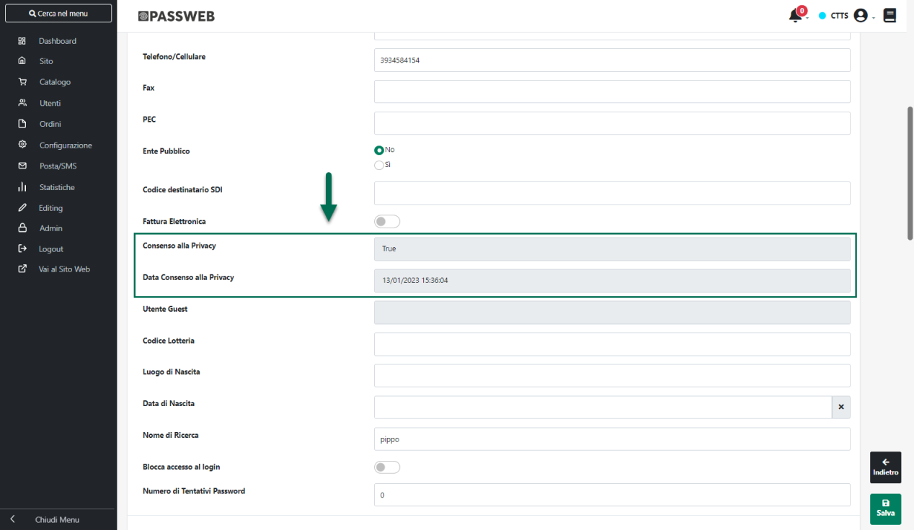
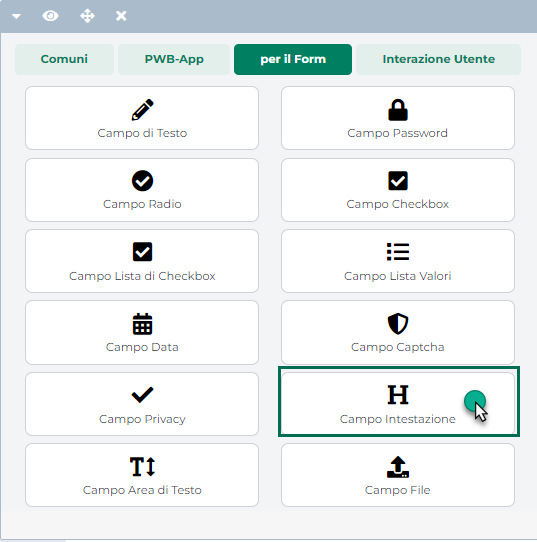

# CARRELLI ABBANDONATI

All'interno di questa sezione è possibile attivare/disattivare l'invio
allo Store MailChimp dei dati relativi ai carrelli abbandonati.

**Abilita Carrelli Abbandonati**: consente, se selezionato, di abilitare
l'invio a MailChimp dei dati relativi ai Carrelli Abbandonati.

**ATTENZIONE!** Ovviamente verranno inviati allo Store MailChimp i soli
Carrelli abbondonati relativi ad utenti registrati (dotati quindi di uno
specifico indirizzo mail) presenti all'interno della Lista collegata
allo Store MailChimp.

Tra le informazioni inviate a MailChimp relativamente ai Carrelli
Abbandonati sarà presente anche uno specifico url di recupero del
Carrello.

Cliccando su questo link, da inserire, ovviamente nelle relative mail di
recupero, l'utente verrà quindi ricondotto al sito Passweb dove troverà
il proprio carrello compilato in maniera completamente automatica con
gli articoli presenti all'interno del Carrello Abbandonato di partenza.

In realtà affinché tutto ciò possa avvenire esattamente come descritto è
necessario che:

- L'utente sia già loggato sul sito Passweb

- Non sia stata attivata la gestione unificata del carrello (gestione
  questa che, per sua stessa natura è incompatibile con il recupero
  automatico di vecchi carrelli abbandonati)

**ATTENZIONE!** A differenza di quello che avviene per articoli e
clienti, non esiste, allo stato attuale, un'operazione di
sincronizzazione manuale dei Carrelli Abbandonati. **Questo tipo di
informazioni verranno inviate allo Store MailChimp in maniera
completamente automatica al termine di ogni sincronizzazione Sito --
Gestionale (Totale, per Variati o Parziale).**

Una volta attivato il flag "Abilita Carrelli abbandonati" sarà quindi
necessario attendere la prima sincronizzazione schedulata o,
eventualmente, lanciarne una manuale, prima di poter verificare la
presenza di questo tipo di dati all'interno dello Store MailChimp. Al
termine della sincronizzazione verrà inviata, all'amministratore del
sito, una mail contenente un report relativo alle attività di
sincronizzazione tra Passweb e MailChimp.

**ATTENZIONE!** Affinchè la procedura di sincronizzazione con MailChimp,
relativamente ai Carrelli abbandonati, possa funzionare correttamente,
attivando tutti i trigger del caso e scatenando quindi l'invio delle
varie mail di recupero, **è indispensabile verificare, PRIMA DI
TRASMETTERE DEI CARRELLI ABBANDONATI, di aver attivato correttamente
all'interno di MailChimp la relativa automazione**

Nel caso in cui questo tipo di automazione non dovesse essere ancora
stata attivata e/o dovesse essere stata posta, per una qualsiasi
ragione, in pausa, in fase di sincronizzazione non verrà inviato a
MailChimp nessun carrello abbandonato

Per maggiori informazioni relativamente a come attivare e configurare su
MailChimp l'automazione relativa ai Carrelli Abbandonati si consiglia di
fare riferimento alla relativa documentazione di prodotto.

