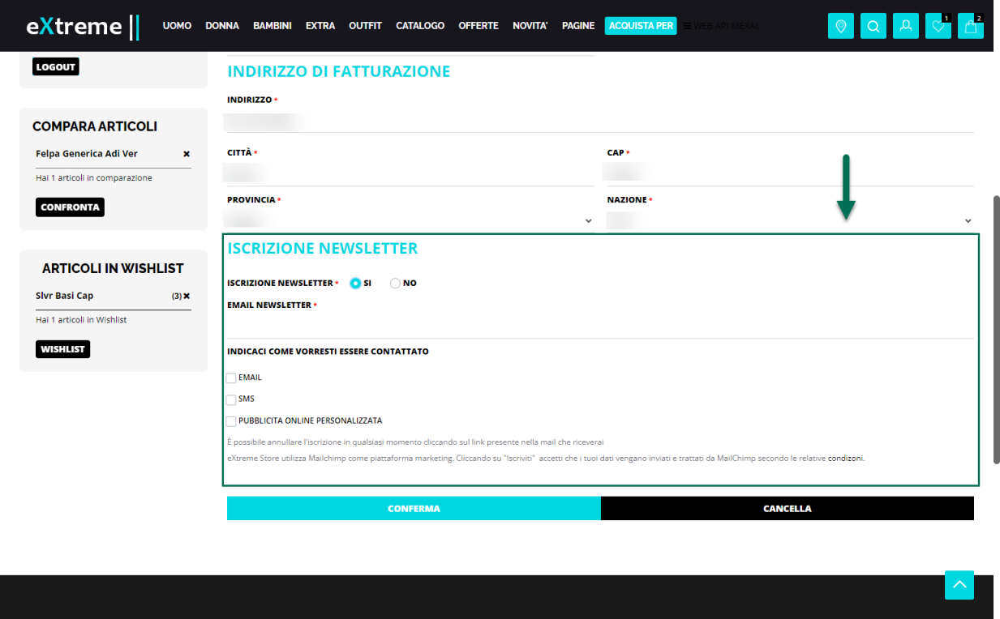
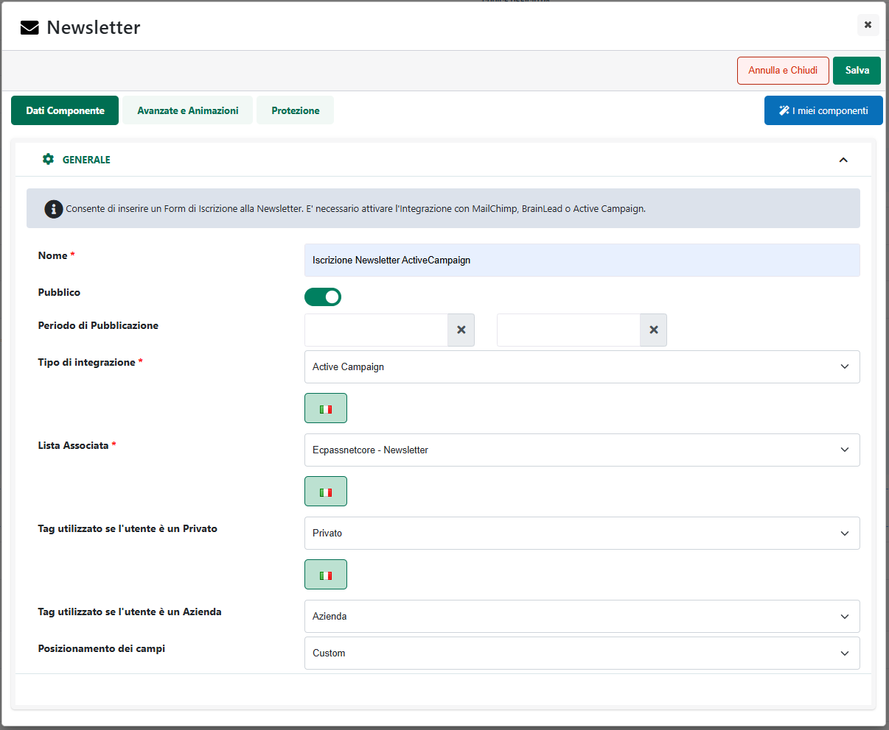

# GTM SERVER SIDE -- CON STAPE.IO

Arrivati a questo punto dovrebbe ormai essere chiaro che un passaggio
indispensabile nell'implementazione di un sistema di tracciamento server
side è quello che prevede la creazione di un server intermedio su cui
andare ad installare il nuovo contenitore GTM di tipo server e verso cui
dovranno poi essere inviati i dati.

In questo senso è possibile scegliere tre diverse strade:

1.  [Utilizzare piattaforme server già pronte come possono essere ad
    esempio Google Cloud Platform, AWS, Azure ...]{.underline}

> In particolare nel momento in cui, in fase di configurazione del
> contenitore server di GTM, si dovesse optare per un provisioning
> automatico, verrebbero utilizzati i server di Google e questo
> richiederebbe quindi la disponibilità di un' account su Google Cloud
> Platform con associata una carta di credito e un account di
> fatturazione perfettamente funzionante.
>
> Ci verrebbe assegnato un credito iniziale di 300\$, che potrebbe anche
> essere sufficiente per effettuare alcuni test. Esaurito il credito il
> traffico generato verso il server inizierà ad essere fatturato.
>
> I problemi di questa soluzione sono essenzialmente due: il primo è la
> difficolta nel configurare correttamente la piattaforma server,
> considerando che ambienti come Google Cloud o AWS non sono così
> semplici da gestire; il secondo sono i costi che, a seguito di
> configurazioni non corrette, potrebbero anche aumentare in maniera
> considerevole

2.  [Creare e gestire autonomamente un server proprietario]{.underline}

> Optare, in fase di configurazione del contenitore server di GTM, per
> un provisioning manuale e decidere poi di "farsi il server in casa" è
> sicuramente un'opzione che ha i suoi vantaggi sia dal punto di vista
> del controllo dei dati che entrano ed escono dal proprio sito, sia dal
> punto di vista dei costi che potrebbero non dipendere più dal traffico
> gestito e non essere quindi più un'incognita particolarmente
> pericolosa da considerare.
>
> Del resto ovviamente la gestione di un server proprietario non è
> comunque a costo 0 richiede una disponibilità notevole di risorse, di
> tempo e soprattutto competenze tecniche davvero molto elevate (cosa
> che rende questa strada forse la meno percorribile)

3.  [Affidarsi a piattaforme come Stape.io che facilitano
    l'implementazione di tutto il sistema con costi contenuti e
    facilmente controllabili]{.underline}

> Piattaforme come stape.io tendono infatti a sfruttare gli aspetti più
> efficienti delle due precedenti opzioni eliminando gli aspetti legati
> alla complessità tecnica di un server proprietario o alla
> configurazione di piattaforme come Google Cloud o AWS, e offrendo
> anche piani a pagamento chiari e sicuri

Nei successivi capitoli andremo quindi ad esaminare in maniera un po'
più dettagliata tutto il processo necessario per poter effettivamente
configurare il sistema di tracciamento server side utilizzando la
piattaforma e i servizi messi a disposizione da Stape.io, processo
questo che, sulla base di quanto visto anche nei precedenti capitoli di
questo manuale, si svilupperà essenzialmente in tre distinti step:

1.  Implementazione del tracciamento lato client

2.  Creazione del contenitore GTM di tipo Server

3.  Creazione e configurazione dell'account sulla piattaforma Stape.io

##### STEP1 -- IMPLEMENTAZIONE DEL TRACCIAMENTO LATO CLIENT 

Come indicato nei precedenti capitoli di questo manuale
l'implementazione di un sistema di tracciamento server side non vuol
dire assolutamente abbandonare in maniera definitiva il tracciamento
lato client fino ad ora implementato per il nostro sito.

Il tracciamento lato client rappresenta il punto iniziale di tutto il
processo essendo il sistema deputato a raccogliere tutte le informazioni
relative agli eventi che si verificano sul nostro sito. In
considerazione di ciò dovrà continuare ad essere gestito esattamente
allo stesso modo in cui lo si gestiva prima di attivare anche il
tracciamento server side quindi mediante integrazione nativa sul sito o
mediante l'utilizzo di un contenitore GTM di tipo web.

Per maggiori informazioni relativamente a come poter implementare un
tracciamento lato client utilizzando l'integrazione nativa tra il
proprio sito Passweb e GA4 è possibile fare riferimento a quanto
indicato nella sezione "*Google Analytics -- Google Analytics 4*" di
questo manuale

Per maggiori informazioni relativamente invece a come poter implementare
un tracciamento lato client utilizzando Google Tag Manager è possibile
fare riferimento a quanto indicato nella sezione "*Google Tag Manager --
GTM e GA4*" di questo manuale

**ATTENZIONE!** indipendentemente dal fatto di gestire il tracciamento
lato client nativamente sul sito o mediante l'utilizzo di un contenitore
web di GTM, la cosa importante, come vedremo nei successivi capitoli,
sarà quella di configurare il sistema in maniera tale che i dati
raccolti non vengano più inviati direttamente agli endpoint dei server
di Analytics ma bensì al contenitore GTM di tipo server che andremo ad
attivare.

##### STEP 2 -- CREAZIONE DI UN CONTENITORE GTM SERVER 

Una volta implementato correttamente il tracciamento lato client, il
passo successivo è quello che prevede di andare a creare il contenitore
GTM di tipo Server.

In questo senso è subito bene chiarire che un contenitore GTM di tipo
server altro non è semplicemente se non una nuova tipologia di
contenitore configurabile e attivabili in Google Tag Manager

{width="5.044444444444444in"
height="3.3569444444444443in"}

Ha i classici elementi di un qualsiasi altro contenitore GTM quindi Tag,
Attivatori, Variabili, Modelli e Cartelle anche se ognuno di questi
elementi si riferisce alla parte server side e offrirà quindi parametri
di gestione e configurazione diversi da quelli dei corrispondenti
elementi di un contenitore di tipo Web.

Le modalità di creazione di questi elementi sono esattamente le stesse
che abbiamo già visto ed esaminato per un normale contenitore web anche
se, allo stato attuale, la scelta tra i Tag o gli Attivatori disponibili
ed utilizzabili è ancora piuttosto limitata.

{width="5.044444444444444in"
height="3.3569444444444443in"}

{width="5.044444444444444in"
height="3.3569444444444443in"}

Oltre a questi elementi in un contenitore GTM di tipo server troveremo
poi una nuova entità, i cosiddetti **Client**

{width="5.044444444444444in"
height="3.3569444444444443in"}

che, come precedentemente evidenziato svolgeranno un ruolo fondamentale
in tutto il sistema server side essendo di fatto gli adattatori che
rendono possibile la comunicazione tra la parte client e la parte server
del sistema di tracciamento.

In questo senso una volta creato un contenitore GTM di tipo server
troveremo già disponibili due Client, uno per Google Analytics 4 e uno
per Universal Analytics cosa questa che ci consentirà di implementare in
maniera abbastanza semplice il nostro sistema di tracciamento server
side con GA4

Volendo potremo aggiungere anche nuovi Client che diverrebbero necessari
nel momento in cui dovessimo implementare sistemi di tracciamento server
side diversi da GA4 ma, come per i Tag o gli Attivatori, al momento le
possibilità offerte sono ancora piuttosto limitate

{width="5.044444444444444in"
height="3.3569444444444443in"}

Chiariti questi concetti di carattere generale relativi a contenitore
GTM di tipo server vediamo ora più nei dettagli come poterne
effettivamente creare uno

1.  Accedere all'interfaccia di Amministrazione del proprio account GTM
    e cliccare sul pulsante raffigurante un piccolo + posto in alto a
    destra della sezione "Contenitore"

{width="5.044444444444444in"
height="3.3569444444444443in"}

2.  Assegnare un nome al contenitore che si intende creare, selezionare
    come piattaforma di destinazione l'opzione "**Server**" e cliccare
    sul pulsante "**Crea**"

{width="5.044444444444444in"
height="3.3569444444444443in"}

3.  Ora quello che stiamo creando è un Contenitore Server (diverso da un
    "tradizionale" Contenitore GTM Web) per cui ci verrà chiesto di
    impostare e configurare il server su cui questo contenitore dovrà
    essere installato.

> Considerando che il nostro scopo non è quello di gestire un
> provisioning diretto e automatico sui server di Google Cloud ma bensì
> quello di utilizzare il servizio automatico messo a disposizione da
> stape.io dovremo selezionare l'opzione di configurazione manuale
> ("**Esegui manualmente il provisioning del server di tagging**") e
> salvarci da qualche parte (es. in un semplice file di testo) il valore
> presente all'interno del campo "**Configurazione del contenitore**"
> evidenziato in figura

{width="5.044444444444444in"
height="3.3569444444444443in"}

> **ATTENZIONE!** il valore del campo evidenziato in figura ci servirà
> poi in fase di configurazione del Contenitore Server su stape.io

Arrivati a questo punto la configurazione del nostro contenitore GTM di
tipo Server non è però completa. Dobbiamo infatti impostare ancora l'
url del server su cui questo stesso contenitore verrà installato e per
far questo dobbiamo prima completare la creazione del server su
Stape.io.

##### STEP 3 -- CREAZIONE E CONFIGURAZIONE DELL'ACCOUNT SU STAPE.IO 

Una volta creato il contenitore GTM di tipo Server, seguendo quanto
descritto nel precedente capitolo di questo manuale, lo step successivo
è or quello che prevede di impostare sulla piattaforma Stape.io il
server deputato ad ospitare il nostro nuovo contenitore GTM

1.  In questo senso il primo passaggio è ovviamente quello che prevede
    di creare un nuovo account sulla piattaforma di stape.

> Nel momento in cui è stata scritta questa guida, stape mette a
> disposizione 3 diverse tipologie di piani variabili a seconda delle
> richieste che verranno poi inviate al server (e quindi a seconda del
> traffico effettivamente ricevuto dal proprio sito e degli eventi che
> si è deciso di tracciare ed inviare al server stesso) e gestibili con
> canone mensile o annuale.
>
> Per iniziare e per testare il servizio è possibile aderire al piano
> free che non richiede carte di credito e solo dopo aver verificato che
> tutto funziona in maniera corretta passare ad uno dei piani a
> pagamento (il piano free non è sufficiente per gestire progetti in
> produzione avendo un limite di sole 10000 richieste mensili)
>
> Accedere quindi al portale <https://stape.io> e creare un nuovo
> account in maniera tale da aderire al piano free (generalmente l'unico
> dato richiesto per fare ciò è un indirizzo mail valido)

{width="5.044444444444444in"
height="3.3569444444444443in"}

> Una volta inserito l'indirizzo verrà inviata alla casella indicata una
> mail per confermare la creazione dell'account e impostare così la
> propria password di accesso

{width="5.044444444444444in"
height="3.3569444444444443in"}

{width="5.044444444444444in"
height="3.3569444444444443in"}

2.  Una volta completata la creazione dell'account verremo
    automaticamente ricondotti alla Dashboard di stape e potremo quindi
    creare l'istanza del server destinata ad ospitare il nostro
    contenitore GTM di tipo server.

> Cliccare quindi sul pulsante "**Create Container**" presente in
> corrispondenza del box "**Recent GTM Containers**"

{width="5.044444444444444in"
height="3.3569444444444443in"}

3.  Completare la creazione del Container compilando i campi richiesti
    come nella figura di seguito riportata e cliccare poi sul pulsante
    "**Create**"

{width="5.044444444444444in"
height="3.3569444444444443in"}

- **Name**: consente di assegnare un nome al container che stiamo
  creando

- **Container** **Configuration**: all'interno di questo campo andrà
  inserito esattamente il codice di configurazione del contenitore GTM
  di tipo Server che abbiamo creato al punto 3 del precedente capitolo
  di questo manuale

{width="5.044444444444444in"
height="3.3569444444444443in"}

- **Server location**: consente di indicare dove dovrà essere gestito il
  server che andremo a creare. In questo senso, in ottemperanza anche
  alle norme GDPR, dovremo ovviamente selezionare una location europea
  (es. Germania)

- **Custom domain**: consente, se abilitato, di associare all'istanza
  del server che andremo a creare un dominio personalizzato.

> **ATTENZIONE!** l'associazione all'istanza del server di un dominio
> personalizzato non è un passaggio obbligatorio, (potremmo infatti
> utilizzare anche l' url assegnato in automatico da stape) **ma resta
> comunque un'operazione assolutamente consigliata** per diverse
> ragioni, prima fra tutte la possibilità di superare molti sistemi di
> blocco dei pixel di tracciamento che possono essere installati sui
> browser dei visitatori del nostro sito
>
> Per maggiori informazioni in merito si rimanda a quanto indicato anche
> nel successivo capitolo di questo manuale ("*Aggiungere un dominio
> personalizzato al contenitore GTM Server Side su Stape.io*")

4.  Una volta completata la creazione del contenitore server di stape
    (stato "**Running**") verremo automaticamente ricondotti ad una
    maschera di dettaglio del contenitore stesso maschera questa
    all'interno della quale potremo visualizzare l' url che la
    piattaforma avrà assegnato automaticamente al nostro server (campo
    "**Tagging Server URL**") valore questo di fondamentale importanza
    perché, come precedentemente evidenziato, ci servirà per completare
    la configurazione del contenitore GTM di tipo Server

{width="5.146527777777778in"
height="3.4715277777777778in"}

5.  Tornare quindi nell'interfaccia di amministrazione del nostro
    contenitore server di GTM e cliccare sulla voce "**Impostazioni
    Contenitore**"

{width="5.044444444444444in"
height="3.3569444444444443in"}

6.  Inserire all'interno del campo "**URL contenitore del server**"
    l'indirizzo assegnato su stape.io al nostro server (campo "**Tagging
    Server URL**" evidenziato al punto 4) e cliccare sul pulsante
    "**Salva**"

{width="5.044444444444444in"
height="3.3569444444444443in"}

##### AGGIUNGERE UN DOMINIO PERSONALIZZATO AL CONTENITORE GTM SERVER SIDE SU STAPE.IO

Come evidenziato nei precedenti capitoli di questo manuale
l'associazione di un dominio personalizzato al server creato su stape, e
destinato ad ospitare il nostro GTM di tipo server, non è un passaggio
obbligatorio ma resta comunque una cosa assolutamente consigliata da
fare.

**Nello specifico, il consiglio è quello di utilizzare un sottodominio
del dominio principale in uso al sito che si intende tracciare.**

Supponendo quindi di utilizzare per il nostro sito il dominio
**www.clobis.it** potremmo pensare di associare al server creato su
stape un dominio di terzo livello del tipo **gtm.clobis.it**

Il vantaggio in tutto ciò è quello di riuscire poi ad implementare tutto
il tracciamento utilizzando di fatto cookie di prima parte (rilasciati
cioè sullo stesso dominio del sito principale), cosa questa che ci
consentirà di superare molti sistemi di blocco per i pixel di
tracciamento, sistemi questi che possono essere installati sui browser
dei visitatori e che sono basati sulla cosiddetta ITP (Intelligent
Tracking Prevention) una tecnologia che opera, essenzialmente, bloccando
cookie di terza parte (rilasciati cioè su di un dominio diverso da
quello in uso al sito) ossia proprio quei cookie che ci troveremmo ad
utilizzare nel momento in cui dovessimo decidere di non impostare, per
il server stape, un dominio personalizzato.

In queste condizioni quindi potremo riuscire ad ottenere dati più
accurati, riducendo eventuali "buchi" di tracciamento

Fatte queste considerazioni di fondamentale importanza vediamo ora come
poter impostare effettivamente un dominio personalizzato sul server di
stape e come poterlo poi collegare anche al nostro contenitore GTM di
tipo server.

In sostanza, come evidenziato nel precedente capitolo di questo manuale,
nel momento in cui siamo andati a creare, sulla piattaforma di Stape, un
nuovo server (ossia l'oggetto dove verranno poi collocati ed accesi
tutti i tag di tracciamento) ci siamo trovati di fronte alla possibilità
di gestire l' url di questo stesso server in due modi differenti:

1.  Utilizzare l' url associato al server direttamente da Stape, in
    maniera automatica, al termine della procedura di creazione del
    server stesso

2.  Impostare per il server un dominio e quindi un url personalizzato

Nel momento in cui dovessimo decidere di optare per la prima soluzione
(opzione sconsigliata) non dovremmo far altro che attendere la creazione
del server per poi visualizzare l' url ad esso associato all'interno del
campo **Tagging Server URL**

{width="5.044444444444444in"
height="3.3569444444444443in"}

In queste condizioni, come si può facilmente notare l' url associato al
server sarà però un sottodominio del dominio principale della
piattaforma (quindi di tipo https://xxxxx.euw.stape.io) che nulla ha a
che vedere con il dominio del nostro sito e che ci porterebbe quindi ad
utilizzare poi, in fase di tracciamento, cookie di terza parte.

Nel momento in cui volessimo invece optare per la seconda soluzione
(opzione questa assolutamente consigliata) dovremmo semplicemente
attivare, in fase di configurazione del server stape, il parametro
**Custom domain** come evidenziato in figura

{width="5.044444444444444in"
height="3.3569444444444443in"}

inserendo quindi il dominio di terzo livello che intendiamo utilizzare
all'interno del campo "**Domain name**", e cliccare poi sul pulsante
"**Create**"

**ATTENZIONE!** Questa operazione può anche essere fatta successivamente
alla creazione del server andando semplicemente in modifica dei relativi
parametri di configurazione

In base alla zona impostata all'interno del campo "**Servers Location**"
(e quindi in base a dove avremo deciso di collocare il nostro server)
Stape ci fornirà anche l'indirizzo IP cui dovremo poi puntare il dominio
di terzo livello che abbiamo deciso di utilizzare (campo "**Value**")

{width="5.044444444444444in"
height="3.3569444444444443in"}

A questo punto quindi dovremo accedere al pannello di gestione del
nostro dominio (o rivolgerci al provider presso cui abbiamo registrato
il dominio) e creare un nuovo record DNS corrispondente al sottodominio
impostato su Stape puntandolo all'indirizzo IP che ci è stato assegnato,
anch'esso, da Stape.

**ATTENZIONE!** in considerazione del fatto che Passepartout non
gestisce direttamente domini di secondo livello, per eventuale
assistenza nel effettuare questo tipo di operazioni è necessario
rivolgersi direttamente al provider presso cui è stato registrato il
dominio in uso al sito

Una completato tutto il processo e attesi i tempi tecnici per
l'effettiva propagazione dei nuovi record DNS (l'operazione sarà
completata quando effettuando un ping al dominio di terzo livello in
questione si otterrà come risposta esattamente l'indirizzo IP assegnato
da Stape), l'ultimo passaggio sarà ora quello di andare ad aggiornare
anche la configurazione del contenitore GTM di tipo server inserendo
anche qui (eventualmente al posto del url automatico di stape
precedentemente inserito) il nuovo dominio di terzo livello.

Per fare questo sarà quindi sufficiente aprire nuovamente le
impostazioni del nostro contenitore GTM Server e inserire il dominio di
terzo livello all'interno del campo "**URL contenitore del server**"

{width="5.044444444444444in"
height="3.3569444444444443in"}

**ATTENZIONE!** E' necessario verificare sempre che anche le
impostazioni del tag di tracciamento di GA4 (direttamente su Tag Manager
o sulle impostazioni del sito Passweb a seconda del metodo di
tracciamento che si è deciso di implementare) siano effettivamente
coerenti con l' url associato al server di Stape

