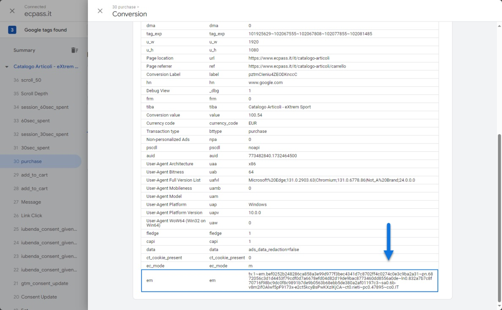

# CONVALIDARE L'INVIO DEI DATI UTENTE A GA4 / GOOGLE ADS

I dati utente inviati a Google Ads o a GA4 seguendo le procedure
indicate nei precedenti capitoli di questo manuale serviranno, di base,
per poter gestire sulla relativa piattaforma le conversioni avanzate
(enhanced conversion)

In ogni caso tali dati, per ragioni di privacy, saranno sempre dati
crittati, non decodificabili e non potranno mai essere visualizzati
direttamente utilizzando una qualche metrica o un qualche report
disponibile su Google Analytics o su Google Ads.

In conseguenza di ciò, nel momento in cui l'esigenza dovesse essere
quella di verificare che il nostro sistema di tracciamento funzioni come
deve e che i dati utente presenti nel dataLayer vengano prelevati in
maniera corretta dai vari Tag di tracciamento, potremmo utilizzare lo
strumento di debug messo a disposizione da Google Tag Manager.

Per fare questo sarà necessario:

- Accedere all'account di GTM collegato al sito e cliccare sul pulsante
  "**Preview**" posto in alto a destra nella barra degli strumenti

- In questo modo verrà aperto lo strumento disponibile su Google Tag
  Manager per poter effettuare il debug del proprio sistema di
  tracciamento. Dovremo quindi digitare l'url del nostro sito e cliccare
  sul pulsante "**Connect**"

- Su un nuovo tab del browser verrà quindi aperto il nostro sito mentre
  nel tab attuale avremo la possibilità di vedere ed esaminare nel
  dettaglio i vari Tag con i dati che sono stati acquisti dal sito e che
  verranno poi inviati al relativo sistema di tracciamento (Google Ads
  piuttosto che Google Analytics)

- Dovremo quindi portarci nel tab di gestione dei Tag e selezionare, tra
  gli eventi presenti nella colonna di sinistra, quello che ha fatto
  scattare il Tag di tracciamento precedentemente configurato per
  gestire anche i dati utente

- Una volta individuato e selezionato questo evento, espandendo la
  sezione "API Call" presente nella parte destra della maschera avremo
  la possibilità di verificare il dettaglio della chiamata API che il
  Tag ha generato e che è stata di fatto utilizzata per inviare i dati
  alla piattaforma di tracciamento (nel caso in questione a Google Ads)

> Come evidenziato in figura, se tutto è andato correttamente, già
> all'interno di questa chiamata dovremo trovare una sezione
> "**enhanced_conversion**" contenente i dati utente prelevati dal sito
> e inviati poi alla piattaforma di tracciamento.
>
> Come indicato nei precedenti capitoli di questo manuale alcuni di
> questi dati devono necessariamente essere hashati per ragioni di
> privacy e GDPR (ad esempio la mail) mentre altri come l'indirizzo
> possono essere passati in chiaro.

- Oltre alla verifica effettuata nel punto precedente potremo anche
  cliccare direttamente sul relativo Tag di tracciamento

> in modo tale da poter analizzare, forse in maniera più semplice, il
> dettaglio dei dati da esso gestiti
>
> In questo caso una volta aperta la maschera di dettaglio del Tag
> dovremo andare a ricercare, tra tutti i parametri presenti, il
> parametro **em** che, nello specifico, è quello deputato alla gestione
> dei dati utente

- **Se il parametro em manca** completamente, significa che i dati
  utente, necessari per la gestione delle conversioni avanzate, non sono
  stati inviati. La prima cosa da fare in questo caso potrebbe quindi
  essere il fatto di verificare che, in fase di configurazione del Tag
  di tracciamento, sia stato correttamente selezionato il parametro per
  la gestione degli User Provided Data

- **Se è presente il parametro em**, ma è del tipo "**tv.1\~em.**",
  significa che il parametro delle conversioni avanzate viene inviato,
  ma è vuoto e quindi, anche in questo caso, che i dati utente non sono
  stati inviati.

- **Se è presente il parametro em**, ma è simile a "**tv.1\~em.e1**",
  significa che il parametro delle conversioni avanzate è stato inviato
  correttamente, ma si è verificato un problema nei dati inviati.

- **Se il parametro em è presente** ed è simile a **"tv.1\~em." seguito
  da una lunga stringa di caratteri** (come nel caso evidenziato in
  figura), significa che il parametro delle conversioni avanzate è stato
  inviato senza errori e la lunga stringa di caratteri rappresenta
  proprio il valore dei dati utente hashati passato da Google Tag
  Manager al sistema di tracciamento (nel caso in esame a Google Ads)

> Come ulteriore riprova del fatto che i dati utente siano
> effettivamente quelli prelavati dal sito potremmo anche cliccare sulle
> due piccole parentesi graffe poste in alto a destra nella tabella
> contenente tutti i parametri del Tag

> in maniera tale da vedere anche il dettaglio di come i dati sono
> gestiti all'interno del parametro em

> Utilizzando gli strumenti per sviluppatori del browser (nello
> specifico richiamando la variabile dataLayer dalla sezione "Console")
> potremo anche verificare che il valore dei dati utente presente su GTM
> è effettivamente lo stesso di quelli presente nel dataLayer gestito da
> Passweb

