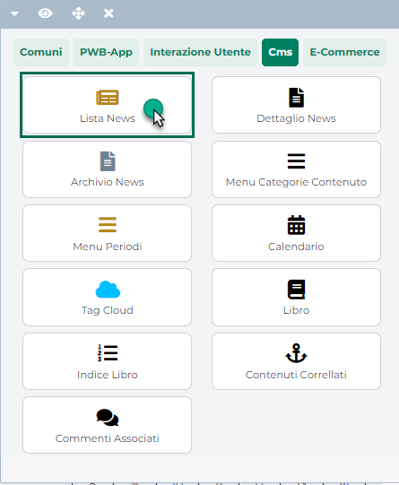

# BRAINLEAD

Brainlead ( <https://brainlead.it> ) è una piattaforma italiana di
**Data Tracking** e **Marketing Automation** che consente di monitorare
e segmentare i clienti del proprio sito, di acquisire i lead generati
dalle campagne di marketing tracciandone il comportamento e creando
anche funnel di vendita completi ai quali poter collegare poi diverse
azioni di marketing automation.

La piattaforma si pone quindi a metà tra i software di web analytics
"puri", come possono essere Google Analytics o Matomo, e sistemi di mail
marketing come MailChimp; traccia il comportamento degli utenti
all'interno del sito, li profila e utilizza le informazioni raccolte per
le attività di conversione alle vendite (carrelli abbandonati, cross
selling, up selling ...), attività queste che potranno essere svolte su
diversi canali: Email, SMS, Whatsapp ...

Grazie a Brainlead è possibile avviare operazioni di:

- **Lead nurturing**. Il lead nurturing è quell'attività che prevede di
  coltivare e alimentare i propri contatti commerciali al fine di
  condurli verso l'acquisto di un prodotto o di un servizio.

- **Lead scoring e lead grading**. Il lead scoring è un'attività
  cruciale nell'ambito del marketing che valuta quanto una persona è
  interessata ai prodotti e ai servizi di un'azienda.

- **Lead capture**. L'obiettivo della lead capture è quello di acquisire
  i lead attraverso delle campagne online e offline, raccogliendoli così
  in un unico database in modo da avere una visione d'insieme e una
  gestione centralizzata.

- **Social enrichment**. Il social enrichment è una tecnica molto valida
  grazie alla quale è possibile arricchire le informazioni sui lead con
  i dati pubblici presenti sui social network.

- **Lead management**. Il lead management è l'insieme dei processi
  aziendali che trasformano i lead in opportunità di business che
  verranno poi gestite dall'area vendite.

- **Report**. Brainlead permette di controllare, verificare e analizzare
  tutti i dati acquisti sui propri lead

**ATTENZIONE! anche se la piattaforma ha sede in Italia e, a differenza
di altri strumenti, non richiede quindi l'invio di dati al di fuori
della comunità europea, si parla pur sempre di un sistema di
tracciamento e di profilazione degli utenti**

In conseguenza di ciò nel momento in cui si dovesse decidere di
attivarlo sarà necessario, da una parte, fornire, nelle Norme sulla
gestione della privacy del proprio sito, un'informativa adeguata circa
l'utilizzo di questa piattaforma e, dall'altra parte, verificare di aver
gestito in maniera corretta la richiesta di consenso preventivo come
effettivamente previsto dalla normativa GDPR

**ATTENZIONE!** lo scopo di questo manuale non è quello di fornire una
guida dettagliata all'utilizzo di Brainlead che rimane comunque uno
strumento di terze parti che, per poter essere utilizzato al meglio,
richiede specifiche conoscenze.

In tal senso il consiglio è dunque quello di rivolgersi sempre alla
documentazione ufficiale e al relativo supporto tecnico

