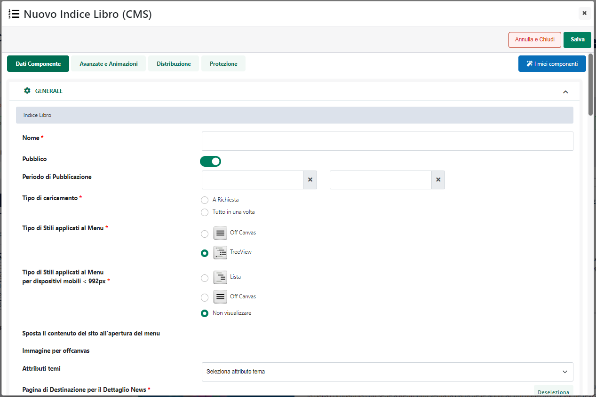
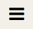
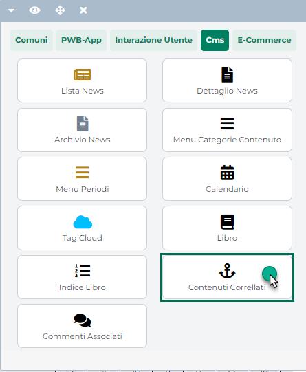
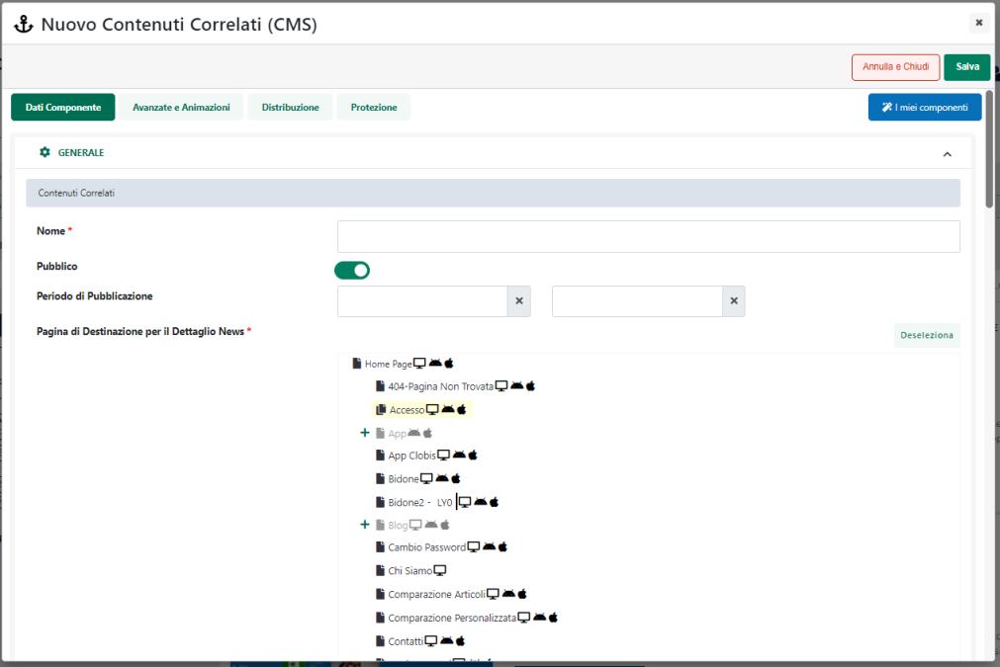

# CLIENTI

All'interno di questa sezione è possibile:

- Configurare e gestire la generazione del feed utilizzato per
  condividere con Clerk le informazioni relative ai clienti presenti sul
  sito

- Decidere quali campi e quindi quali informazioni utente, oltre a
  quelle obbligatorie, dovranno essere inserite all'interno del feed e
  inviate a Clerk mediante apposite chiamate API

{width="5.597222222222222in"
height="3.4805555555555556in"}

In questo senso dunque i parametri presenti all'interno della sezione
"Generale" consentono rispettivamente di:

**Genera Feed alla Sincronizzazione**: consente, se selezionato, di
generare automaticamente il feed ad ogni sincronizzazione sito --
gestionale (Standard o Totale).

**Filtro Clienti**: consente di impostare un filtro di selezione per
individuare, tra i clienti attualmente presenti all'interno del proprio
sito, quelli che dovranno essere inseriti nel feed e importati dunque
nel database di Clerk (per maggiori informazioni relativamente a come
poter impostare il filtro clienti si veda anche quanto indicato
all'interno del capitolo "*Utenti -- Siti Ecommerce -- Gruppi Utenti
Sito -- Filtri Utente e Filtri Articolo -- Filtri Utente*" di questo
manuale)

**ATTENZIONE!** considerando il modo in cui opera la sincronizzazione
via feed tra le due piattaforme (si veda in proposito quanto indicato
all'interno del precedente capitolo "*Sincronizzazione Dati"*) occorre
fare particolare attenzione prima di variare il filtro impostato in
corrispondenza di questo campo.

**Nel momento in cui eventuali variazioni al filtro di selezione dei
clienti dovessero portare infatti ad escludere dal corrispondente feed
determinati utenti, e dovesse essere stata impostata anche la
generazione automatica del feed alla sincronizzazione, quando poi Clerk
andrà a rileggersi il file, gli utenti non più presenti nel feed
verranno automaticamente rimossi anche da Clerk (posto che non abbiano
degli ordini associati)**

**ATTENZIONE!** per maggiori informazioni relativamente alla possibilità
di esportare su Clerk i dati dei clienti già presenti all'interno del
proprio sito ecommerce in maniera GDPR compliance, si rimanda a quanto
indicato nel successivo capitolo "*Privacy e GDPR*" di questo manuale

**URL Feed**: consente di visualizzare l'url di pubblicazione del feed,
quello che dovrà poi essere inserito all'interno del campo "JSON
Customers URL" alla pagina "**Data -- Configuration**" dello store Clerk
con cui si desidera effettuare l'integrazione (per maggiori informazioni
in merito si veda anche quanto indicato all'interno del precedente
capitolo "*Sincronizzazione Dati*")

Il pulsante "**Genera Feed**" presente nella parte bassa di questa
sezione consente invece di avviare manualmente la generazione del
relativo feed.

Oltre alla generazione del Feed occorre poi ricordare che, come per gli
ordini, anche nel caso dei clienti Passweb e Clerk possono scambiarsi i
dati attraverso apposite chiamate API.

In questo senso infatti i nuovi utenti che andranno a registrarsi sul
sito successivamente all'integrazione tra le due piattaforme, verranno
inviati a Clerk automaticamente.

Allo stesso modo nel momento in cui un utente dovesse variare i suoi
dati anagrafici agendo dal proprio profilo, non sarà necessario
attendere la rigenerazione del feed inquanto, anche in questo caso, al
salvataggio del profilo i dati dell'utente verranno inviati
automaticamente a Clerk con un'apposita chiamata API.

La sezione "**Campi Aggiuntivi Utente**" consente quindi di specificare,
oltre a quelli obbligatori, quali campi dovranno essere effettivamente
inseriti nel feed Clienti e inviati a Clerk mediante le relative
chiamate API.

{width="5.409027777777778in"
height="3.584722222222222in"}

**ATTENZIONE! eliminando alcuni dei campi precedentemente gestiti
all'interno di questa sezione questi verranno poi eliminati, al
successivo invio dei dati (via API e/o via feed), anche all'interno di
Clerk**

Nella parte sinistra di questa sezione sono elencati i campi utente
attualmente codificati che verranno quindi inseriti nel Feed e anche
inviati a Clerk via API alla registrazione di un nuovo utente e/o nel
momento in cui un utente registrato dovesse variare e confermare il suo
profilo.

Sulla destra sono invece riportate le proprietà del campo attualmente
selezionato in elenco. Per modificare uno dei campi gestiti sarà quindi
sufficiente selezionarlo e agire poi sui parametri presenti all'interno
della sezione "**Modifica Campo"**.

Allo stesso modo per codificare un nuovo campo sarà necessario cliccare
sull'icona raffigurante un piccolo + (
{width="0.18819444444444444in"
height="0.18819444444444444in"} ) e definire poi le relative proprietà.

In particolare per ogni singolo campo utente occorrerà specificare un
valore per i seguenti parametri:

**Tipo di dato**: consente di indicare la tipologia del campo utente da
gestire. È possibile indicare una delle seguenti opzioni:

- **Attributo Cliente**: in questo caso l'informazione utente da
  inserire nel feed e/o da inviare via API sarà quella memorizzata
  all'interno dell'attributo cliente indicato in corrispondenza del
  successivo parametro "**Attributo di Origine**"

- **Campo Cliente**: in questo caso l'informazione utente da inserire
  nel feed e/o da inviare via API sarà quella memorizzata all'interno
  del campo dell'anagrafica cliente indicato in corrispondenza del
  successivo parametro "**Campo di Origine**"

- **Personalizzato**: in questo caso l'informazione utente da inserire
  nel feed e/o da inviare via API sarà esattamente quella indicata in
  maniera specifica all'interno del successivo parametro "**Valore
  personalizzato**"

**Etichetta del campo**: consente di specificare l'etichetta del campo
utente da gestire, etichetta questa che verrà poi riportata anche
all'interno di Clerk

In definitiva dunque per ogni utente verranno condivise con Clerk (via
API o tramite feed) le seguenti informazioni:

- **id utente Passweb** -- obbligatorio

- **indirizzo Email** -- obbligatorio

- **nominativo utente** (nome e cognome / ragione sociale) --
  obbligatorio

- **consenso marketing** (corrispondente al parametro "subscribed") --
  obbligatorio **e impostato sempre a false**

- tutti i dati specificati all'interno della sezione "**Campi aggiuntivi
  utente**" -- opzionali

**ATTENZIONE!** i dati obbligatori (id, email, nominativo ...) verranno
inviati a Clerk e inseriti nel relativo feed in ogni caso, non è quindi
necessario inserire tali informazioni anche all'interno della sezione
"Campi aggiuntivi utente".

In merito a questi campi obbligatori occorre fare una precisazione
relativamente al parametro "**subscribed**" che, come sopra evidenziato,
verrà automaticamente impostato a false, da Passweb, per ogni cliente
(sia in fase di generazione del feed che in fase di invio dati via API).

Tale parametro è quello che determina la possibilità di inviare ai
relativi utenti, direttamente da Clerk (con la funzionalità di
Newsletter del modulo di Email) comunicazioni di carattere commerciale.

Ora, considerando che al momento non è attiva l'integrazione Passweb --
Clerk per quel che riguarda la gestione della Newsletter, Passweb dovrà
necessariamente impostare tale parametro a false. L'informazione
relativa alla possibilità di inviare comunicazioni di carattere
commerciale ai vari utenti (Iscrizione Newsletter Si/No) verrà infatti
salvata direttamente sulla specifica piattaforma (MailChimp,
ActiveCampaign ...) integrata con Passweb e utilizzata per gestire
questo tipo di servizio.

Questo non pregiudica la possibilità di integrare Clerk direttamente con
una delle piattaforme di Newsletter gestite da Passweb e quindi la
possibilità di creare direttamente da Clerk sulle altre piattaforme le
varie audience generate e gestite dalla sua IA.

Semplicemente Clerk non saprà a quale utente poter inviare comunicazioni
di carattere commerciale e a quale utente non poterlo fare perché non
sarà Clerk a gestire questi invii. Questo lo farà direttamente
ActiveCampaign o MailChimp che riceveranno l'informazione da Passweb nel
momento in cui un utente dovesse decidere di iscriversi o disiscriversi
alla Newsletter direttamente dal sito.

L'unica accortezza in questo caso dovrà essere dunque quella **di non
esportare direttamente da Clerk, sulla piattaforma utilizzata in Passweb
per gestire la Newsletter, i vari utenti (subscribers).**

Per far questo sarà necessario verificare di non aver attivato
all'interno della sezione "**Sync subscribers**" (modulo "**Email --
Configuration**") di Clerk degli esportatori verso la piattaforma di
Newsletter utilizzata su Passweb (ActiveCampaign, MailChimp ...)

{width="5.675in"
height="3.3118055555555554in"}

Nel momento in cui uno degli esportatori evidenziati in figura dovesse
essere attivato infatti, lo stato di iscrizione al relativo servizio di
Newsletter, inizialmente impostato da Passweb sulla base della scelta
effettuata dall'utente sul sito, potrebbe poi essere sovrascritto da
Clerk (dove come detto subscribed sarà sempre impostato a false) **con
il risultato che nessuno degli utenti presenti nelle varie liste di
ActiveCampaign o MailChimp potrà poi ricevere comunicazioni di carattere
commerciale**

Infine un'ultima considerazione da fare è quella che riguarda la
creazione del feed clienti nel caso di siti in multilingua. In queste
condizioni infatti il consiglio è quello di creare su Clerk uno store
per ciascuna lingua gestita sul sito e su Passweb ovviamente un Account
Clerk per ciascuno Store marcando anche uno di questi account come
account di default

In queste condizioni il feed clienti verrà generato tenendo in
considerazione anche la Nazione selezionata dall'utente stesso in fase
di registrazione al sito (o quella eventualmente associata nella sua
anagrafica gestionale nel caso in cui l'utente dovesse essere stato
importato direttamente da Mexal). Dalla Nazione verrà poi ricavata la
lingua e in base alla lingua il cliente verrà inserito in uno store
piuttosto che in un altro

Supponendo dunque:

- di avere il sito in tre lingue, italiano francese e inglese

- di gestire all'interno del sito 4 distinti paesi Italia, Francia,
  Inghilterra e Spagna

- di aver creato tre store distinti all'interno di Clerk

- di aver configurato su Passweb 3 Account Clerk con le corrette
  impostazioni di lingua e valuta

- di aver impostato l'account in lingua italiana come account di default

In queste condizioni i clienti che dovessero soddisfare l'eventuale
filtro impostato verranno divisi nei feed dei vari account Clerk
presenti su Passweb come di seguito indicato:

- I clienti che risultano associati, nella loro anagrafica al paese
  Italia verranno inseriti nel feed dell'Account Clerk per cui è stata
  impostata la lingua italiana

- I clienti che risultano associati, nella loro anagrafica al paese
  Francia verranno inseriti verranno inseriti nel feed dell'Account
  Clerk per cui è stata impostata la lingua francese

- I clienti che risultano associati, nella loro anagrafica al paese
  Inghilterra o ad esempio al paese Stati Uniti d'America, verranno
  inseriti nel feed dell'Account Clerk per cui è stata impostata la
  lingua inglese

- I clienti che risultano associati, nella loro anagrafica al paese
  Spagna verranno inseriti nel feed dell'Account Clerk per cui è stata
  impostata la lingua italiana (che è quello di default)

**ATTENZIONE!** considerando che la divisione per Nazione viene
applicata automaticamente da Passweb non sarà necessario impostare un
eventuale filtro clienti dello stesso tipo

Per maggiori informazioni relativamente all'integrazione Passweb --
Clerk nel caso di siti multilingua si veda anche quanto indicato nel
relativo capitolo ("*Passweb e Clerk -- Integrazione -- Multilingua*")
di questo manuale

