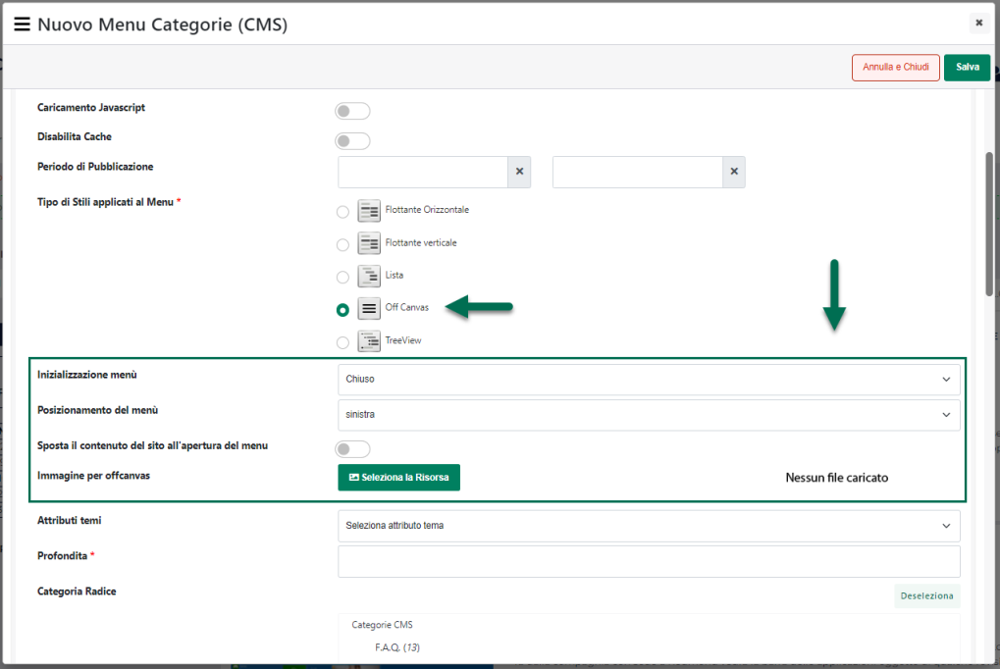

# ARTICOLI

All'interno di questa sezione è possibile:

- Configurare e gestire la generazione del feed utilizzato per
  condividere con Clerk le informazioni relative ai prodotti gestiti
  all'interno del proprio sito Ecommerce.

- Decidere quali campi articolo, oltre a quello obbligatori, dovranno
  essere inseriti all'interno del feed e inviati a Clerk

In questo senso dunque il parametro:

**Filtro Articoli**: consente di impostare un eventuale filtro di
selezione per individuare, tra quelli gestiti all'interno del sito, i
prodotti che dovranno essere inseriti nel feed e importati dunque nel
database di Clerk (per maggiori informazioni relativamente a come poter
impostare il filtro articoli si veda anche quanto indicato all'interno
del capitolo "*Utenti -- Siti Ecommerce -- Gruppi Utenti Sito -- Filtri
Utente e Filtri Articolo -- Filtri Articolo*" di questo manuale)

**Includi Articoli Padre**: consente, se selezionato, di includere nel
feed articoli anche i padri di struttura

**Genera Feed alla Sincronizzazione**: consente, se selezionato, di
generare automaticamente il feed ad ogni sincronizzazione sito --
gestionale (Standard o Totale).

**ATTENZIONE!** oltre al feed, al termine di ogni sincronizzazione
parziale Passweb si preoccuperà di inviare a Clerk anche i dati dei
prodotti coinvolti in eventuali ordini effettuati all'interno sito,
utilizzando per questo apposite chiamate API, in modo tale da mantenere
allineate il più possibile le disponibilità dei prodotti tra le due
piattaforme.

**Url Feed**: consente di visualizzare l'url di pubblicazione del feed,
quello che dovrà poi essere inserito all'interno del campo "JSON
Products URL" alla pagina "**Data -- Configuration**" dello store Clerk
con cui si desidera effettuare l'integrazione (per maggiori informazioni
in merito si veda anche quanto indicato all'interno del precedente
capitolo "*Sincronizzazione Dati*")

Il pulsante "**Genera Feed**" presente nella parte bassa della maschera
consente invece di avviare manualmente la generazione del relativo feed.

La sezione "**Campi Aggiuntivi Articolo**" consente invece di
specificare, oltre a quelli obbligatori, quali campi e quindi quali dati
dovranno essere effettivamente inseriti nel feed Articoli e condivisi
quindi anche con Clerk.

Sulla sinistra sono elencati i campi articolo attualmente codificati e
che verranno quindi inseriti nel Feed.

Sulla destra sono invece riportate le proprietà del campo attualmente
selezionato in elenco. Per modificare uno dei campi gestiti sarà quindi
sufficiente selezionarlo e agire poi sui parametri presenti all'interno
della sezione "**Modifica Campo"**.

Allo stesso modo per codificare un nuovo campo sarà necessario cliccare
sull'icona raffigurante un piccolo + (
 ) e definire poi le relative proprietà.

In particolare per ogni singolo campo utente occorrerà specificare un
valore per i seguenti parametri:

**Tipo di dato**: consente di indicare la tipologia del campo utente da
gestire. E' possibile indicare una delle seguenti opzioni:

- **Attributo Articolo**: in questo caso l'informazione da inserire nel
  feed sarà quella memorizzata all'interno dell'attributo articolo
  indicato in corrispondenza del successivo parametro "**Attributo di
  Origine**".

> E' possibile selezionare uno qualsiasi degli attributi attualmente
> gestiti anche se, per ovvie ragioni, ha senso utilizzare soltanto
> attributi di tipo testuale

- **Campo Articolo**: in questo caso l'informazione da inserire nel feed
  sarà quella memorizzata all'interno del campo articolo indicato in
  corrispondenza del successivo parametro "**Campo di Origine**"

> In questo caso è possibile selezionare una delle seguenti opzioni:

- **Alias**: codice alias dell'articolo

- **Categoria Statistica**: categoria statistica dell'articolo

- **Codice Articolo Fornitore**: codice fornitore dell'articolo

- **Codice Alternativo**: codice alternativo dell'articolo

- **Colori** -- campo a valori multipli: descrizione del colore inserita
  nella tabella Taglie di Mexal -- valorizzato solo per quei prodotti
  associati ad una serie taglie Mexal marcata come "Serie Colore"

> **ATTENZIONE!** Per maggiori informazioni in merito a come poter
> marcare una serie taglie come "Serie Colori" si veda anche quanto
> indicato all'interno del capitolo "*Catalogo -- Gestione Articoli --
> Taglie o Colori Ecommerce Mexal -- Configurazione di una serie di
> Taglie / Colori*" di questo manuale
>
> Verranno considerati tutti i colori associati nella tabella taglie di
> Mexal al relativo articolo indipendentemente dal fatto che questi
> siano o meno effettivamente disponibili

- **Colori disponibili**: analogo al campo precedente ma verranno presi
  in considerazione i soli colori effettivamente disponibili

- **Confezione**: numero di elementi presenti nella confezione --
  valorizzato solo per articoli gestiti a confezione

- **Data Creazione formato dd/MM/yyyy**: data di importazione in Passweb
  del corrispondente articolo

<!-- -->

- **Data Creazione formato Unix**: data di importazione in Passweb del
  corrispondente articolo espressa in formato UNIX

<!-- -->

- **Descrizione**: Descrizione Web dell'articolo. Corrisponde a quanto
  presente nell'omonimo campo dell'Anagrafica Passweb del relativo
  articolo

- **Descrizione senza codice HTML**: analogo al campo precedente. In
  questo caso però il testo presente all'interno del campo verrà epurato
  di eventuali tag HTML

- **Descrizione** **Dettagliata**: Descrizione Dettagliata
  dell'articolo. Corrisponde a quanto presente nell'omonimo campo
  dell'Anagrafica Passweb del relativo articolo

- **Descrizione Dettagliata senza codice HTML**: analogo al campo
  precedente. In questo caso però il testo presente all'interno del
  campo verrà epurato di eventuali tag HTML

- **Descrizione HTML / 2 / 3**: valore del campo **"**Descrizione
  HTML/2/3**"** presente all'interno della maschera **"Modifica
  Articolo"** accessibile, in Passweb, dalla voce di menu *"Catalogo --
  Gestione Articoli"*

- **Descrizione HTML senza codice HTML / 2 / 3**: analogo al campo
  precedente. In questo caso però il testo presente all'interno del
  campo verrà epurato di eventuali tag HTML

<!-- -->

- **Disponibilità**: valore della disponibilità dell'articolo stesso
  aggiornato all'ultima sincronizzazione e calcolato sulla base di
  quanto impostato alla pagina \"*Catalogo - Configurazione Parametri
  Catalogo*\" del Wizard.

<!-- -->

- **Group_id**: valorizzato:

  - per articoli "semplici" con il loro codice articolo

  - per articoli padri di struttura con il loro codice articolo

  - per articoli figli di struttura con il codice del loro articolo
    padre

- **Group_leader**: valorizzato a:

  - **true** per articoli semplici e padri di struttura

  - **false** per articoli figli di struttura

- **IVA**: aliquota iva del corrispondente prodotto

- **Natura**: descrizione della Natura associata sul gestionale al
  relativo articolo

- **Natura** **Codice**: codice della Natura associata sul gestionale al
  relativo articolo

- **Nominativo Fornitore** -- campo a valori multipli: Nominativo (Nome
  Cognome / Ragione Sociale) Fornitore associato, lato gestionale, al
  relativo prodotto.

- **Prezzo Originale**: prezzo (numerico) originale del prodotto
  calcolato sulla base del listino e della valuta indicati nei parametri
  di configurazione del Feed

- **Prezzo Originale Valuta**: prezzo (numerico + codice ISO valuta)
  originale del prodotto calcolato sulla base del listino e della valuta
  indicati nei parametri di configurazione del Feed

- **Prezzo Scontato**: prezzo (numerico) del prodotto calcolato sulla
  base del listino, della valuta e della Categoria Sconto Cliente
  indicati nei parametri di configurazione del Feed

- **Prezzo Scontato Valuta**: prezzo (numerico + codice ISO valuta) del
  prodotto calcolato sulla base del listino, della valuta e della
  Categoria Sconto Cliente indicati nei parametri di configurazione del
  Feed

> **ATTENZIONE!** i prezzi inseriti all'interno del feed saranno sempre
> prezzi ivati (coerentemente con il fatto che anche nel feed e nelle
> chiamata API relative agli ordini verranno considerati sempre prezzi
> ivati)

- **Taglie** -- campo a valori multipli: descrizione della taglia
  inserita nella tabella Taglie di Mexal -- valorizzato solo per quei
  prodotti associati ad una serie taglie Mexal marcata come "Serie
  Taglie"

> **ATTENZIONE!** Per maggiori informazioni in merito a come poter
> marcare una serie taglie come "Serie Taglie" si veda anche quanto
> indicato all'interno del capitolo "*Catalogo -- Gestione Articoli --
> Taglie o Colori Ecommerce Mexal -- Configurazione di una serie di
> Taglie / Colori*" di questo manuale
>
> Verranno considerati tutti le taglie associate nella tabella taglie di
> Mexal al relativo articolo indipendentemente dal fatto che questi
> siano o meno effettivamente disponibili

- **Taglie Disponibili**: analogo al campo precedente ma verranno prese
  in considerazione le sole taglie effettivamente disponibili

- **Taglie Colori** -- campo a valori multipli: descrizione della taglia
  o del colore inserita nella tabella Taglie di Mexal. Valorizzato per i
  prodotti associati ad una serie taglie di Mexal indipendentemente dal
  fatto che sia stata marcata come Serie Taglie o come Serie Colori

- **Taglie Colori Disponibili:** analogo al campo precedente ma verranno
  presi in considerazione i soli colori / le sole taglie effettivamente
  disponibili

- **Tipologia Articolo**: valorizzato con:

  - **"Variante**" per articoli padri di struttura o per articoli
    gestiti a Taglie / Colori

  - **"Semplice"** per articoli figli

- **Valuta**: codice ISO della valuta indicata in fase di configurazione
  del Feed

<!-- -->

- **Personalizzato**: in questo caso l'informazione da inserire nel feed
  sarà esattamente quella indicata in maniera specifica all'interno del
  successivo parametro "**Valore personalizzato**"

**Etichetta del campo**: consente di specificare l'etichetta del campo
articolo da gestire, etichetta questa che verrà poi riportata anche
all'interno di Clerk

**ATTENZIONE!** In definitiva dunque per ogni articolo presente
all'interno del feed verranno condivise con Clerk le seguenti
informazioni:

- **id**: codice articolo -- campo obbligatorio

- **name**: titolo articolo -- campo obbligatorio

- **description**: descrizione web dell'articolo -- campo obbligatorio

- **price**: prezzo ivato dell'articolo calcolato sulla base del
  listino, della valuta e della Categoria Sconto Cliente indicati nei
  parametri di configurazione del Feed (valore numerico senza codice ISO
  della valuta) -- campo obbligatorio

- **image**: url dell'immagine catalogo dell'articolo -- campo
  obbligatorio

- **url**: url della pagina articolo -- campo obbligatorio

- **categories --** campo a valori multipli: codice della categoria
  merceologica di appartenenza del relativo articolo + codici di
  eventuali categorie padre -- campo obbligatorio

- **created_at**: data di importazione in Passweb del corrispondente
  articolo -- campo obbligatorio

- **tutti i campi specificati all'interno della sezione "Campi
  aggiuntivi articolo"** -- campi opzionali

**ATTENZIONE!** i campi obbligatori (id, name, description, price ...)
verranno inseriti nel feed articoli sempre e comunque per cui non è
necessario inserire tali informazioni anche all'interno della sezione
"Campi aggiuntivi articolo".

**ATTENZIONE!** **il feed degli articolo conterrà ovviamente sempre e
comunque tutti i prodotti oggetto dell'eventuale filtro impostato in
fase di configurazione del feed stesso**

Nel caso dei siti multilingua i campi presenti all'interno del feed (es.
"description") verranno valorizzati nella lingua impostata in fase di
configurazione del relativo account Clerk

