# RACCOMANDAZIONI IMPLEMENTATE MEDIANTE INJECTION O EMBEDDING

Nel momento in cui l'esigenza dovesse essere quella di implementare le
Raccomandazioni Clerk lasciando che sia Clerk stesso ad iniettarle nelle
pagine del nostro sito, oppure embeddando il codice HTML indicato da
Clerk, il modo di operare sarà in tutto e per tutto analogo a quello già
visto per il modulo di Ricerca.

Dovremo quindi, per prima cosa, definire un "**Design**" ossia
l'interfaccia grafica della Raccomandazione che si andrà poi ad
implementare agendo in questo senso dalla sezione "**Reccomendations --
Design**" del proprio account Clerk

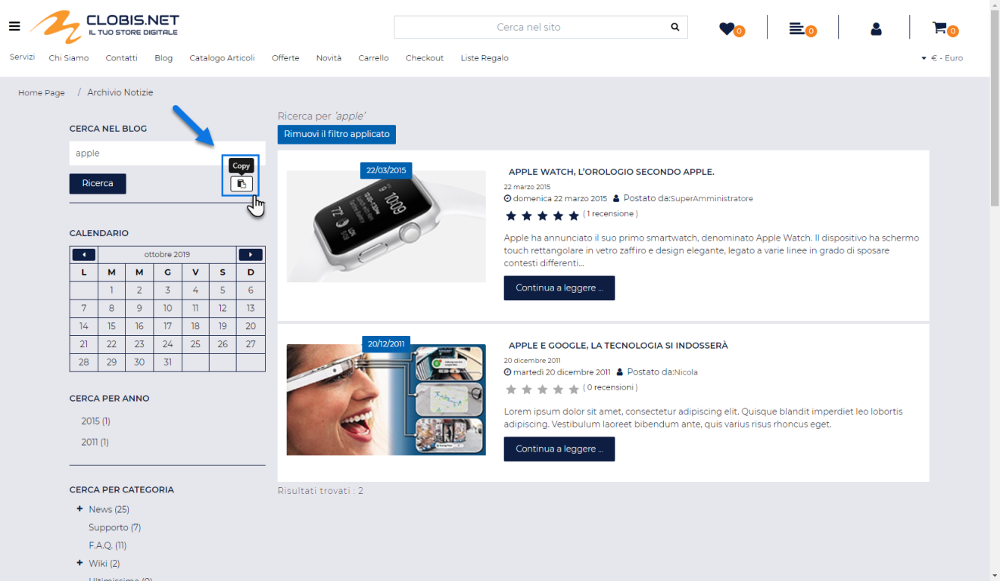

Il pulsante "**New design**" presente nella parte alta della maschera
consente di creare un nuovo Design, indicando inoltre se per far questo
dovremo partire da uno dei template messi a disposizione da Clerk
(opzione "**Product Slider**") oppure fare tutto da zero (opzione
"**Blank**")

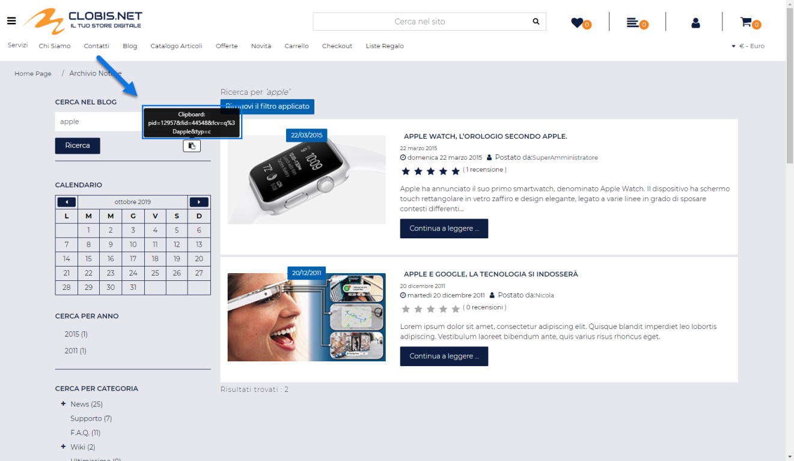

Nel primo caso, selezionando uno dei template messi a disposizione da
Clerk

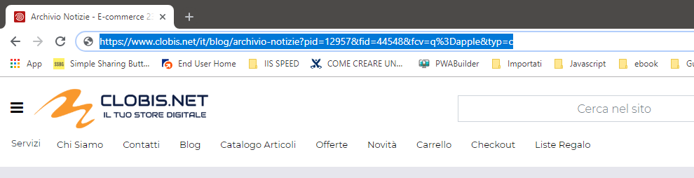

avremo poi la possibilità di personalizzarlo utilizzando esclusivamente
l'editor visuale messo a disposizione da Clerk e operando esattamente
allo stesso modo di quanto fatto per il modulo di ricerca

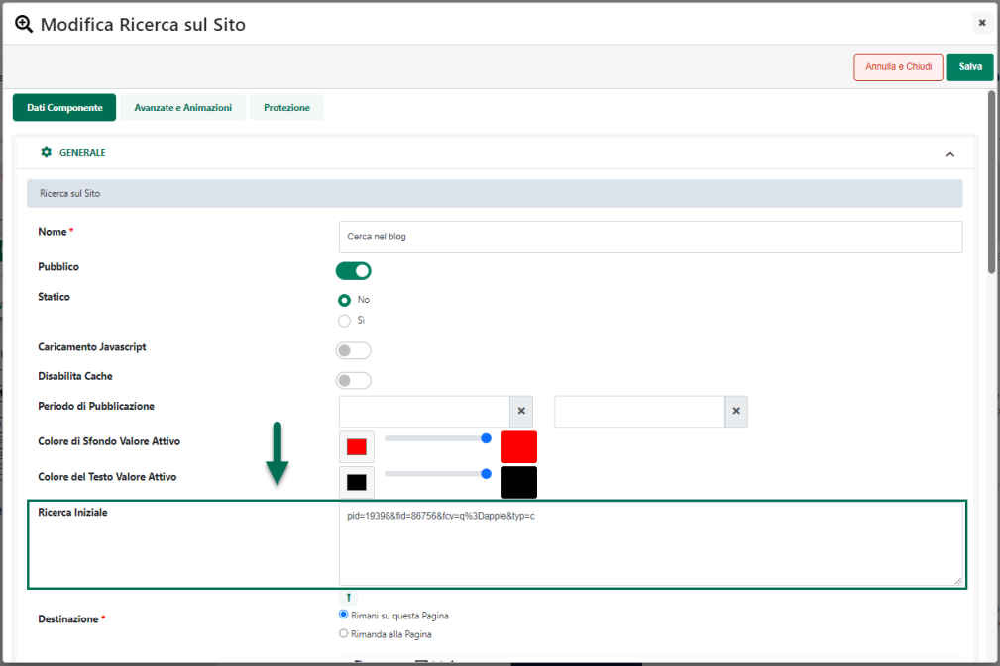

Nel secondo caso invece avremo la possibilità di decidere se utilizzare
l'editor visuale oppure se fare tutto a livello di codice utilizzando il
linguaggio di templating (Liquid) messo a disposizione da Clerk
(esattamente come per il modulo di Omnisearch)

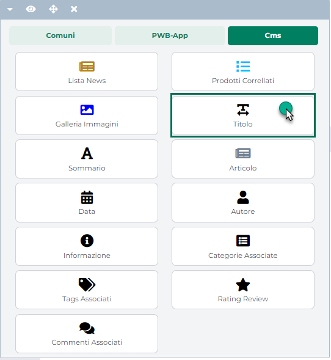

**ATTENZIONE!** per maggiori informazioni relativamente alla creazione
dei Design, con l'editor visuale o a livello di codice, si consiglia di
fare riferimento sempre alla specifica documentazione di prodotto
(<https://help.clerk.io/it/platform/designs/design-editor/> -
<https://help.clerk.io/it/platform/designs/code-designs/> ) e/o di
rivolgersi direttamente all'assistenza Clerk

Una volta completato il Design e impostata quindi l'interfaccia grafica,
il passo successivo sarà quello di creare e configurare la
raccomandazione che dovrà poi essere effettivamente implementata
all'interno del sito e questo lo si farà operando all'interno della
sezione "**Reccomendations -- Slierds**"

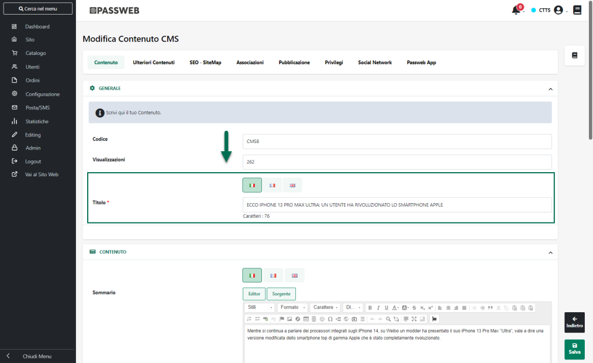

Il pulsante "**New Slider**" presente nella parte alta della maschera
consentirà di creare una nuova raccomandazione, che dovrà poi essere
configurata esattamente allo stesso modo di quanto avveniva per il
modulo di ricerca, impostando quanto richiesto in ciascuna delle sezioni
indicate:

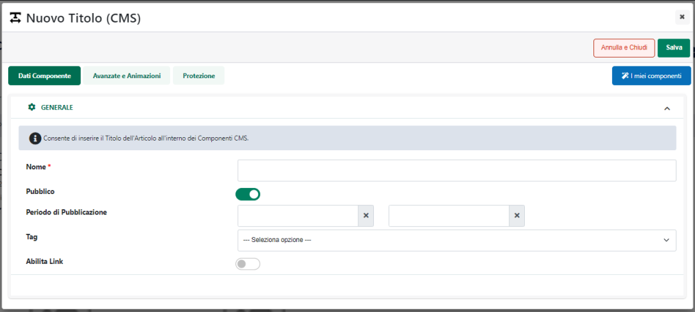

Nello specifico la sezione:

**Slider name**: consente di assegnare un nome e delle label alla
raccomandazione che si sta configurando, informazioni queste molto
importanti perché verranno poi utilizzate nei vari cruscotti di analisi
dati messe a disposizione da Clerk per capire l'impatto prodotto dai
prodotti mostrati da questa raccomandazione sulle vendite registrate

**Slider type**: consente di impostare i parametri di configurazione
della raccomandazione e, in particolare, la logica che dovrà poi
determinare quali prodotti dovranno effettivamente essere visualizzati
al suo interno.

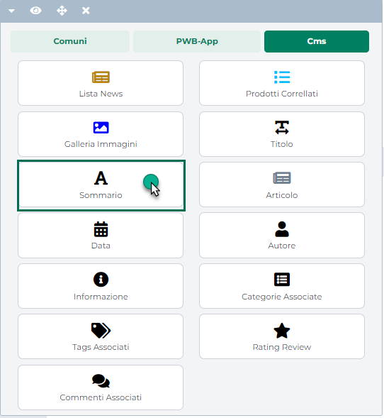

**Design:** consente di impostare e configurare, selezionandolo tra
quelli precedentemente realizzati, il Design e quindi l'interfaccia
grafica che dovrà essere utilizzata per la raccomandazione che si sta
realizzando.

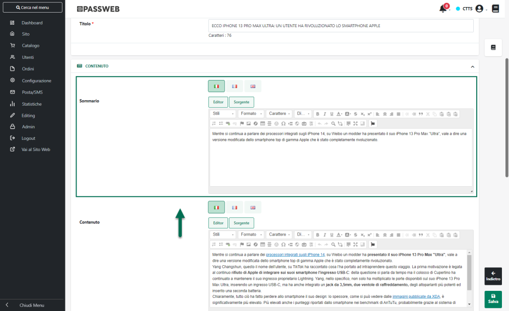

**Insert into website:** consente di impostare la modalità da utilizzare
per visualizzare la raccomandazione all'interno del nostro sito. In
questo senso è possibile operare in due modi diversi:

- **Injection:** selezionando questa opzione la raccomandazione verrà
  iniettata nella pagina web direttamente da Clerk. In queste condizioni
  sarà quindi indispensabile indicare, tra le altre cose, il selettore
  CSS dell'elemento presente all'interno della pagina del sito Passweb
  in relazione al quale dovrà poi essere inserita la raccomandazione
  (campo "Display element in relation to the following element").

> Dipendentemente poi dalla logica di visualizzazione dei prodotti
> selezionata potrebbe essere necessario inserire altri dati affinché la
> raccomandazione possa funzionare in maniera corretta

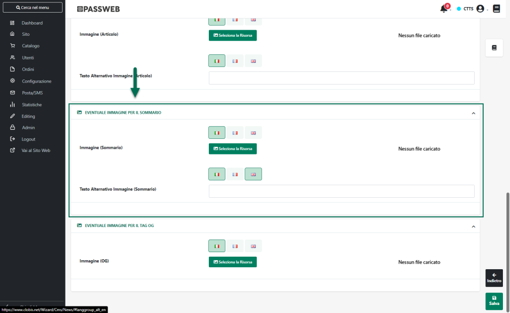

> Nel caso in figura, ad esempio, è stata scelta la logica "Mos sold
> with" (Più venduti con) che, tipicamente dovrà essere inserita in una
> pagina prodotto, e che dovrà quindi mostrare risultati diversi a
> seconda della pagina prodotto effettivamente visualizzata dall'utente
>
> In queste condizioni dunque, affinché la raccomandazione possa
> funzionare in maniera corretta, sarà necessario indicare anche il
> selettore CSS dell'elemento presente nella pagina che individua il
> codice articolo in maniera tale che sulla base di questo valore la
> raccomandazione possa effettivamente mostrare in maniera dinamica
> risultati diversi a seconda delle specifica scheda prodotto che verrà
> poi visualizzata.
>
> Un' altro esempio in questo senso potrebbe essere rappresentato dalle
> raccomandazioni collegate alle categorie merceologiche (es. "Best
> Sellers In Category") che dovranno quindi variare i prodotti mostrati
> in relazione alla specifica pagina di categoria effettivamente
> visualizzata dall'utente e per le quali sarà dunque necessario
> indicare il selettore CSS dell'elemento presente nella pagina che
> individua il codice della categoria merceologica

- **Embedded code:** selezionando questa opzione verrà fornito da Clerk
  lo snippet di codice che dovremo poi inserire (mediante un componente
  HTML) all'interno della/e pagina/e del sito Passweb in cui far
  comparire la raccomandazione in questione

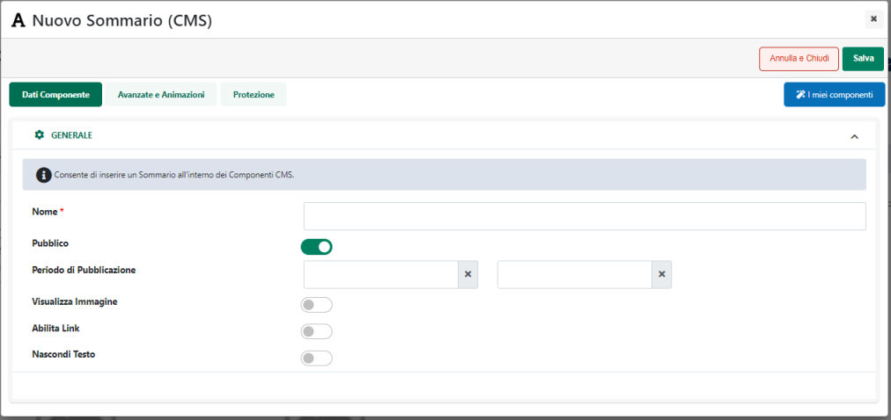

> Anche in questo caso, esattamente come per l'injection, lo snippet di
> codice fornito da Clerk dovrà comunque essere personalizzato inserendo
> quanto richiesto dalla specifica raccomandazione. Nell'esempio
> indicato in figura, ad esempio, sarà necessario inserire in
> corrispondenza dell'attributo "**data-products**" il codice
> dell'articolo in relazione al quale dovranno essere visualizzati i
> prodotti della raccomandazione.
>
> Ovviamente non potrà essere inserito un codice articolo statico,
> altrimenti i prodotti mostrati dalla raccomandazione non varieranno il
> relazione alla pagina prodotto effettivamente visualizzata
> dall'utente, ma dovremo inserire un elemento dinamico che possa
> variare automaticamente il suo valore in relazione alla pagina
> effettivamente visualizzata dall'utente.
>
> In questo senso, considerando che questo snippet di codice dovrà
> essere inserito nella pagina Passweb utilizzando un componente HTML
> sarà possibile utilizzare uno dei segnaposto disponibili nella sua
> maschera di configurazione

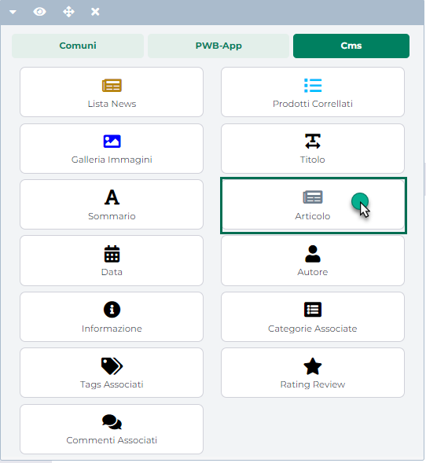

> Tra questi segnaposto troveremo infatti anche:

- **Codice Articolo -- {{SKU}}**

- **Codice Categoria Merceologica** -- {{**CATEGORYCODE**}}

- **Elenco codici articolo in carrello** -- **{{PRODUCTSCODECART}}**

- **ID post CMS -** {{**IDCMSPOST**}}

> che, tipicamente, sono quelli che possono essere richiesti dalle
> diverse tipologie di raccomandazioni offerte da Clerk
>
> Per maggiori informazioni relativamente ai segnaposto utilizzabili
> all'interno del componente HTML si veda quanto indicato nel relativo
> capitolo di questo manuale ("*Componenti Comuni -- Componente HTML --
> Configurazione*")

Infine, per quel riguarda i vantaggi che si possono ottenere adottando
questo metodo di implementazione possiamo sottolineare da una parte il
fatto di alleggerire il caricamento della pagina web (considerando
infatti che tutto il lavoro verrà fatto da Clerk non ci saranno query da
dover effettuare sul database del sito Passweb per determinare ad
esempio quelli che possono essere gli articoli più venduti, quelli
venduti assieme ad un altro ...) e dall'altra parte sicuramente la
possibilità di inserire queste raccomandazioni anche dove non sarebbe
possibile utilizzare il componente "Popolarità prodotto" come ad esempio
nel pop up di aggiunta in carrello

Per quel che riguarda invece gli svantaggi questi sono da ricercarsi
essenzialmente in quella che può essere la difficoltà nella
personalizzazione (sia a livello grafico che a livello di contenuti)
che, come detto, dovrà essere effettuata quasi interamente all'interno
di Clerk (di cui sarà dunque indispensabile conoscere logiche e
funzionamento) e soprattutto nel discorso relativo ai prezzi.

Anche in questo caso infatti, come già evidenziato per il modulo di
ricerca, occorrerà tenere in considerazione il fatto che il prezzo
visualizzato per i prodotti oggetto della raccomandazione sarà,
generalmente, lo stesso prezzo di listino inserito anche nel Feed
Articoli utilizzato per l'integrazione Passweb -- Clerk e questo, se da
una parte potrebbe essere corretto per un sito B2C in cui il prezzo dei
prodotti non cambia a seconda dell'utente loggato, dall'altra parte
potrebbe anche non andar bene nel caso in cui il prezzo dei prodotti
dovesse invece variare a seconda dell'utente.

